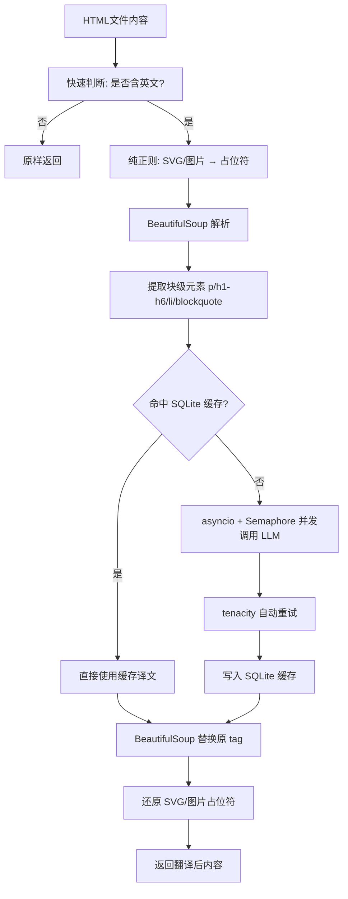

# EPUB Fixer AI 翻译模块设计

> 在完成核心引擎 `ExtremeCompiler` 的排版清洗之后，AI 翻译是最有商业价值但技术挑战最大的功能。
> 核心目标：**保留排版（HTML 结构、标签、属性）的前提下完成全书翻译**。

---

## 一、核心技术难点

### 1.1 DOM 碎片化陷阱（最棘手）

EPUB 的 HTML 中，一句话经常被标签切碎：

```html
She was <i class="emphasis">very</i> angry.
```

若按文本节点分割，会得到三块独立片段，分别翻译后语法崩塌。

**解决方案**：连同 HTML 标签整块发给 LLM，在 System Prompt 中严厉要求"**保持所有 HTML/XML 标签结构绝对不变，仅翻译文本**"。现代大模型（DeepSeek-Chat、GPT-4o）具备此能力。

### 1.2 SVG / 图片污染风险

BeautifulSoup 的 XML 解析器会把 SVG 大小写敏感属性强制小写（`preserveAspectRatio` → `preserveaspectratio`），导致封面/插图显示异常。

**解决方案（占位符法）**：在进入 BeautifulSoup 之前，纯正则把所有 `<svg>...</svg>`、``、`<image>` 替换为字符串占位符，翻译完成后原样替换回来，绕过 DOM 解析。

### 1.3 并发与 API 限流

串行翻译一整本书可能需要数小时。

**解决方案**：`asyncio` + `Semaphore(5)` 控制并发数，配合 `tenacity` 指数退避（2s/4s/8s）自动重试 429 错误。

### 1.4 中断重翻成本

翻译中途失败若从头重翻，浪费大量 Token 费用。

**解决方案**：SQLite 本地缓存（`translation_cache.db`），对每个 HTML chunk 计算 SHA-256 哈希，命中缓存直接返回，实现完美断点续传。

---

## 二、已实现的模块架构



### 文件结构

| 文件 | 职责 |
|---|---|
| `engine/translation_cache.py` | SQLite 初始化、SHA-256 哈希、读写操作 |
| `engine/cleaners/semantics_translator.py` | 核心翻译器：占位符保护、并发控制、LLM 调用、统计报告 |
| `engine/compiler.py` | 通过 `enable_translation=True` 参数激活翻译器 |

---

## 三、LLM 接入配置

通过环境变量控制，支持热替换任意兼容 OpenAI 协议的模型：

```bash
# .env
OPENAI_API_KEY=sk-xxx
OPENAI_BASE_URL=https://api.deepseek.com/v1   # 或 https://api.openai.com/v1
OPENAI_MODEL=deepseek-chat                     # 或 gpt-4o-mini
```

### 已知模型定价参考（每百万 Token）

| 模型 | Input | Output | 推荐场景 |
|---|---|---|---|
| `deepseek-chat` | $0.27 | $1.10 | 性价比首选 |
| `gpt-4o-mini` | $0.15 | $0.60 | 低成本备选 |
| `gpt-4o` | $2.50 | $10.00 | 高质量要求 |
| `deepseek-reasoner` | $0.55 | $2.19 | 复杂结构专用 |

---

## 四、System Prompt 设计

```
你是一位顶级的书籍翻译专家。目标语言是：{target_lang}。
用户将给你一段包含 HTML 标签的文本。
规则：
1. 翻译文本内容，使其符合目标语言的母语表达习惯，信达雅。
2. 绝对不能修改、增加或删除任何 HTML 标签及属性（如 id, class, href）。
3. 保持标签与对应文字的包裹关系完全一致。
4. 只输出翻译后的 HTML 字符串，不要输出任何解释，不要包含 markdown 代码块外壳。
```

---

## 五、翻译统计报告（Token 经济学）

每次翻译任务结束后输出 `TranslationStats` 摘要：

```
==================================================
📊 翻译统计报告
==================================================
  模型: deepseek-chat
  总段落数: 1,234
  命中缓存: 89
  API 调用: 1,145
  失败次数: 0
  ─────────────────────
  Prompt Tokens:     245,678
  Completion Tokens: 312,456
  Total Tokens:      558,134
  ─────────────────────
  预估费用: $0.4092 USD
  耗时: 142.3s
==================================================
```

---

## 六、翻译质量评估工具

`backend/test_step2_quality_eval.py` 提供自动抽样对比报告：

- 从原文与译文 EPUB 中提取同位置段落
- 自动判断：是否已翻译、是否含中文、长度比
- 生成 `translation_quality_report.md`，供人工审阅

### 已知翻译质量问题

| 问题类型 | 示例 | 原因 |
|---|---|---|
| 导航文件未翻译 | `nav.xhtml` 中的章节目录 | 导航文件被 TocRebuilder 排除处理 |
| 长度比异常（> 3 或 < 0.2） | 模型扩写或截断 | 需在 Prompt 中补充"保持内容完整性"要求 |

---

## 七、未来演进方向（P2）

### 7.1 术语表注入（RAG）

允许用户上传专有名词映射表，在 Prompt 中作为 Context 传入，保证人名、地名翻译统一。

### 7.2 双语对照输出

不直接覆盖原标签，而是将翻译后的标签插入原标签下方，配合特殊 CSS class 实现双屏对照阅读体验：

```html
<p class="original">She was very angry.</p>
<p class="zh-cn">她非常愤怒。</p>
```

### 7.3 上下文记忆（前情提要）

单章节过大时（超过 2000 tokens）按 `<p>` 分块，并携带"前情提要"保证人称、称呼的跨块一致性。

### 7.4 商业化定位

由于涉及密集 API 调用，建议作为**高级订阅功能（Pro/Premium）**，按字数或 Token 计费，确保商业模式跑通。
