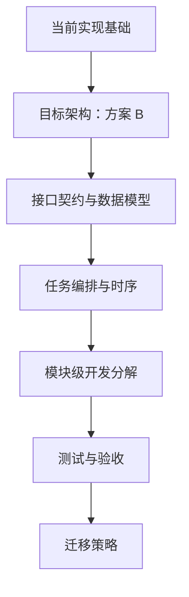
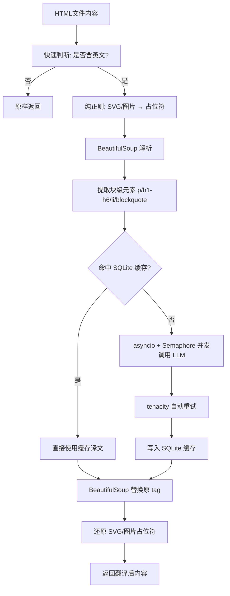
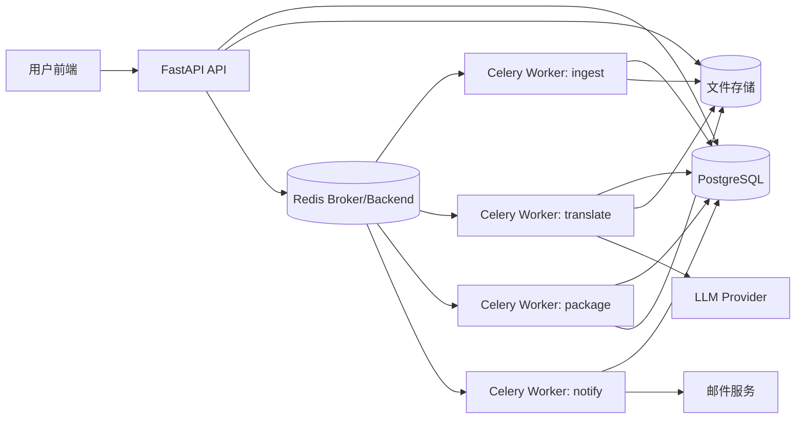
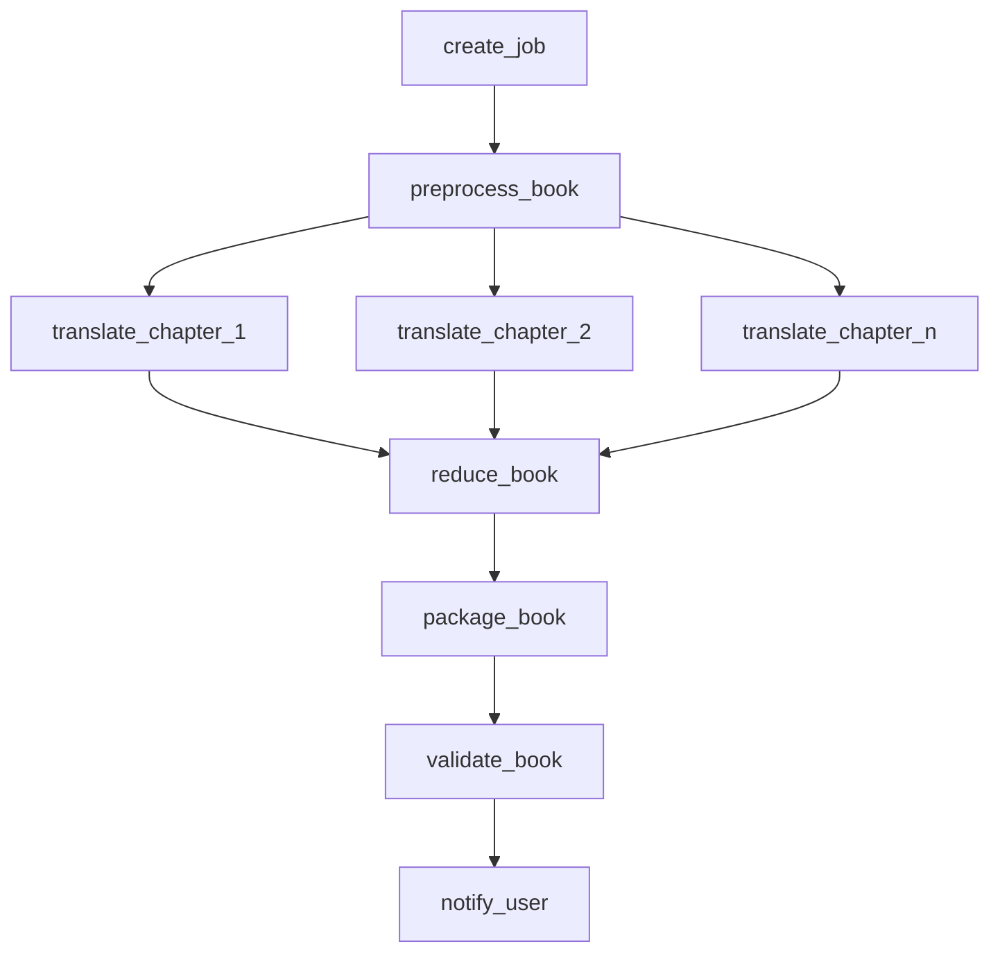
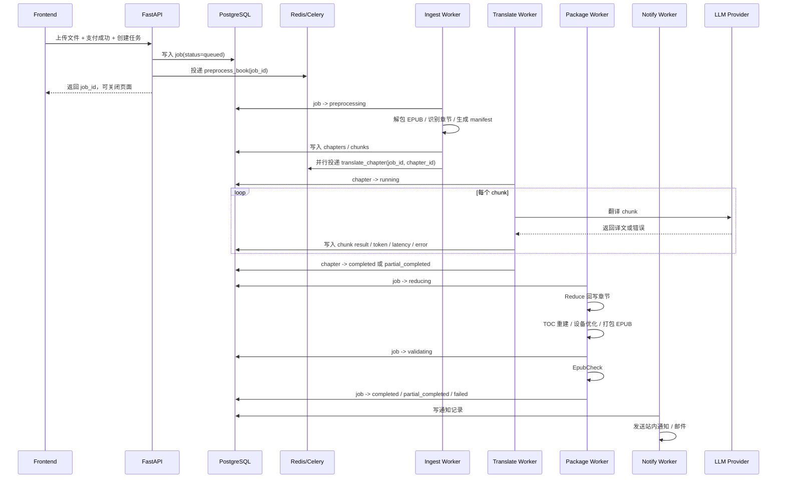

# EPUB Fixer AI 翻译模块设计

> 在完成核心引擎 `ExtremeCompiler` 的排版清洗之后，AI 翻译是最有商业价值但技术挑战最大的功能。
> 核心目标：**保留排版（HTML 结构、标签、属性）的前提下完成全书翻译**。

---

## 导读：如何使用本文档

### 阅读路径

| 角色/目的 | 推荐阅读章节 |
|---|---|
| 产品与决策视角 | `八、目标架构` → `九、实施路线图` → `十、接口契约` → `十四、测试与验收策略` → `十五、迁移策略` |
| 工程实施视角 | `一、核心技术难点` → `二、当前实现架构` → `八、目标架构` → `十、接口契约` → `十一、数据模型` → `十二、任务编排` → `十三、模块级开发分解` |
| 排障与质量视角 | `六、质量评估与人工抽检` → `十、接口契约` → `十一、数据模型` → `十二、任务编排` → `十四、测试与验收策略` |

### 文档结构图



### 文档分区

- `一` 到 `七`：当前 MVP 的技术基础、约束、质量与未来演进方向
- `八` 到 `十二`：方案 B 的目标架构、API、数据模型、任务时序
- `十三` 到 `十五`：模块级实施、测试策略、从现有代码迁移的对照清单

---

## 一、核心技术难点

### 1.1 DOM 碎片化陷阱（最棘手）

EPUB 的 HTML 中，一句话经常被标签切碎：

```html
She was <i class="emphasis">very</i> angry.
```

若按文本节点分割，会得到三块独立片段，分别翻译后语法崩塌。

**解决方案**：连同 HTML 标签整块发给 LLM，在 System Prompt 中严厉要求"**保持所有 HTML/XML 标签结构绝对不变，仅翻译文本**"。现代大模型（DeepSeek-Chat、GPT-4o）具备此能力。

### 1.2 SVG / 图片污染风险

BeautifulSoup 的 XML 解析器会把 SVG 大小写敏感属性强制小写（`preserveAspectRatio` → `preserveaspectratio`），导致封面/插图显示异常。

**解决方案（占位符法）**：在进入 BeautifulSoup 之前，纯正则把所有 `<svg>...</svg>`、``、`<image>` 替换为字符串占位符，翻译完成后原样替换回来，绕过 DOM 解析。

### 1.3 并发与 API 限流

串行翻译一整本书可能需要数小时。

**解决方案**：`asyncio` + `Semaphore(5)` 控制并发数，配合 `tenacity` 指数退避（2s/4s/8s）自动重试 429 错误。

### 1.4 中断重翻成本

翻译中途失败若从头重翻，浪费大量 Token 费用。

**解决方案**：SQLite 本地缓存（`translation_cache.db`），对每个 HTML chunk 计算 SHA-256 哈希，命中缓存直接返回，实现完美断点续传。

### 1.5 失败时已转换内容的存储与复用

**现状**：

- **跨任务/重试复用**：`TranslationCache` 按「原文内容哈希 + target_lang」存储译文。同一本书（或相同段落）在**重新提交**或**新任务**中再次出现时，命中缓存的 chunk 直接返回已存译文，**不重复调用 LLM、不重复消耗 Token**。翻译过程中每成功写完一个 chunk 即写入缓存，因此任务在中途失败时，**已翻译过的段落**在下次运行（同机、同库）中会自动命中缓存。
- **同任务续跑（Resume）**：当前同步流水线（`job_runner` + `ExtremeCompiler`）是「一次跑完全书」，失败后若用户再次提交**同一任务**，会重新从头执行，但其中与上次相同的 chunk 会通过 `TranslationCache` 命中，仅未翻译过的段落会再次请求 LLM。Celery MapReduce 路径下若持久化了 `job_chunks`，后续可扩展为「按 job_id 加载已完成的 chunk，只翻译未完成部分」，实现真正的断点续传。

**建议**：

- 产品/文案上可明确告知用户：「若转换失败，重新提交同一文件时，已成功翻译过的内容会从缓存读取，不会重复计费。」
- 可选实现：在同步流水线中按 chunk 写入 `job_chunks`（与 Celery 路径一致），任务失败或取消后，重试同一 job 时先加载已有 chunk，只对缺失 chunk 调用翻译，进一步减少重复请求与等待时间。

---

## 二、当前实现架构（MVP）



### 文件结构

| 文件 | 职责 |
|---|---|
| `engine/translation_cache.py` | SQLite 初始化、SHA-256 哈希、读写操作 |
| `engine/cleaners/semantics_translator.py` | 核心翻译器：占位符保护、并发控制、LLM 调用、统计报告 |
| `engine/compiler.py` | 通过 `enable_translation=True` 参数激活翻译器 |

---

## 三、当前 LLM 接入配置

通过环境变量控制，支持热替换任意兼容 OpenAI 协议的模型：

```bash
# .env
OPENAI_API_KEY=sk-xxx
OPENAI_BASE_URL=https://api.deepseek.com/v1   # 或 https://api.openai.com/v1
OPENAI_MODEL=deepseek-chat                     # 或 gpt-4o-mini
```

### 已知模型定价参考（每百万 Token）

| 模型 | Input | Output | 推荐场景 |
|---|---|---|---|
| `deepseek-chat` | $0.27 | $1.10 | 性价比首选 |
| `gpt-4o-mini` | $0.15 | $0.60 | 低成本备选 |
| `gpt-4o` | $2.50 | $10.00 | 高质量要求 |
| `deepseek-reasoner` | $0.55 | $2.19 | 复杂结构专用 |

### 3.1 方案 B 的模型路由原则

不同转换任务不应强绑定到同一个模型。进入方案 B 后，建议采用“**产品档位 -> 路由策略 -> 实际模型**”三层抽象：

- 产品档位：前台展示给用户的可购买服务，如 `标准版`、`专业版`、`高精度版`
- 路由策略：根据书籍复杂度、任务类型、语言方向选择主模型与 fallback 模型
- 实际模型：后端真实调用的 `deepseek-chat`、`gpt-4o-mini`、`gpt-4o` 等

推荐路由思路：

| 任务类型 | 推荐主模型 | 推荐回退模型 | 定位 |
|---|---|---|---|
| 基础全文翻译 | `deepseek-chat` | `gpt-4o-mini` | 成本优先 |
| 高保真翻译 | `gpt-4o-mini` / `gpt-4o` | `deepseek-chat` | 质量优先 |
| 复杂结构书（术语/STEM/脚注密集） | `gpt-4o` / `deepseek-reasoner` | `gpt-4o-mini` | 稳定性与结构保护优先 |

### 3.2 定价原则

定价不建议直接暴露“某个模型多少钱”，而建议采用：

- 用户购买的是“服务档位”
- 后端保存的是“真实模型与理论成本”
- 价格规则由 `pricing matrix` 决定，而不是直接由模型名决定

建议分三层记录：

1. 前台展示价格：用户真正支付的价格
2. 任务理论成本：按 token 与模型定价估算出的内部成本
3. 实际调用记录：主模型、fallback 模型、token 消耗、重试次数

建议的第一阶段价格策略：

- 基础排版转换：不走 LLM，不单独计费
- 标准全文翻译：固定按次收费
- 高精度翻译：高于标准版的固定按次收费

后续演进方向：

- 按模型档位差异定价
- 按 token 或字数分段定价
- 按复杂度（例如 STEM/高术语密度）增量定价

---

## 四、Prompt 设计

```
你是一位顶级的书籍翻译专家。目标语言是：{target_lang}。
用户将给你一段包含 HTML 标签的文本。
规则：
1. 翻译文本内容，使其符合目标语言的母语表达习惯，信达雅。
2. 绝对不能修改、增加或删除任何 HTML 标签及属性（如 id, class, href）。
3. 保持标签与对应文字的包裹关系完全一致。
4. 只输出翻译后的 HTML 字符串，不要输出任何解释，不要包含 markdown 代码块外壳。
```

---

## 五、统计与成本透明（Token 经济学）

每次翻译任务结束后输出 `TranslationStats` 摘要：

```
==================================================
📊 翻译统计报告
==================================================
  模型: deepseek-chat
  总段落数: 1,234
  命中缓存: 89
  API 调用: 1,145
  失败次数: 0
  ─────────────────────
  Prompt Tokens:     245,678
  Completion Tokens: 312,456
  Total Tokens:      558,134
  ─────────────────────
  预估费用: $0.4092 USD
  耗时: 142.3s
==================================================
```

---

## 六、质量评估与人工抽检

`backend/test_step2_quality_eval.py` 提供自动抽样对比报告：

- 从原文与译文 EPUB 中提取同位置段落
- 自动判断：是否已翻译、是否含中文、长度比
- 生成 `translation_quality_report.md`，供人工审阅

### 6.1 推荐的人机协同抽检流程

人工抽检不建议“通读整本书”，而应采用“**机器预筛 + 人工复核**”：

#### 第一步：机器预筛

先由程序自动筛出高风险段落：

- 译文没有中文字符
- 原文与译文相似度过高
- 长度比异常（过长/过短）
- HTML 结构异常
- 命中了术语表但译法疑似不一致

#### 第二步：人工抽样

对每本书优先抽以下位置：

- 导航/目录页
- 正文开头章节
- 正文中段章节
- 附录/索引/版权页
- 图片、表格、脚注密集章节

每个章节优先抽 3 到 5 段：

- 含粗体/斜体/链接的段落
- 长段落
- 专有名词密集段
- 含数字、年份、单位的段落
- 标题、列表、引用块

#### 第三步：人工判定标签

建议统一使用以下标签：

- `已翻译`
- `未翻译`
- `误译`
- `漏译`
- `过度发挥`
- `术语不一致`
- `结构破坏`
- `非正文误翻译`
- `正文误跳过`

#### 第四步：抽检结论

每本书最终给出一个人工结论：

- `可交付`
- `可交付但需人工复核`
- `不建议交付`

并记录：

- 抽检通过率
- 关键问题数

### 6.2 人工抽检是否需要前端

第一阶段**不需要专门前端页面**，后端生成结构化 Markdown/JSON 报告即可，人工可直接审阅：

- `translation_quality_report.md`
- 或未来的 `quality_report.json`

原因：

- 首阶段重点是验证流程与质量口径，而不是先做审核平台
- 抽检量通常远小于普通用户任务量，先用 Markdown 报告更轻、更快
- 工程上更利于调试和问题复盘

但进入产品化阶段后，建议补一个轻量前端审核页，用于：

- 快速查看高风险段落
- 标注问题标签
- 汇总抽检结果
- 反哺术语表、提示词与黑名单规则

因此结论是：

- **现在**：人工抽检不需要前端，报告文件足够
- **后续规模化**：建议增加内部审核前端，而不是面向普通用户开放

### 已知翻译质量问题

| 问题类型 | 示例 | 原因 |
|---|---|---|
| 导航文件未翻译 | `nav.xhtml` 中的章节目录 | 导航文件被 TocRebuilder 排除处理 |
| 长度比异常（> 3 或 < 0.2） | 模型扩写或截断 | 需在 Prompt 中补充"保持内容完整性"要求 |

---

## 七、未来演进方向（P2）

### 7.1 术语表注入（RAG）

允许用户上传专有名词映射表，在 Prompt 中作为 Context 传入，保证人名、地名翻译统一。

### 7.2 双语对照输出

不直接覆盖原标签，而是将翻译后的标签插入原标签下方，配合特殊 CSS class 实现双屏对照阅读体验：

```html
<p class="original">She was very angry.</p>
<p class="zh-cn">她非常愤怒。</p>
```

### 7.3 上下文记忆（前情提要）

单章节过大时（超过 2000 tokens）按 `<p>` 分块，并携带"前情提要"保证人称、称呼的跨块一致性。

### 7.4 商业化定位

由于涉及密集 API 调用，建议作为**高级订阅功能（Pro/Premium）**，按字数或 Token 计费，确保商业模式跑通。

---

## 八、目标架构：方案 B（后台任务化 + MapReduce）

### 8.1 目标

当前翻译链路仍偏向"前端发起后持续轮询"的同步体验，不适合长篇 EPUB 翻译。下一阶段直接采用 **方案 B**：

- 将翻译改造成真正的后台任务，用户关闭页面后任务继续执行
- 引入 `Redis + Celery + PostgreSQL` 作为正式任务底座
- 将 EPUB 翻译过程重构为 **章节级任务调度 + 章节内块级 Map + 全书级 Reduce**
- 在任务完成后通过站内通知/邮件通知用户，而不是要求用户长时间停留在前端页面

### 8.2 目标架构



### 8.3 MapReduce 设计原则

#### Map 阶段

- 按章节拆分任务，每章生成标准化 `manifest`
- 章节内部按段落块（chunk）并发翻译
- 每个 chunk 独立记录缓存命中、模型、耗时、Token、错误原因

#### Reduce 阶段

- 按 `locator/xpath` 将 chunk 结果回写到原章节 XHTML
- 支持单语覆盖和双语并排两种输出模式
- 汇总章节级统计，最终重建目录、打包 EPUB、执行 EpubCheck

#### 为什么不用"每段一个 Celery 任务"

- 队列开销过大
- 调度成本高于收益
- 更容易触发外部 LLM 限流

因此采用：

- 章节级 Celery Task
- 章节内部 `asyncio` 并发
- 全书级 Reduce 汇总

---

## 九、实施路线图（按功能项）

### 9.1 底座与数据模型

- [ ] 基础设施起盘：引入 `Redis + Celery + PostgreSQL`，补齐 `.env.example`、依赖与启动脚本
- [ ] 任务数据模型与建表：新增 `jobs / job_chapters / job_chunks / job_stages / notifications`
- [x] API v2 骨架：新增 `POST /api/v2/jobs`、`GET /api/v2/jobs`、`GET /api/v2/jobs/{id}`（含 download/stats/events/cancel/notifications，见 test_d3_api_v2_skeleton.py）

### 9.2 后台任务化

- [x] 现有整本转换迁入 Celery：先把当前 `convert_file_to_horizontal()` 整体迁入 Worker（`job_runner.run_job` + `tasks.job_pipeline.run_conversion`，v1/v2 创建时按 REDIS_URL/CELERY_BROKER_URL 选择 Celery 或 BackgroundTasks）
- [x] 阶段状态与结构化日志：记录 `preprocessing / translating / packaging / validating` 阶段，并统一 `trace_id`（compiler stage_callback、job_runner 写入 store、v2 events 返回，见 test_d5_stage_events）
- [x] 任务详情与任务中心最小前端：上传后进入后台队列，用户可关闭页面后稍后返回查看结果（index.html 任务中心 Tab、GET /api/v2/jobs 列表、创建用 POST /api/v2/jobs、可关闭页面提示与「前往任务中心」、?job_id= 直链）

### 9.3 MapReduce 重构

- [x] Manifest 设计与正文识别：完成 EPUB 解包、正文/非正文分类、chunk manifest 生成（domain/manifest_service.build_manifest、engine/chunk_extractor、ChapterKind 分类，见 test_d6_manifest）
- [x] 章节级翻译任务拆分：实现 `translate_chapter(job_id, chapter_id)`，章节内继续按 chunk 并发（SemanticsTranslator.translate_single_chunk_async、chapter_translation_service、jobs.translate_chapter 任务，见 test_d7_translate_chapter）
- [x] chunk 结果持久化：写入缓存命中、模型、Token、耗时、错误原因（SingleChunkResult、ChunkResult 扩展、chapter_translation_service 调用 job_store.upsert_chunk；内存 store 实现 upsert_chunk/list_chunks，见 test_d7 中 test_upsert_chunk_memory_store）
- [x] Reduce 回写章节：按 `locator/xpath` 回填译文，支持单语与双语模式（domain/chapter_reduce_service：get_node_by_locator、apply_chunk_results，见 test_d8_reduce）
- [x] 全书 Reduce 与打包：重建目录、设备优化、重新打包 EPUB（domain/book_reduce_service：reduce_and_package、set/get_chapter_output；章节翻译结果写 reduced_html 并落盘供打包；见 test_d9_book_reduce）

### 9.4 质量、通知与稳定性

- [x] EpubCheck 与状态判定：明确 `completed / partial_completed / failed` 的边界，杜绝假成功（compiler._run_epubcheck 返回 bool，validation_passed 写入 ConversionResult；job_runner 用 status_resolver 判定，校验未通过标 failed + EPUB_VALIDATION_FAILED，见 test_d10_status_resolver）
- [x] 通知系统第一版：站内通知 + 邮件通知（domain/notification_service：notify_job_completed 写站内 + 可选邮件；job_runner 完成后调用；内存 store add/list_notifications；GET /api/v2/notifications，见 test_d11_notifications）
- [x] 翻译链路增强：补主/备 `base_url`、模型 fallback、连接池、超时、指数退避、结果校验（SemanticsTranslator 已有 base_url/model fallback、httpx 连接池、超时与重试；本项新增退避 jitter、结果校验 _looks_like_html/_looks_like_error_response，.env.example 与 test_d12_translation_enhancement）
- [x] 回归与压测：覆盖上传、排队、后台执行、任务中心、通知、下载、失败处理的端到端链路（test_d13_regression：E2E 翻译全失败必返 failed、任务结束后有通知；run_regression.py 跑齐 D1–D13 + C1–C6）

### 9.5 实施顺序要求

必须按以下顺序推进，避免范围失控：

1. 底层基础设施
2. 数据模型与建表
3. API v2 骨架
4. 后台任务化
5. 阶段可观测性
6. Manifest 标准化
7. 章节级翻译任务
8. Reduce 回写
9. 打包与校验
10. 通知系统
11. 翻译链路增强
12. 回归与压测

### 9.6 验收标准

- [ ] 前端关闭页面后，后台任务仍可持续执行
- [ ] 翻译全失败时必须返回 `failed`，不得再伪装为 `success`
- [ ] 部分翻译失败时必须返回 `partial_completed`，并提供明确错误码
- [ ] `/api/v2/jobs/{job_id}` 能返回结构化 `translation_stats`、`metrics_summary` 和阶段信息
- [ ] 完成后用户可通过任务中心或通知入口获取结果，不再依赖长时间前端轮询

---

## 十、接口契约：API v2

### 10.1 设计原则

- 前端只与 `job`、`stats`、`events`、`notifications` 交互，不感知 Celery 细节
- 所有长任务围绕 `job_id` 组织
- `message` 给用户看，`error_code` 给程序判定
- `completed` 必须代表结果可下载且可信，`partial_completed` 必须明确告警

### 10.2 Job 状态枚举

```json
[
  "queued",
  "preprocessing",
  "mapping",
  "translating",
  "reducing",
  "packaging",
  "validating",
  "completed",
  "partial_completed",
  "failed",
  "cancelled"
]
```

### 10.3 错误码枚举

```json
[
  "CONVERT_FAILED",
  "TRANSLATION_FAILED",
  "PARTIAL_TRANSLATION",
  "UPLOAD_TOO_LARGE",
  "UNSUPPORTED_TYPE",
  "LLM_TIMEOUT",
  "LLM_CONNECTION_ERROR",
  "LLM_RATE_LIMIT",
  "EPUBCHECK_FAILED",
  "INTERNAL_ERROR"
]
```

**引擎加载失败与安全模式**：当 EPUB 无法被 `ebooklib` 解析时，会抛出 `Failed to load EPUB` 或（在回退到安全模式后再次加载失败时）`Failed to load EPUB in safe mode`，对应错误码 `CONVERT_FAILED`。实现上已做两点改进：(1) 安全模式优先复用首次已成功加载的 `book`，避免二次加载同一文件失败；(2) `EpubUnpacker` 保留并上抛最后一次加载异常信息，接口/前端可展示具体原因（如文件损坏、格式不兼容），便于用户排障。

### 10.4 核心接口

| 接口 | 方法 | 作用 |
|---|---|---|
| `/api/v2/jobs` | `POST` | 上传文件并创建后台任务 |
| `/api/v2/jobs` | `GET` | 获取任务中心列表 |
| `/api/v2/jobs/{job_id}` | `GET` | 获取任务详情 |
| `/api/v2/jobs/{job_id}/download` | `GET` | 下载结果 EPUB |
| `/api/v2/jobs/{job_id}/stats` | `GET` | 获取章节/块级聚合统计 |
| `/api/v2/jobs/{job_id}/events` | `GET` | 获取结构化阶段日志 |
| `/api/v2/jobs/{job_id}/cancel` | `POST` | 取消任务 |
| `/api/v2/notifications` | `GET` | 获取站内通知列表 |

### 10.5 `POST /api/v2/jobs`

用途：上传文件并创建后台任务，创建后立即返回，前端不再同步等待。

请求字段：

- `file`
- `output_mode`
- `device`
- `enable_translation`
- `target_lang`
- `bilingual`
- `glossary_json`
- `paypal_order_id`

响应示例：

```json
{
  "job_id": "job_01hvx8r2m6",
  "trace_id": "tr_9ffa299f8ffb4197",
  "status": "queued",
  "message": "任务已创建，已进入后台队列",
  "source_filename": "How the World Really Works.epub",
  "enable_translation": true,
  "target_lang": "zh-CN",
  "bilingual": false,
  "device": "generic",
  "created_at": "2026-03-10T16:20:00Z"
}
```

### 10.6 `GET /api/v2/jobs/{job_id}`

用途：任务详情页核心接口，返回状态、阶段、质量统计、翻译统计、下载地址。

响应示例：

```json
{
  "job_id": "job_01hvx8r2m6",
  "trace_id": "tr_9ffa299f8ffb4197",
  "status": "translating",
  "message": "正在翻译 chap_06，已完成 42/108 段",
  "source_filename": "How the World Really Works.epub",
  "output_mode": "simplified",
  "device": "generic",
  "enable_translation": true,
  "target_lang": "zh-CN",
  "bilingual": false,
  "error_code": null,
  "download_url": null,
  "quality_stats": {
    "css_cleaned": 12,
    "typography_fixed": 0,
    "toc_generated": 0,
    "stem_protected": 2
  },
  "translation_stats": {
    "model": "deepseek-chat",
    "total_chunks": 108,
    "translated_chunks": 42,
    "cached_chunks": 11,
    "failed_chunks": 3,
    "api_calls": 34,
    "total_tokens": 32353,
    "cost_usd": 0.0203,
    "elapsed_seconds": 194.3,
    "connection_errors": 1,
    "last_error": "ReadTimeout",
    "all_failed": false
  },
  "metrics_summary": "⏱ Pipeline ...",
  "stage_summary": {
    "current_stage": "translating",
    "progress_percent": 46
  }
}
```

### 10.7 `GET /api/v2/jobs/{job_id}/stats`

用途：返回章节级和块级的聚合统计，供任务详情页或后台管理页使用。

响应示例：

```json
{
  "job_id": "job_01hvx8r2m6",
  "summary": {
    "status": "partial_completed",
    "chapters_total": 12,
    "chapters_completed": 10,
    "chapters_partial": 1,
    "chapters_failed": 1,
    "chunks_total": 108,
    "chunks_translated": 91,
    "chunks_cached": 14,
    "chunks_failed": 3,
    "tokens_total": 71231,
    "cost_usd": 0.0441
  }
}
```

### 10.8 `GET /api/v2/jobs/{job_id}/events`

用途：返回结构化事件流，用于前端渲染进度时间线，而不是仅依赖一条 `message`。

响应示例：

```json
{
  "items": [
    {
      "time": "2026-03-10T16:20:01Z",
      "level": "info",
      "stage": "preprocessing",
      "message": "开始解包 EPUB"
    },
    {
      "time": "2026-03-10T16:21:12Z",
      "level": "warn",
      "stage": "translating",
      "message": "chap_06 chunk_003 连接超时，准备重试"
    }
  ]
}
```

---

## 十一、数据模型：核心表结构与 Manifest

### 11.1 `jobs`

用途：保存任务的主状态、输出文件路径、总体统计和最终错误信息。

建议字段：

- `id`
- `user_id`
- `trace_id`
- `source_filename`
- `source_path`
- `output_path`
- `status`
- `output_mode`
- `device`
- `enable_translation`
- `target_lang`
- `bilingual`
- `glossary_json`
- `message`
- `error_code`
- `error_message`
- `quality_stats_json`
- `translation_stats_json`
- `metrics_summary`
- `notify_status`
- `created_at`
- `updated_at`
- `finished_at`

### 11.2 `job_chapters`

用途：保存章节级执行状态，是章节级 Celery Task 的最小观察单位。

建议字段：

- `job_id`
- `chapter_id`
- `file_path`
- `chapter_kind`
- `status`
- `chunk_total`
- `chunk_success`
- `chunk_failed`
- `chunk_cached`
- `started_at`
- `finished_at`
- `error_message`

### 11.3 `job_chunks`

用途：保存 chunk 级翻译结果与失败明细，支持失败重试、统计和质量排查。

建议字段：

- `job_id`
- `chapter_id`
- `chunk_id`
- `sequence`
- `locator`
- `source_hash`
- `status`
- `cached`
- `model`
- `base_url`
- `retry_count`
- `prompt_tokens`
- `completion_tokens`
- `latency_ms`
- `error_message`
- `created_at`
- `updated_at`

### 11.4 `job_stages`

用途：保存全局阶段耗时与状态，支撑 `metrics_summary` 和时间线展示。

建议字段：

- `job_id`
- `stage_name`
- `status`
- `started_at`
- `finished_at`
- `elapsed_ms`
- `metadata_json`

### 11.5 `notifications`

用途：保存站内通知和邮件发送记录，避免通知与主任务状态混在一起。

建议字段：

- `job_id`
- `user_id`
- `channel`
- `status`
- `payload_json`
- `sent_at`
- `error_message`
- `created_at`

### 11.6 Chunk Manifest 标准格式

Map 阶段的核心中间产物建议统一为标准 JSON：

```json
{
  "job_id": "job_123",
  "chapters": [
    {
      "chapter_id": "chap_06",
      "file_path": "EPUB/xhtml/06_1_Understanding_Energ.xhtml",
      "chapter_kind": "body",
      "chunks": [
        {
          "chunk_id": "chap_06_0001",
          "sequence": 1,
          "locator": "/html/body/div/p[1]",
          "html": "<p>Energy is...</p>",
          "text": "Energy is...",
          "word_count": 34,
          "char_count": 187
        }
      ]
    }
  ]
}
```

字段约束：

- `locator` 必须稳定，用于 Reduce 精准回写
- `sequence` 必须可排序
- `html` 与 `text` 分离，便于同时做结构保护和翻译质量检查

---

## 十二、任务编排：后台任务与 MapReduce 时序

### 12.1 Celery 任务依赖图



### 12.2 端到端时序图



### 12.3 状态流转规则

任务必须遵守以下规则：

1. `completed` 只用于结果可信且可下载的任务
2. `partial_completed` 用于部分译文失败但结果仍可交付的任务
3. `failed` 用于全翻译失败、打包失败、校验失败等不可交付场景
4. `notify` 阶段不得反向影响主任务状态，通知失败只记录到 `notifications`

### 12.4 实施注意事项

- Celery Worker 必须使用幂等设计，避免同一章节被重复投递时造成重复写入
- 最终输出文件必须采用临时文件 + 原子 rename，避免半成品覆盖正式结果
- 章节级任务是推荐粒度；不建议第一版直接把每个 chunk 拆成独立 Celery Task

---

## 十三、模块级开发分解

### 13.1 后端 API 层

涉及文件：

- `backend/app/main.py`
- `backend/app/api/jobs_v2.py`（新增）
- `backend/app/api/notifications.py`（新增）
- `backend/app/schemas/job_v2.py`（新增）

开发任务：

- [ ] 从 `v1` 中剥离后台任务逻辑，新增 `v2` 接口
- [ ] 实现 `POST /api/v2/jobs`，仅负责创建任务、保存文件、投递队列
- [ ] 实现 `GET /api/v2/jobs`、`GET /api/v2/jobs/{id}`、`GET /api/v2/jobs/{id}/stats`
- [ ] 实现 `GET /api/v2/jobs/{id}/events` 与 `POST /api/v2/jobs/{id}/cancel`
- [ ] 实现通知列表与已读接口

验收重点：

- API 不再直接执行长时间翻译
- 接口返回结构与 `API v2 契约摘要` 一致

### 13.2 存储与数据层

涉及文件：

- `backend/app/models.py`
- `backend/app/storage.py`
- `backend/app/storage_db.py`
- `backend/app/repositories/job_repository.py`（新增）
- `backend/app/repositories/chunk_repository.py`（新增）
- `backend/app/repositories/stage_repository.py`（新增）

开发任务：

- [ ] 扩展 `Job` 结构，支持 `translation_stats`、`metrics_summary`、`notify_status`
- [ ] 新增 `job_chapters`、`job_chunks`、`job_stages`、`notifications` 持久化逻辑
- [ ] 建立迁移脚本，确保旧库可平滑升级
- [ ] 为 chunk 级写入和读取提供 repository 封装

验收重点：

- 任务状态、章节状态、chunk 状态都能从 DB 准确恢复
- 服务重启后任务详情不丢失

### 13.3 Celery 与任务编排

涉及文件：

- `backend/app/infra/celery_app.py`（新增）
- `backend/app/tasks/job_pipeline.py`（新增）
- `backend/app/tasks/ingest.py`（新增）
- `backend/app/tasks/translate.py`（新增）
- `backend/app/tasks/package.py`（新增）
- `backend/app/tasks/notify.py`（新增）

开发任务：

- [ ] 接入 `Celery + Redis`
- [ ] 将现有整本转换先迁入 `job_pipeline`
- [ ] 再拆分为 `preprocess_book / translate_chapter / reduce_book / package_book / validate_book / notify_user`
- [ ] 配置任务重试、延迟确认、队列隔离

验收重点：

- 用户关闭页面后任务仍继续
- Worker 重启后状态可恢复或明确失败

### 13.4 EPUB Manifest 与正文识别

涉及文件：

- `backend/app/domain/manifest_service.py`（新增）
- `backend/app/engine/chunk_extractor.py`（新增）
- `backend/app/engine/unpacker.py`
- `backend/app/engine/compiler.py`

开发任务：

- [ ] 识别 EPUB 中文件类型：正文、导航、版权、附录、索引等
- [ ] 生成章节级 manifest
- [ ] 为每个 chunk 生成稳定 `locator/xpath`
- [ ] 输出标准 `manifest.json`

验收重点：

- 正文识别正确率可人工抽检
- `locator` 足够稳定，可支持后续 Reduce 精准回写

### 13.5 翻译执行层

涉及文件：

- `backend/app/engine/cleaners/semantics_translator.py`
- `backend/app/domain/chapter_translation_service.py`（新增）
- `backend/app/engine/translation_cache.py`

开发任务：

- [ ] 将翻译粒度从整本迁到章节内 chunk
- [ ] 写入 chunk 级结果：成功、失败、缓存命中、tokens、latency
- [ ] 增强连接稳定性：base_url fallback、model fallback、timeout、retry、jitter
- [ ] 增加结果校验：结构合法、目标语言特征、原文相似度检测

验收重点：

- 不再出现“全英文但任务 success”
- 翻译失败可清晰归类到连接、超时、限流、结构不合法等类型

### 13.6 Reduce、打包与校验

涉及文件：

- `backend/app/domain/reducer_service.py`（新增）
- `backend/app/engine/reducers/xhtml_reducer.py`（新增）
- `backend/app/packager.py`
- `backend/app/engine/toc_rebuilder.py`
- `backend/app/engine/compiler.py`

开发任务：

- [ ] 读取 manifest 与 chunk result，按 `locator` 回写章节 XHTML
- [ ] 支持双语模式写回
- [ ] 汇总章节结果后执行 TOC 重建、设备优化、打包 EPUB
- [ ] 接入 EpubCheck，判定 `completed / partial_completed / failed`

验收重点：

- 译文真实写回 EPUB，而不是只停留在日志/缓存中
- 失败状态判定准确，避免误导用户

### 13.7 前端任务中心与通知中心

涉及文件：

- `frontend/index.html`
- `frontend/lib.js`
- `frontend/tasks.html`（新增）
- `frontend/task-detail.html`（新增）
- `frontend/tasks.js`（新增）

开发任务：

- [ ] 上传成功后跳转任务详情页或任务中心
- [ ] 展示任务状态、翻译统计、质量统计、阶段信息、下载入口
- [ ] 支持通知列表、已读状态、失败原因展示
- [ ] 保留原有上传能力，但不再要求用户长时间停留等待

验收重点：

- 前端职责从“盯住轮询页”转为“查看后台任务状态”
- 失败和部分成功都能被用户明确感知

---

## 十四、测试与验收策略

### 14.1 是否需要测试用例

需要，而且是这次重构的**硬性要求**，不是锦上添花。

原因：

- 方案 B 会把系统从“单进程 API + 本地状态”升级成“后台任务系统”
- MapReduce 重构会引入更多中间状态、更多失败路径、更多幂等要求
- 没有测试的话，极容易再次出现：
  - 翻译失败却显示成功
  - 前端状态正常但结果文件没有写回译文
  - Worker 重启后任务丢失
  - 通知已发但文件不可下载

### 14.2 测试分层

#### 单元测试

目标：验证最小逻辑单元。

建议覆盖：

- `manifest` 生成
- 正文/非正文识别
- chunk locator 稳定性
- 结果校验逻辑
- 状态流转函数
- 错误码映射
- 通知 payload 生成

建议位置：

- `backend/tests/unit/`
- `frontend/tests/`

#### 集成测试

目标：验证模块之间协作。

建议覆盖：

- API 创建任务 -> DB 写入 -> Celery 投递
- 章节级翻译任务 -> chunk result 入库
- Reduce -> 打包 -> 校验
- 通知写入与读取

建议位置：

- `backend/tests/integration/`

#### 端到端测试

目标：验证真实用户链路。

建议覆盖：

1. 上传 EPUB -> 后台翻译 -> 完成 -> 下载
2. 上传后关闭页面 -> 稍后回来 -> 结果仍可见
3. 模拟 LLM 连接失败 -> 任务必须 `failed`
4. 模拟部分 chunk 失败 -> 任务必须 `partial_completed`
5. 通知发出后任务详情和下载状态一致

建议位置：

- `backend/tests/e2e/`
- 若后续接浏览器自动化，可加 `browser` 测试

### 14.3 必测故障场景

以下故障路径必须有测试，不可只测 happy path：

- [ ] 所有翻译块都失败
- [ ] 只有部分章节失败
- [ ] Reduce 过程失败
- [ ] 打包成功但 EpubCheck 失败
- [ ] Worker 中途中断
- [ ] 任务被重复投递
- [ ] 通知发送失败
- [ ] 下载文件丢失或路径失效

### 14.4 当前工程的测试迁移建议

当前已有前端纯函数测试，应继续保留并扩展：

- `frontend/tests/test_f1_bilingual.js`
- `frontend/tests/test_f2_metrics.js`
- `frontend/tests/test_f3_cost.js`
- `frontend/tests/test_f4_f5_safemode_errorcode.js`
- `frontend/tests/test_f6_history.js`
- `frontend/tests/test_f7_glossary_input.js`

建议新增：

- `frontend/tests/test_f8_job_center.js`
- `frontend/tests/test_f9_notifications.js`
- `frontend/tests/test_f10_v2_api_mapping.js`

后端建议从现有零散测试迁移到分层结构：

- `backend/tests/unit/test_manifest.py`
- `backend/tests/unit/test_chunk_validator.py`
- `backend/tests/unit/test_status_machine.py`
- `backend/tests/integration/test_v2_jobs_api.py`
- `backend/tests/integration/test_translate_chapter_task.py`
- `backend/tests/integration/test_reduce_and_package.py`
- `backend/tests/e2e/test_background_job_flow.py`

### 14.5 验收口径

当以下条件同时满足时，方案 B 才算进入可上线状态：

1. 单元测试覆盖核心状态机、manifest、chunk 校验逻辑
2. 集成测试覆盖 API -> 队列 -> DB -> 打包主链路
3. 至少有 1 条 E2E 用例覆盖“关闭页面后后台完成任务”
4. 至少有 1 条 E2E 用例覆盖“翻译全失败必须 failed”
5. 通知与下载链路至少有 1 条联动测试

---

## 十五、迁移策略：从现有代码平滑过渡到方案 B

### 15.1 迁移策略总原则

本次迁移不建议“全量推倒重写”，而应采用：

1. 保留已验证的 EPUB 处理能力
2. 先把执行模型从“请求内处理”迁到“后台任务处理”
3. 再把翻译链路从“整本黑盒”拆成“章节级任务 + chunk 级结果”

也就是说，**优先重构编排层，不优先重写清洗器本身**。

### 15.2 可直接复用的现有模块

以下模块已经具备较强复用价值，应尽量保留：

| 现有文件 | 当前职责 | 方案 B 中的去向 | 处理建议 |
|---|---|---|---|
| `backend/app/engine/unpacker.py` | 解包 EPUB | Ingest 阶段基础能力 | 直接复用，补 manifest 输出能力 |
| `backend/app/engine/packager.py` | 打包 EPUB | Package 阶段核心能力 | 直接复用，改为由 Celery package task 调用 |
| `backend/app/engine/toc_rebuilder.py` | 重建 TOC | Reduce / Package 阶段 | 直接复用 |
| `backend/app/engine/translation_cache.py` | SQLite 翻译缓存 | chunk 翻译缓存层 | 保留接口，后续可升级为 Redis/DB 辅助索引 |
| `backend/app/engine/cleaners/css_sanitizer.py` | CSS 清洗 | Reduce 后处理 | 直接复用 |
| `backend/app/engine/cleaners/cjk_normalizer.py` | CJK 横排转换 | 预处理 / SafeMode | 直接复用 |
| `backend/app/engine/cleaners/device_profile.py` | 设备优化 | Package 前后处理 | 直接复用 |
| `backend/app/engine/cleaners/typography_enhancer.py` | 排版增强 | Reduce 后处理 | 直接复用 |
| `backend/app/engine/cleaners/stem_guard.py` | STEM 保护 | Reduce 后处理 | 直接复用 |

### 15.3 需要保留但要明显重构的模块

| 现有文件 | 当前问题 | 方案 B 中的目标形态 | 处理建议 |
|---|---|---|---|
| `backend/app/main.py` | 同时承担 API 与任务编排职责 | 只保留 HTTP 控制面 | 拆出 `api/jobs_v2.py`，弱化业务逻辑 |
| `backend/app/converter.py` | 仍偏同步入口 | 变成后台任务服务调用入口 | 保留 façade 角色，但不再由请求直接执行 |
| `backend/app/engine/compiler.py` | 整本串行调度器 | 过渡期编排器 / 最终拆散为任务图 | 先用于 Celery 过渡，后续逐步拆为 ingest/translate/reduce/package |
| `backend/app/engine/cleaners/semantics_translator.py` | 整本页面内翻译器 | 章节内 chunk 翻译执行器 | 保留翻译核心能力，但必须拆出 chunk 级输入输出与结果校验 |
| `backend/app/models.py` | Job 模型字段不足 | 承载 Job/统计/状态基础模型 | 增加 `translation_stats`、`metrics_summary`、通知状态等 |
| `backend/app/storage.py` | 以内存存储为主 | 仅用于本地开发兜底 | 生产路径弱化 |
| `backend/app/storage_db.py` | 持久化字段不够完整 | 成为方案 B 的正式 DB 访问层 | 需要扩展 chapters/chunks/stages/notifications 表 |

### 15.4 需要新增的核心模块

以下模块在方案 B 中属于新增，不建议继续把职责塞回原文件：

#### API 层新增

- `backend/app/api/jobs_v2.py`
- `backend/app/api/notifications.py`
- `backend/app/schemas/job_v2.py`
- `backend/app/schemas/notification.py`

#### 基础设施新增

- `backend/app/infra/celery_app.py`
- `backend/app/infra/mailer.py`

#### 任务层新增

- `backend/app/tasks/job_pipeline.py`
- `backend/app/tasks/ingest.py`
- `backend/app/tasks/translate.py`
- `backend/app/tasks/package.py`
- `backend/app/tasks/notify.py`

#### 领域服务新增

- `backend/app/domain/manifest_service.py`
- `backend/app/domain/chapter_translation_service.py`
- `backend/app/domain/reducer_service.py`
- `backend/app/domain/notification_service.py`
- `backend/app/domain/stage_tracker.py`

#### 数据访问层新增

- `backend/app/repositories/job_repository.py`
- `backend/app/repositories/chunk_repository.py`
- `backend/app/repositories/stage_repository.py`

#### 引擎层新增

- `backend/app/engine/chunk_extractor.py`
- `backend/app/engine/reducers/xhtml_reducer.py`

### 15.5 前端迁移差异

当前前端主要围绕 `frontend/index.html + frontend/lib.js` 构建，适合作为 MVP，但不适合作为长期任务中心。

| 现有文件 | 当前职责 | 方案 B 中的变化 |
|---|---|---|
| `frontend/index.html` | 上传、轮询、结果展示 | 保留上传入口，但弱化“长时间盯状态”的角色 |
| `frontend/lib.js` | 表单与展示纯逻辑 | 保留并扩展，增加任务中心 / 通知中心纯函数 |
| `frontend/tests/*.js` | 前端纯逻辑测试 | 继续保留，新增 `job center`、`notifications`、`v2 api mapping` 用例 |

建议新增：

- `frontend/tasks.html`
- `frontend/task-detail.html`
- `frontend/tasks.js`

### 15.6 推荐迁移顺序（对照当前代码）

#### 第一步：只替换执行模型

目标：不动太多引擎代码，先把执行从 FastAPI 内部迁到 Celery。

涉及文件：

- `backend/app/main.py`
- `backend/app/converter.py`
- `backend/app/storage_db.py`
- `backend/app/infra/celery_app.py`（新增）
- `backend/app/tasks/job_pipeline.py`（新增）

#### 第二步：补齐状态与观测

目标：让后台任务可解释、可恢复、可排查。

涉及文件：

- `backend/app/models.py`
- `backend/app/storage_db.py`
- `backend/app/domain/stage_tracker.py`（新增）
- `backend/app/api/jobs_v2.py`（新增）

#### 第三步：拆翻译链路

目标：把翻译从整本处理改为章节级任务 + chunk 级结果。

涉及文件：

- `backend/app/engine/cleaners/semantics_translator.py`
- `backend/app/domain/manifest_service.py`（新增）
- `backend/app/engine/chunk_extractor.py`（新增）
- `backend/app/tasks/translate.py`（新增）
- `backend/app/repositories/chunk_repository.py`（新增）

#### 第四步：做 Reduce 与交付

目标：让译文真实回写，并能稳定打包、校验、下载。

涉及文件：

- `backend/app/domain/reducer_service.py`（新增）
- `backend/app/engine/reducers/xhtml_reducer.py`（新增）
- `backend/app/engine/packager.py`
- `backend/app/engine/toc_rebuilder.py`
- `backend/app/tasks/package.py`（新增）

#### 第五步：前端产品化

目标：把前端从“轮询页”升级为“任务中心 + 通知中心”。

涉及文件：

- `frontend/index.html`
- `frontend/lib.js`
- `frontend/tasks.html`（新增）
- `frontend/task-detail.html`（新增）
- `frontend/tasks.js`（新增）

### 15.7 不建议立即做的事项

以下事项不建议在方案 B 第一阶段同时推进，以免范围失控：

- 将每个 chunk 拆成独立 Celery Task
- 立即引入复杂的用户配额与账单联动
- 先做浏览器推送通知再做任务中心
- 在没有 manifest 标准化之前先做 Reduce
- 在状态机未稳定之前先开放“自动重试失败任务”

### 15.8 迁移完成的判断标准

当以下条件成立时，可认为当前代码已完成从 MVP 到方案 B 的核心迁移：

1. `v2` 接口已成为默认后台任务入口
2. FastAPI 请求不再直接承载长时间翻译执行
3. 章节级任务、chunk 级结果、全书 Reduce 已打通
4. `completed / partial_completed / failed` 判定稳定可靠
5. 用户可通过任务中心和通知系统获取结果，而不是依赖长时间前端轮询
