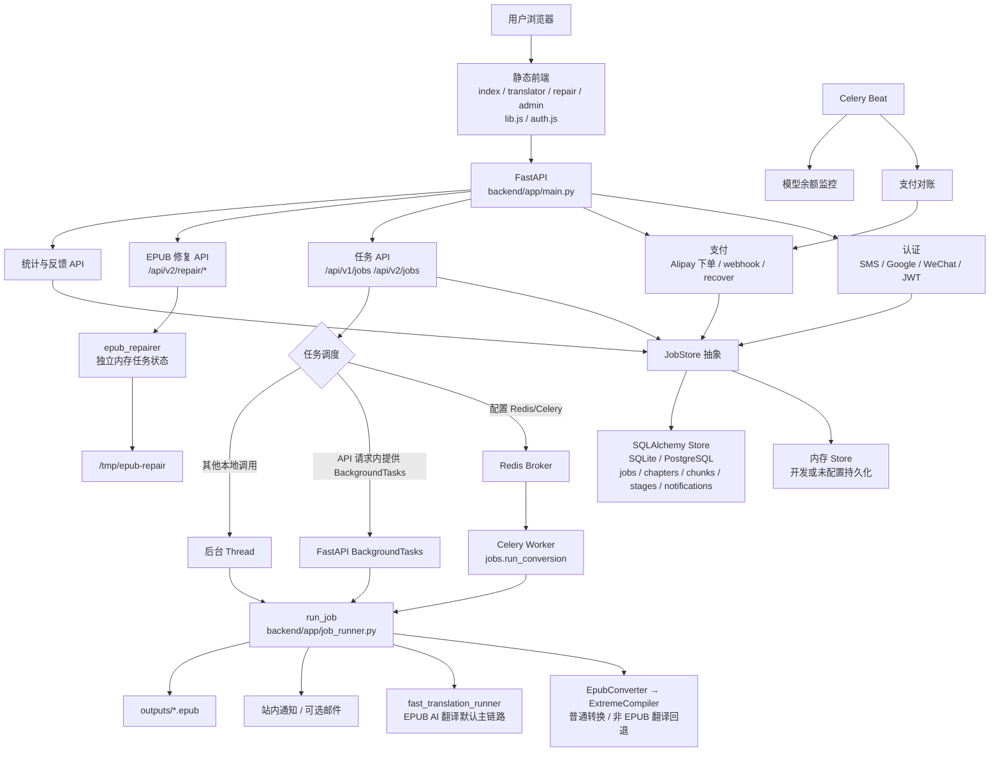
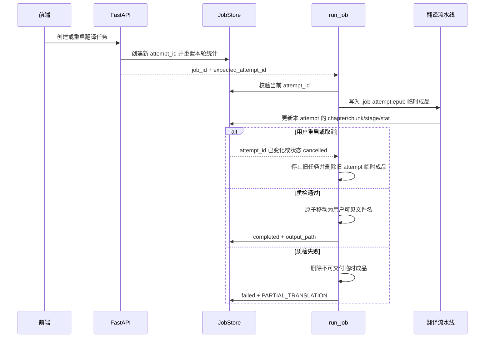
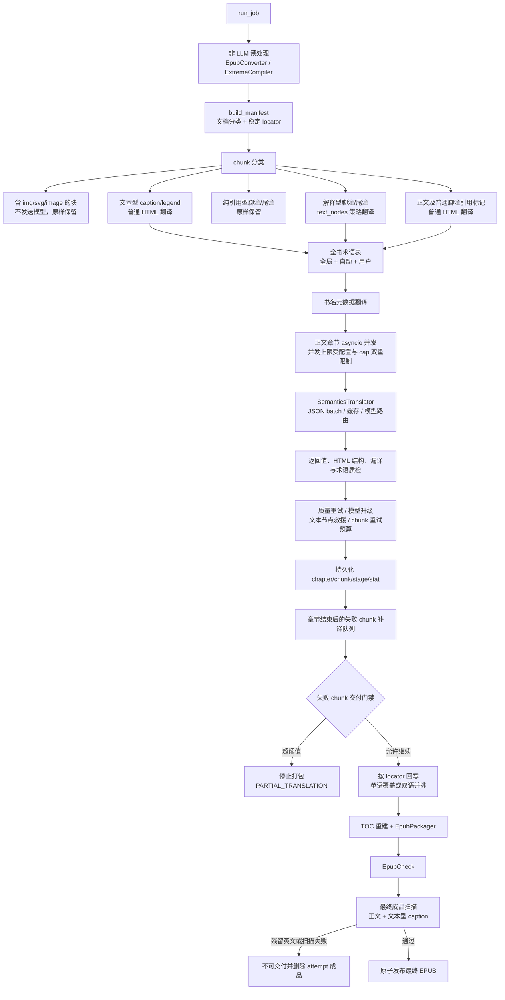

# EPUB Factory 当前架构

> 更新时间：2026-07-11
>
> 状态：`current`
>
> 本文以当前代码为准，描述已经接入主任务入口的真实架构。历史设计与演进方案见 `AI-TRANSLATION-DESIGN.md`。

## 1. 系统边界

生产环境由 FastAPI 同源提供前端与 API。Celery 目前以“整本任务”为队列单位；章节并发与 chunk 批处理发生在 Worker 进程内部，并不是每章或每段各自创建一个 Celery Task。

## 2. 任务生命周期与 attempt 隔离

关键约束：

- `attempt_id` 是一次翻译尝试的持久身份；重启会创建新身份，不继承旧 attempt 的段落数、Token、错误和 QA 统计。
- Store 更新携带 `expected_attempt_id`，旧 Worker 的迟到写入不会覆盖新任务状态。
- 翻译输出先写入 attempt 专属隐藏文件，只有通过交付检查后才移动为最终文件。
- 取消、被新 attempt 取代或失败时，attempt 专属成品会被删除。

## 3. EPUB AI 翻译主链路

### 3.1 Chunk 分类规则

| 内容类型 | 当前行为 | 原因 |
|---|---|---|
| 普通正文 | 翻译 | 主体内容 |
| 正文中的脚注引用标记 | 随正文翻译，不再据此跳过整段 | 引用标记不代表整段是脚注 |
| 解释型脚注/尾注 | 使用 `text_nodes` 策略翻译 | 保留锚点、编号和复杂内联结构 |
| 纯 DOI、URL、书目引用型脚注 | 原样保留 | 避免破坏可核验引用 |
| 文本型图片说明，如 `caption`、`figcaption`、`legend` | 翻译并计入最终 QA | 属于可读内容，不能因图片语义而漏译 |
| 同一块内直接包含 `img`、`svg` 或 `image` | 不发送模型，原样保留 | 防止媒体标签和 SVG 属性被改写 |
| 图片像素内部的文字 | 当前不识别、不翻译 | 需要 OCR 与图片重绘能力，见 TODO |

Manifest 会记录 `image_note_chunks_skipped`、`image_caption_chunks`、`reference_note_chunks_skipped` 和 `structured_note_chunks`，并透传到任务统计与前端详情。

### 3.2 翻译执行与救援

- `SemanticsTranslator` 使用 SQLite `translation_cache.db`，缓存键包含目标语言与术语表哈希。
- 普通 chunk 走 JSON batch；解释型脚注走结构化文本节点策略。
- 模型返回需通过空结果、错误样式、疑似未翻译、HTML 结构等检查。
- 质量失败会按预算重试，并可升级到质量模型；整段仍失败时可降级为文本节点救援。
- 初轮章节翻译结束后，`failed_chunk_rescue` 对未耗尽预算的失败段落再排队补译。
- 每个 chunk 的模型、base URL、Token、耗时、重试次数、错误和 QA 结果会写入 Store。

## 4. 交付质量门禁

| 层级 | 执行位置 | 失败行为 |
|---|---|---|
| 模型响应校验 | `SemanticsTranslator` | 在单 chunk 预算内重试或救援 |
| Chunk QA | `fast_translation_runner` | 标记 warn/fail，进入失败补译队列 |
| 预打包失败率门禁 | `fast_translation_runner` | 失败数和失败率同时超阈值时停止打包 |
| EPUB 结构校验 | `EpubCheck` | 标记 `EPUB_VALIDATION_FAILED`，不可交付 |
| 成品文本审计 | `translation_qa_service` | 中文目标默认要求残留块为 0；扫描失败同样不可交付 |
| Attempt 原子发布 | `job_runner` | 只有通过门禁的 attempt 文件才成为下载文件 |

最终成品审计会检查正文与文本型图片说明；明确排除非正文文件、媒体块和纯引用型脚注。不能把“模型调用完成”或“EPUB 成功打包”当作翻译成功。

## 5. 标准转换与格式适配

- EPUB AI 翻译且 `EPUB_FAST_TRANSLATION=1` 时进入上述快速翻译主链路。
- 普通 EPUB 转换、非 EPUB 输入或关闭快速翻译时进入 `EpubConverter -> ExtremeCompiler`。
- PDF、DOCX、Markdown 会先经格式适配转换为临时 EPUB，再复用核心编译链路。
- MOBI/AZW3 由 `job_runner` 调用 Calibre `ebook-convert` 转成临时 EPUB。
- 标准编译管线负责 CJK/OpenCC、CSS 清洗、排版增强、STEM 保护、设备配置、TOC 和打包。

## 6. 可观测性与数据

- `jobs`：任务身份、输入输出、状态、错误、整体统计。
- `job_chapters`：章节类型与成功、失败、缓存数量。
- `job_chunks`：定位器、模型、Token、延迟、重试、错误与审计结果。
- `job_stages`：预处理、Manifest、术语表、翻译、Reduce、校验等事件。
- `notifications`：站内通知与邮件状态。
- 前端通过 `/api/v2/jobs/{id}`、`/stats`、`/translation-diagnostics`、`/events` 展示实时统计和失败位置。

未配置持久化时使用内存 Store；配置 `DATABASE_URL` 或 `EPUB_PERSISTENT_STORE=1` 后使用 SQLAlchemy 的 SQLite/PostgreSQL Store。Celery Worker 必须配合持久化 Store，才能通过 `job_id` 读取同一任务。

## 7. 辅助与修复链路

- `/api/v2/repair/*` 是独立的 EPUB 诊断/修复产品流，不进入主转换 Job 表。
- `image_caption_repair.py` 是对既有成品进行文本型 caption 补译的维护工具，保留图片字节与 EPUB `mimetype` 规则，并在写出后执行相同的成品 QA；正常新任务不依赖该工具。
- Celery Beat 负责支付对账与模型余额监控，不参与单本书的章节编排。

## 8. TODO：图片像素文字 OCR 翻译

**状态：未实现。** 当前只翻译 XHTML 中可提取的 caption/legend 文本，不读取图片像素中的文字。

建议作为独立、默认关闭的增强阶段接入 Manifest 之后、章节翻译之前：

1. 图片筛选：按尺寸、格式、OCR 文本密度和语言置信度筛出可能含可读文字的图片，跳过装饰图、照片噪声和公式图。
2. OCR：提取文字、位置框、方向与置信度；保留原图哈希和 OCR 原始结果，便于审计与回退。
3. 翻译：复用术语表和模型路由，但将 OCR 结果作为独立 chunk 类型，不与 HTML caption 混在一起。
4. 回写策略：优先生成可访问性文本或可选覆盖层；若必须重绘图片，应保留原图备份、尺寸、透明通道、色彩配置和引用路径。
5. QA：校验 OCR 覆盖率、低置信度、溢出、遮挡、方向和译文残留；任何重绘失败都回退原图，不阻塞普通 HTML 翻译。
6. 可观测性：新增 `image_ocr_candidates`、`image_ocr_translated`、`image_ocr_low_confidence`、`image_ocr_failed` 和额外成本统计。

最低验收条件：

- 功能有显式开关，默认不改变原始图片。
- OCR 失败或低置信度时不静默写坏图片。
- EPUB 内图片引用、尺寸和阅读器显示不受破坏。
- 译文在 Apple Books 和 Kindle 至少各完成一轮真实书稿回归。
- 成品报告能区分 HTML caption 翻译与图片像素 OCR 翻译。

## 9. 代码索引

| 模块 | 主要职责 |
|---|---|
| `backend/app/main.py` | FastAPI 路由、任务创建/重启/取消、调度与诊断接口 |
| `backend/app/job_runner.py` | 整本任务生命周期、attempt 隔离、最终成品门禁与通知 |
| `backend/app/domain/fast_translation_runner.py` | EPUB 快速翻译编排、章节并发、chunk QA、失败救援、Reduce 与校验 |
| `backend/app/domain/manifest_service.py` | 文档分类和 Chunk Manifest |
| `backend/app/engine/chunk_extractor.py` | 正文、caption、媒体块、脚注/尾注分类和稳定 locator |
| `backend/app/engine/cleaners/semantics_translator.py` | 模型调用、缓存、批处理、质量重试、文本节点与 chunk 救援 |
| `backend/app/domain/chapter_reduce_service.py` | 按 locator 回写单章，支持单语/双语 |
| `backend/app/domain/book_reduce_service.py` | 全书 Reduce、书名同步、TOC 重建与打包 |
| `backend/app/domain/translation_attempt.py` | attempt 身份与重启统计重置 |
| `backend/app/domain/translation_qa_service.py` | 最终 EPUB 残留扫描和 QA 报告 |
| `backend/app/storage.py` / `storage_db.py` | 内存/持久化 Store |
| `backend/app/tasks/job_pipeline.py` | Celery 整本任务入口 |
