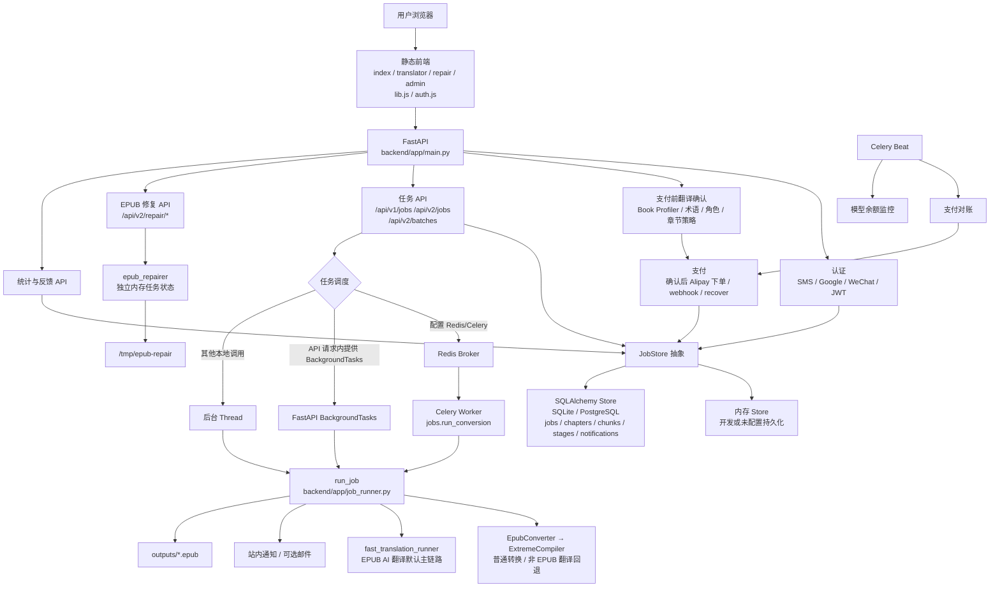
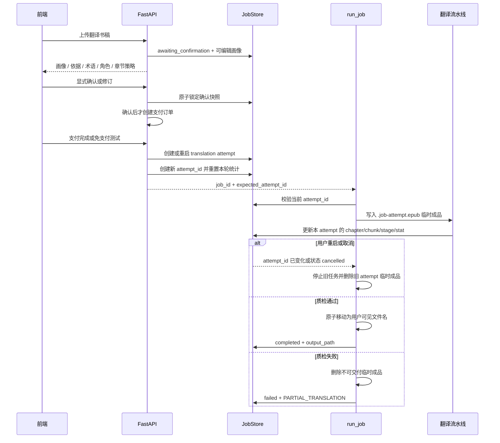
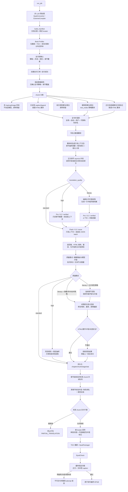

# EPUB Factory 当前架构

> 更新时间：2026-09-18（新增模型费用账本）
>
> 状态：`current`
>
> 本文以当前代码为准，描述已经接入主任务入口的真实架构。历史设计与演进方案见 `AI-TRANSLATION-DESIGN.md`。

> 2026-09-21 规划补充：PDF 翻译尚未实现，详见 [PDF 翻译技术架构](PDF-TRANSLATION-ARCHITECTURE.md)。该方案定义文本／扫描分流、MinerU 免费 API、超限转 DeepSeek Flash、OCR 性能与密钥安全；不属于下图的已上线功能。

## 1. 系统边界

```mermaid
flowchart TB
  U["用户浏览器"] --> FE["静态前端<br/>index / translator / repair / admin<br/>lib.js / auth.js"]
  FE --> API["FastAPI<br/>backend/app/main.py"]

  API --> Auth["认证<br/>SMS / Google / WeChat / JWT"]
  API --> Preflight["支付前翻译确认<br/>Book Profiler / 术语 / 角色 / 章节策略"]
  Preflight --> Pay["支付<br/>确认后 Alipay 下单 / webhook / recover"]
  API --> JobAPI["任务 API<br/>/api/v1/jobs /api/v2/jobs<br/>/api/v2/batches"]
  API --> Repair["EPUB 修复 API<br/>/api/v2/repair/*"]
  API --> Admin["统计与反馈 API"]

  JobAPI --> Store["JobStore 抽象"]
  Auth --> Store
  Pay --> Store
  Admin --> Store
  Store --> Mem["内存 Store<br/>开发或未配置持久化"]
  Store --> DB["SQLAlchemy Store<br/>SQLite / PostgreSQL<br/>jobs / chapters / chunks / stages / notifications"]

  JobAPI --> Dispatch{"任务调度"}
  Dispatch -->|"配置 Redis/Celery"| Redis["Redis Broker"]
  Redis --> Worker["Celery Worker<br/>jobs.run_conversion"]
  Dispatch -->|"API 请求内提供 BackgroundTasks"| BG["FastAPI BackgroundTasks"]
  Dispatch -->|"其他本地调用"| Thread["后台 Thread"]
  Worker --> Runner["run_job<br/>backend/app/job_runner.py"]
  BG --> Runner
  Thread --> Runner

  Runner --> Standard["EpubConverter → ExtremeCompiler<br/>普通转换 / 非 EPUB 翻译回退"]
  Runner --> Fast["fast_translation_runner<br/>EPUB AI 翻译默认主链路"]
  Runner --> Notify["站内通知 / 可选邮件"]
  Runner --> Output["outputs/*.epub"]

  Repair --> RepairEngine["epub_repairer<br/>独立内存任务状态"]
  RepairEngine --> RepairTmp["/tmp/epub-repair"]

  Beat["Celery Beat"] --> Reconcile["支付对账"]
  Beat --> Balance["模型余额监控"]
  Reconcile --> Pay
```

生产环境由 FastAPI 同源提供前端与 API。Celery 目前以“整本任务”为队列单位；章节并发与 chunk 批处理发生在 Worker 进程内部，并不是每章或每段各自创建一个 Celery Task。

## 2. 任务生命周期与 attempt 隔离

```mermaid
sequenceDiagram
  participant UI as 前端
  participant API as FastAPI
  participant Store as JobStore
  participant Runner as run_job
  participant Pipeline as 翻译流水线

  UI->>API: 上传翻译书稿
  API->>Store: awaiting_confirmation + 可编辑画像
  API-->>UI: 画像 / 依据 / 术语 / 角色 / 章节策略
  UI->>API: 显式确认或修订
  API->>Store: 原子锁定确认快照
  API->>API: 确认后才创建支付订单
  UI->>API: 支付完成或免支付测试
  API->>Store: 创建或重启 translation attempt
  API->>Store: 创建新 attempt_id 并重置本轮统计
  API-->>Runner: job_id + expected_attempt_id
  Runner->>Store: 校验当前 attempt_id
  Runner->>Pipeline: 写入 .job-attempt.epub 临时成品
  Pipeline->>Store: 更新本 attempt 的 chapter/chunk/stage/stat
  alt 用户重启或取消
    Store-->>Runner: attempt_id 已变化或状态 cancelled
    Runner->>Runner: 停止旧任务并删除旧 attempt 临时成品
  else 质检通过
    Runner->>Runner: 原子移动为用户可见文件名
    Runner->>Store: completed + output_path
  else 质检失败
    Runner->>Runner: 删除不可交付临时成品
    Runner->>Store: failed + PARTIAL_TRANSLATION
  end
```

### 2.1 批量转换生命周期

批量模式只编排标准转换，不复用 AI 翻译的动态计价与 attempt 机制：

1. 前端支持多文件选择或通过 `webkitdirectory` 递归选择整个文件夹，过滤出支持的电子书格式后，`POST /api/v2/batches` 接收 2–10 个文件；后端为每个文件创建独立 `Job`，并写入共同的 `batch_id`、`batch_size` 和访问令牌。
2. 支付宝订单号使用 `batch_{batch_id}`，金额为单本转换价乘文件数；管理员测试模式整批仍为 ¥0.01。
3. 支付 webhook 或 `/api/v2/batches/{id}/recover` 通过 `try_mark_batch_paid` 在同一存储事务中解锁整批任务，只有首个调用方取得入队权，避免重复回调导致重复转换。
4. 子任务仍以整本为调度单位，互不覆盖状态；`GET /api/v2/batches/{id}` 聚合完成、运行、排队、失败数量和总体进度。
5. 全部完成或部分完成时，`GET /api/v2/batches/{id}/download` 将成功产物打包为 ZIP；失败项继续保留在任务中心供单本排查。

关键约束：

- `attempt_id` 是一次翻译尝试的持久身份；重启会创建新身份，不继承旧 attempt 的段落数、Token、错误和 QA 统计。
- Store 更新携带 `expected_attempt_id`，旧 Worker 的迟到写入不会覆盖新任务状态。
- 翻译输出先写入 attempt 专属隐藏文件，只有通过交付检查后才移动为最终文件。
- 取消、被新 attempt 取代或失败时，attempt 专属成品会被删除。
- 支付前的章节策略编辑只列出实际章节和前后置内容；独立脚注文件继续参与翻译，但继承全书策略，避免为大量单行脚注生成冗余控件。

## 3. EPUB AI 翻译主链路

```mermaid
flowchart TD
  A["run_job"] --> B["非 LLM 预处理<br/>EpubConverter / ExtremeCompiler"]
  B --> C["build_manifest<br/>文档分类 + 稳定 locator"]
  C --> Profile["Book Profiler<br/>元数据 + TOC + 前言/首章/分布式样本"]
  Profile --> Confirm["支付前确认<br/>策略 + 术语 + 角色 + 章节覆盖"]
  Confirm --> PayGate["创建支付订单 / 支付成功"]
  PayGate --> Route["固定策略矩阵<br/>已确认全书策略 + 章节覆盖"]
  Route --> D["chunk 分类"]

  D --> Media["含 img/svg/image 的块<br/>不发送模型，原样保留"]
  D --> Caption["文本型 caption/legend<br/>普通 HTML 翻译"]
  D --> RefNote["纯引用型脚注/尾注<br/>原样保留"]
  D --> ExplainNote["解释型脚注/尾注<br/>text_nodes 策略翻译"]
  D --> Body["正文及普通脚注引用标记<br/>普通 HTML 翻译"]

  Caption --> G["全书术语表<br/>全局 + 自动 + 用户 + 可靠角色译名"]
  ExplainNote --> G
  Body --> G
  G --> Title["书名元数据翻译"]
  Title --> ContextPack["翻译前生成只读上下文包<br/>章节抽样提要 + 相邻原文 + 相关人物"]
  ContextPack --> Chapters["正文章节 asyncio 并发<br/>请求并发按成功/失败动态调节"]
  Chapters --> Mode{"translation_quality"}
  Mode -->|"standard"| Translator["Flash / 0.3 / reuse<br/>只读上下文 + 自适应 JSON batch"]
  Mode -->|"high"| Context["Pro / 0.2 / verified<br/>只读章节摘要 + 前后段上下文"]
  Mode -->|"literary"| StyleSample["抽取全书代表段落<br/>生成一次书级风格档案"]
  StyleSample --> LiteraryDraft["Pro / 0.2 / verified<br/>上下文 + 风格档案"]
  Context --> Translator
  LiteraryDraft --> Translator
  Translator --> Validate["返回值、HTML 结构、漏译、句子结构与术语质检"]
  Validate --> Retry["质量重试 / 健康路由与模型升级<br/>批次拆分 / 文本节点救援"]
  Retry --> Review{"质量模式"}
  Review -->|"standard"| Persist["持久化 chapter/chunk/stage/stat"]
  Review -->|"high"| Semantic["风险规则 + 稳定抽样<br/>只审校高风险段落"]
  Review -->|"literary + 允许润色策略"| Polish["连续章节润色<br/>保持作者声音与术语"]
  Review -->|"literary + 镜像/学术/技术策略"| Verify
  Semantic --> Persist
  Polish --> Verify["对照原文语义回查<br/>修复增译、漏译、逻辑偏差"]
  Verify --> Safe{"HTML/数字/术语/长度安全?"}
  Safe -->|"通过"| Persist
  Safe -->|"不通过"| Keep["拒绝润色结果<br/>保留上一安全译文"]
  Keep --> Persist
  Persist --> Rescue["章节结束后的失败 chunk 补译队列"]
  Rescue --> Consistency["跨章节标准术语 / 角色译名一致性复核"]
  Consistency --> Gate1{"失败 chunk 交付门禁"}
  Gate1 -->|"超阈值"| Stop["停止打包<br/>PARTIAL_TRANSLATION"]
  Gate1 -->|"允许继续"| Reduce["按 locator 回写<br/>单语/双语 + 可选确定性术语标记"]
  Reduce --> Package["TOC 重建 + EpubPackager"]
  Package --> EpubCheck["EpubCheck"]
  EpubCheck --> ArtifactQA["最终成品扫描<br/>正文 + 文本型 caption"]
  ArtifactQA -->|"残留英文或扫描失败"| Stop2["不可交付并删除 attempt 成品"]
  ArtifactQA -->|"通过"| Finalize["原子发布最终 EPUB"]
```

### 3.1 Chunk 分类规则

| 内容类型 | 当前行为 | 原因 |
|---|---|---|
| 普通正文 | 翻译 | 主体内容 |
| 正文中的脚注引用标记 | 随正文翻译，不再据此跳过整段 | 引用标记不代表整段是脚注 |
| 解释型脚注/尾注 | 使用 `text_nodes` 策略翻译 | 保留锚点、编号和复杂内联结构 |
| 纯 DOI、URL、书目引用型脚注 | 原样保留 | 避免破坏可核验引用 |
| 文本型图片说明，如 `caption`、`figcaption`、`legend` | 翻译并计入最终 QA | 属于可读内容，不能因图片语义而漏译 |
| 同一块内直接包含 `img`、`svg` 或 `image` | 只翻译媒体外部文本节点，媒体子树原样保留 | 图片项目符号不能导致整段正文被跳过；不让模型改写 SVG 属性 |
| 图片像素内部的文字 | 当前不识别、不翻译 | 需要 OCR 与图片重绘能力，见 TODO |

Manifest 会记录 `image_note_chunks_skipped`、`image_caption_chunks`、`reference_note_chunks_skipped` 和 `structured_note_chunks`，并透传到任务统计与前端详情。

### 3.2 翻译执行与救援

- `Book Profiler` 在正式翻译前读取有界的 OPF 元数据、TOC、前言/首章和全书分布式样本，输出带 Schema、证据、置信度、人物设定和抽样哈希的任务画像。默认复用当前翻译供应商；解析或调用失败时使用低置信度本地规则并继续任务。
- 前端翻译上传显式请求二阶段确认。后端先保存 `awaiting_confirmation` 任务并返回可编辑画像；用户确认前不创建支付宝订单、不入队。确认接口原子保存版本化快照，重复点击不会重复下单。
- 确认面板可修订全书策略、术语、角色译名/身份、双语模式、术语标记及章节策略。章节覆盖策略会改变该章实际 System Prompt、缓存上下文和文学润色权限。
- 策略只能从 `neutral_faithful / literary_narrative / academic_rigorous / mirror_fidelity / practical_technical` 五个版本化资产中选择。前端可在提交前锁定策略，用户选择优先于探针；`mirror_fidelity`、学术和技术策略不会进入强文学润色。
- 各质量档位默认首选 Flash，显式 Pro 选择仍有效；`standard` 使用温度 `0.3` 和 `reuse`，`high` 与 `literary` 使用温度 `0.2` 和 `verified`，切换质量档位不自动覆盖模型。`verified` 只读取目标语言、提示词、质量档位、模型、温度、术语表、上下文和风格档案完全一致的精确缓存，不跨配置借用旧译文。
- 所有质量模式都使用翻译开始前生成的只读章节抽样提要和相邻原文，不依赖其他并发请求完成顺序；高质量模式使用更长窗口。不存在“请求完成后串行更新滑动窗口”的可变状态。
- 高质量模式的风险规则覆盖长段、标题、复杂 HTML、数字、否定/因果/转折关系、术语异常和疑似原文，并对其余段落做稳定抽样，只对命中的段落使用所选主模型进行语义校对；失败补译可在既有预算内升级 Pro。
- 文学模式先从全书代表段落生成一次书级风格档案，再按连续章节进行润色，并对照原文执行语义回查；任何破坏 HTML、数字、强制术语或出现危险长度变化的候选结果都会被拒绝，回退到上一版安全译文。
- `SemanticsTranslator` 使用 SQLite `translation_cache.db`。精确缓存命名空间包含目标语言、提示词版本、质量档位、模型、温度、策略版本、画像哈希、术语表哈希和上下文哈希，避免旧提示词、低质量模型或不同文体策略互相污染。
- 术语表先清理通用词和低置信度候选，再按当前段落最长匹配，只注入实际出现的术语；不再把全书全部术语塞入每个请求。
- 画像中的人物只有带原文证据才会保留；可靠人物译名合并进术语表，每个请求只注入当前段落命中的人物子集。任务统计保存可审计的术语目录、角色集、画像和策略来源。
- 普通 chunk 走自适应 JSON batch：稳定时在上限内扩大批次，批量失败时递归拆分；解释型脚注走结构化文本节点策略。
- 单本书的模型请求由自适应并发限制器控制：失败时逐级降并发，连续成功后逐步恢复；复杂单段默认不主动升级 Pro，实际失败才进入有界质量兜底。请求还有绝对时限和取消检查，路由排序综合近期失败、冷却和延迟。
- 可选 Redis 令牌桶按供应商和模型共享 RPM/TPM，调用前预留估算 Token，成功后按真实用量修正。该能力默认关闭，只有显式配置 `EPUB_LLM_RATE_LIMITER_ENABLED=1` 及正数 RPM/TPM 后生效；Redis 故障时回退现有进程内限制器。
- 可选 Redis 全局健康路由共享供应商/模型失败、冷却和延迟状态；通过 `EPUB_LLM_GLOBAL_HEALTH_ENABLED=1` 启用，故障时继续使用进程内健康排序。
- Chunk QA 增加保守的句子结构对齐信号；全章完成后聚合跨章节标准术语和角色译名漂移。两者用于定位人工复核，不单独阻断交付。
- 用户显式开启时，Reduce 前根据已确认术语表确定性插入 `epub-term` 标签及原文映射；默认关闭，不让模型改写或生成标签。
- 模型返回需通过空结果、错误样式、疑似未翻译、HTML 结构等检查。
- 质量失败会按预算重试，并可升级到质量模型；整段仍失败时可降级为文本节点救援。
- 每章初轮结束即释放章节并发位，`failed_chunk_rescue` 在共享上限内立即补译未耗尽预算的失败段落，与其余章节重叠，不等待全书结束。
- 术语请求默认 2 并发；成功准备结果和 chunk 检查点保存在原缓存数据库，续跑必须匹配书稿、配置与上下文并通过当前 QA，详情见 [翻译卡点修复](TRANSLATION-PERFORMANCE-2026-09-18.md)。
- 每个 chunk 的模型、base URL、Token、耗时、重试次数、错误和 QA 结果会写入 Store。

## 4. 交付质量门禁

| 层级 | 执行位置 | 失败行为 |
|---|---|---|
| 模型响应校验 | `SemanticsTranslator` | 在单 chunk 预算内重试或救援 |
| Chunk QA | `fast_translation_runner` | 标记 warn/fail，进入失败补译队列 |
| 预打包失败率门禁 | `fast_translation_runner` | 失败数和失败率同时超阈值时停止打包 |
| EPUB 结构校验 | `EpubCheck` | 标记 `EPUB_VALIDATION_FAILED`，不可交付 |
| 成品文本审计 | `translation_qa_service` | 中文目标默认要求残留块为 0；可识别被 `<small>` 等内联标签拆开的英文短标题；扫描失败同样不可交付 |
| Attempt 原子发布 | `job_runner` | 只有通过门禁的 attempt 文件才成为下载文件 |

最终成品审计会检查正文与文本型图片说明；明确排除非正文文件、媒体块和纯引用型脚注。不能把“模型调用完成”或“EPUB 成功打包”当作翻译成功。

## 5. 标准转换与格式适配

- EPUB AI 翻译且 `EPUB_FAST_TRANSLATION=1` 时进入上述快速翻译主链路。
- 普通 EPUB 转换、非 EPUB 输入或关闭快速翻译时进入 `EpubConverter -> ExtremeCompiler`。
- DOCX、Markdown 会先经格式适配转换为临时 EPUB，再复用核心编译链路；共享 HTML 构建器单独生成真正的 nav 文档与正文，并写入 EPUB3 修改时间，避免把普通正文错误声明成导航。
- PDF 暂未开放：主页面、专题页、单文件/文件夹/批量上传均关闭；v1/v2 与批次 API 在保存文件、创建订单和支付前拒绝 `.pdf` 及伪装成其他扩展名的 PDF 文件头；已有 PDF 任务也不能通过公共转换器继续转换。私有适配实验不代表支持或交付。
- MOBI/AZW3 由 `job_runner` 调用 Calibre `ebook-convert` 转成临时 EPUB。
- 标准编译管线负责 CJK/OpenCC、CSS 清洗、排版增强、STEM 保护、设备配置、TOC 和打包。

### 5.1 EPUB 输入与打包兼容性

- `EpubUnpacker -> epub_compat` 在临时副本上规范 `text/html` 声明、容器内相对路径和资源 ID；优先读取可用的 EPUB3 nav，保存根/正文锚点、页头样式及直接挂在 body 下的文字，避免提取表示与 Reduce 回写表示不一致。
- 从原 OPF 保留词汇前缀，将 EPUB2 作者/标识属性升级为 EPUB3 refinements，未声明的自定义元数据保留为兼容的 name/content 形式；合法默认词汇和带前缀扩展属性保持原意。缺少可选页码映射可移除其声明；缺正文或有歧义资源引用则明确拒绝，不补造内容。
- `html_compat` 将旧 `font`、对齐属性，以及图片/表格等有尺寸语义元素上的旧尺寸（包括 pt 等 CSS 长度）迁移为等效 CSS；普通段落/引用上的无效尺寸仅保留为 `data-legacy-*`，不应用为 CSS，避免 `width=0pt` 压扁正文。补齐空标题，将旧 `epub-type` 规范为 `epub:type`；不改变正文、锚点或图片像素。页头按语义去重，重复序列化不累加样式/链接；未知旧资源属性保留在兼容元数据中。
- XHTML 经 ebooklib 的 HTML 解析后，内嵌 script/style 的 XML 实体可能重复转义；兼容层从已解析的源节点恢复对应载荷，连续序列化及重打包保持脚本/样式语义，不用任意字符串反转义。
- OpenCC、地域词典、竖排标点只变更文本，不变更文件路径、href、id 或受保护的代码/数学/SVG 内容。
- 打包时同时保证 nav 与 NCX 资源存在；修复嵌套 NCX 的相对路径及 NCX 自身的空/重复标识，不重命名正文锚点。目录/页码指向已存在但未入 spine 的 HTML，以及含页码标记的非导航 HTML，以 `linear=no` 补入 spine；保持原阅读顺序，不伪造缺失资源。缺失的可选字体只移除不可用 src，保留可用/local/remote 字体并回退阅读器字体。
- 文件名中的嵌入式关键词不再用于跳过正文：`index_split_N` 视作正文，`TableOfContents` 等明确名称视作目录。Manifest 与成品审计优先使用 OPF 的 nav 声明，泛名导航文件不再误计正文；主导航与普通命名的 HTML 目录中的 TOC 标签/目标均独立质检，不能借正文排除漏过未翻译目录。
- `chunk_extractor` 一次遍历建立 locator 索引，以节点对象身份区分重复段落；避免逐段扫描同级节点，保持定位路径及 chunk 编号稳定。
- 翻译资格按 Unicode 字母系统和目标语言判断，不再仅要求拉丁字母；中文成品质检新增日文假名残留信号，显式保留术语仍受豁免。
- 输出仍受 EPUBCheck、目录目标、正文提取与原子发布门禁约束；能够打包并不等于通过交付验收。

## 6. 可观测性与数据

### 模型用量与费用账本

`infra/llm_usage_ledger.py` 在真实模型请求发出前、响应返回后独立落盘，与任务共用 `DATABASE_URL` 的 `llm_usage_attempts` / `llm_usage_requests` 表。支付前分析、正式翻译、补译和审校统一携带图书与 attempt 身份；返回错误 JSON 或质检不通过也记录已消耗的 usage。缓存复用不会生成新的模型请求费用。

`infra/llm_pricing.py` 按供应商主机名、实际模型、缓存输入拆分、币种、峰谷时间和版本价目计算 Decimal 金额。未知用量/价格、跨计价边界与历史缺口不按 0 元处理。登录订单看板提供全书汇总及鉴权的逐请求分页明细；供应商原始账单导入金额独立展示，不将价目计算成本冒充实际扣款。详细口径、供应商配置及持久化见 [LLM-COST-LEDGER.md](LLM-COST-LEDGER.md)。

- `jobs`：任务身份、输入输出、状态、错误、整体统计；批量转换额外使用 `batch_id / batch_index / batch_size` 关联子任务，不另建批次表。
- `jobs.translation_strategy`：用户提交的 `auto` 或人工锁定策略；支付前画像、确认版本、术语目录、角色集及章节覆盖保存在当前 attempt 的 `translation_stats.translation_preflight`。
- `job_chapters`：章节类型与成功、失败、缓存数量。
- `job_chunks`：定位器、模型、Token、延迟、重试、错误与审计结果。
- `job_stages`：预处理、Manifest、术语表、翻译、Reduce、校验等事件。
- `notifications`：站内通知与邮件状态。
- 前端通过 `/api/v2/jobs/{id}`、`/stats`、`/translation-diagnostics`、`/events` 展示实时统计和失败位置。

未配置持久化时使用内存 Store；配置 `DATABASE_URL` 或 `EPUB_PERSISTENT_STORE=1` 后使用 SQLAlchemy 的 SQLite/PostgreSQL Store。Celery Worker 必须配合持久化 Store，才能通过 `job_id` 读取同一任务。

## 7. 辅助与修复链路

- `/api/v2/repair/*` 是独立的 EPUB 诊断/修复产品流，不进入主转换 Job 表。
- `image_caption_repair.py` 是对既有成品进行文本型 caption 补译的维护工具，保留图片字节与 EPUB `mimetype` 规则，并在写出后执行相同的成品 QA；正常新任务不依赖该工具。
- Celery Beat 负责支付对账与模型余额监控，不参与单本书的章节编排。

## 8. TODO：图片像素文字 OCR 翻译

**状态：未实现。** 当前只翻译 XHTML 中可提取的 caption/legend 文本，不读取图片像素中的文字。

建议作为独立、默认关闭的增强阶段接入 Manifest 之后、章节翻译之前：

1. 图片筛选：按尺寸、格式、OCR 文本密度和语言置信度筛出可能含可读文字的图片，跳过装饰图、照片噪声和公式图。
2. OCR：提取文字、位置框、方向与置信度；保留原图哈希和 OCR 原始结果，便于审计与回退。
3. 翻译：复用术语表和模型路由，但将 OCR 结果作为独立 chunk 类型，不与 HTML caption 混在一起。
4. 回写策略：优先生成可访问性文本或可选覆盖层；若必须重绘图片，应保留原图备份、尺寸、透明通道、色彩配置和引用路径。
5. QA：校验 OCR 覆盖率、低置信度、溢出、遮挡、方向和译文残留；任何重绘失败都回退原图，不阻塞普通 HTML 翻译。
6. 可观测性：新增 `image_ocr_candidates`、`image_ocr_translated`、`image_ocr_low_confidence`、`image_ocr_failed` 和额外成本统计。

最低验收条件：

- 功能有显式开关，默认不改变原始图片。
- OCR 失败或低置信度时不静默写坏图片。
- EPUB 内图片引用、尺寸和阅读器显示不受破坏。
- 译文在 Apple Books 和 Kindle 至少各完成一轮真实书稿回归。
- 成品报告能区分 HTML caption 翻译与图片像素 OCR 翻译。

## 9. 代码索引

| 模块 | 主要职责 |
|---|---|
| `backend/app/main.py` | FastAPI 路由、任务创建/重启/取消、调度与诊断接口 |
| `backend/app/job_runner.py` | 整本任务生命周期、attempt 隔离、最终成品门禁与通知 |
| `backend/app/domain/fast_translation_runner.py` | EPUB 快速翻译编排、章节并发、chunk QA、失败救援、Reduce 与校验 |
| `backend/app/domain/book_profile_service.py` | 图书探针抽样、结构化画像、证据审计与非阻塞回退 |
| `backend/app/domain/translation_preflight_service.py` | 支付前画像、术语、角色与章节清单的有界预分析 |
| `backend/app/domain/translation_strategy.py` | 五类版本化策略、动态 Prompt 片段、角色检索与只读章节摘要 |
| `backend/app/domain/translation_consistency_audit.py` | 跨章节标准术语与角色译名一致性信号 |
| `backend/app/domain/term_highlight_service.py` | 已确认术语的确定性 XHTML 标记 |
| `backend/app/domain/manifest_service.py` | 文档分类和 Chunk Manifest |
| `backend/app/engine/chunk_extractor.py` | 正文、caption、媒体块、脚注/尾注分类和稳定 locator |
| `backend/app/engine/cleaners/semantics_translator.py` | 模型调用、缓存、批处理、质量重试、文本节点与 chunk 救援 |
| `backend/app/domain/chapter_reduce_service.py` | 按 locator 回写单章，支持单语/双语 |
| `backend/app/domain/book_reduce_service.py` | 全书 Reduce、书名同步、TOC 重建与打包 |
| `backend/app/domain/translation_attempt.py` | attempt 身份与重启统计重置 |
| `backend/app/domain/translation_qa_service.py` | 最终 EPUB 残留扫描和 QA 报告 |
| `backend/app/infra/llm_token_bucket.py` | 可选 Redis 跨 Worker RPM/TPM 令牌桶 |
| `backend/app/infra/llm_route_health.py` | 可选 Redis 跨 Worker 模型路由健康状态 |
| `backend/app/storage.py` / `storage_db.py` | 内存/持久化 Store |
| `backend/app/tasks/job_pipeline.py` | Celery 整本任务入口 |
