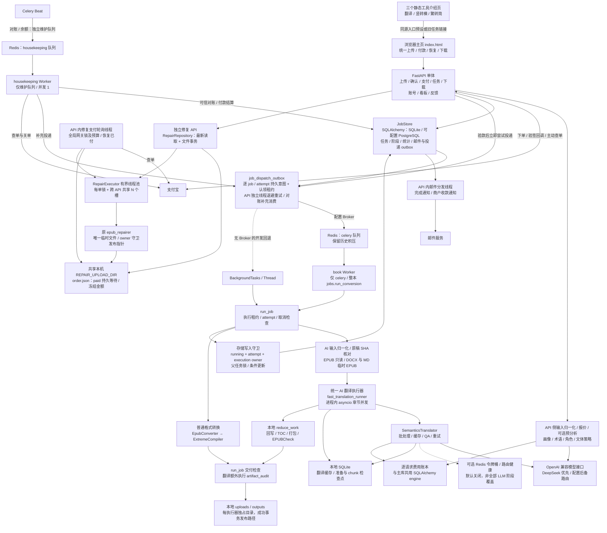
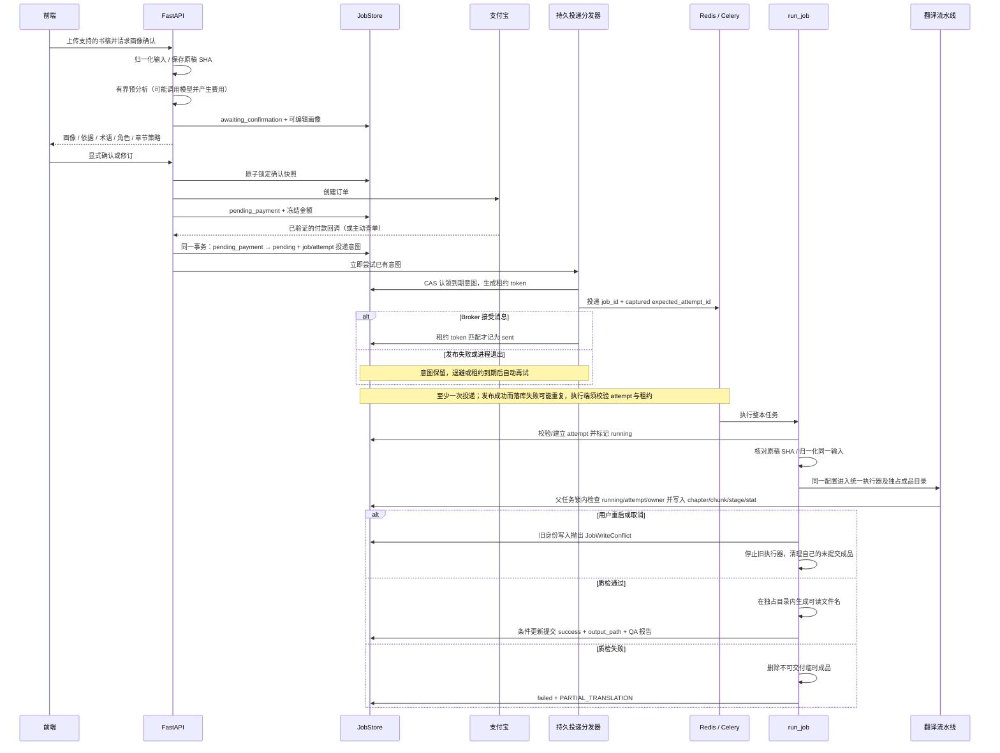
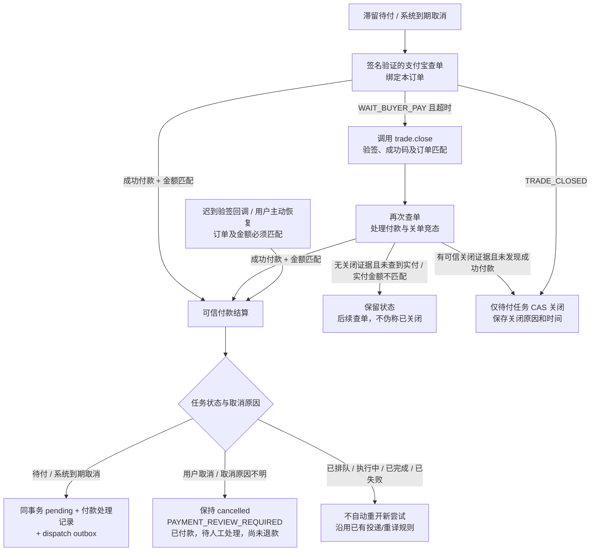
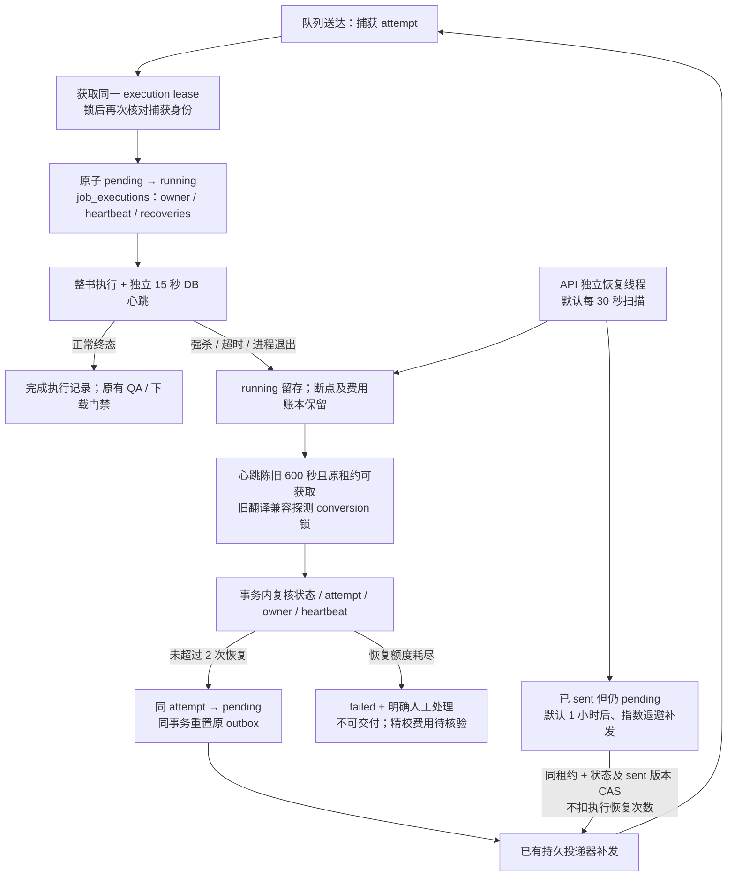
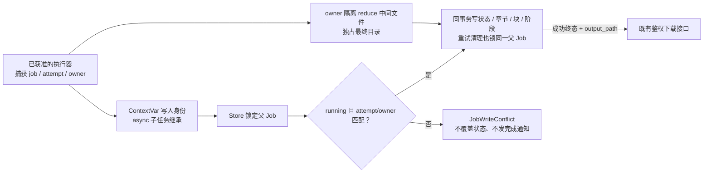
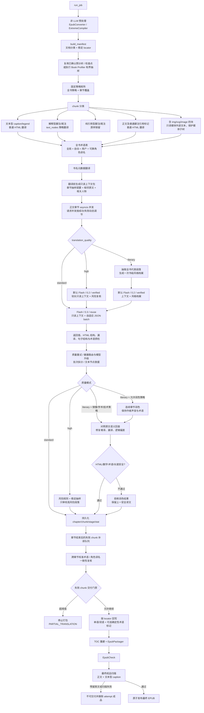
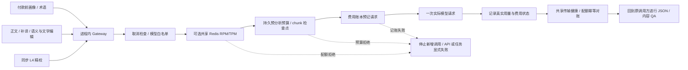

# EPUB Factory 当前架构

本文依据上述提交的本地代码与离线核验，描述实际接通的调用链，不代表已经核验生产配置或部署版本。历史设计见 [AI 翻译设计](AI-TRANSLATION-DESIGN.md)，本轮缺陷与改进顺序见 [架构审查：2026-10-01](ARCHITECTURE-REVIEW-2026-10-01.md)。

R1–R11 及历史导航/表格兼容修复已提交并推送至 `9c8cac6`，尚未部署。包括付款权益、attempt 隔离、转换附加精校、统一翻译入口、持久投递、迟到付款、失联恢复、旧执行器写入和成品保护、书籍与维护任务分队列、独立修复的跨进程隔离，以及三个工具页复用主页统一结账。以下主链路另包含本次交付的 R12：所有模型阶段统一实际请求边界、持久预分析预算与去重；最新门禁与未验证边界见 [逐项优化记录](ARCHITECTURE-OPTIMIZATION-2026-10-01.md)。

当前形态是**模块化单体 API + 整本 Celery 任务 + Worker 内章节并发**；独立 EPUB 修复仍在 API 进程内执行。图中的虚线表示条件启用或旁路调用，不表示已经完成分布式改造。

PDF 公共入口仍拒绝输入；[PDF 翻译技术架构](PDF-TRANSLATION-ARCHITECTURE.md) 与图片像素 OCR/重绘均为规划，不属于已实现能力。

2026-10-02 范围补充：用户要求 PDF 本阶段只处理可靠文本层，图片保持原样；文本 PDF 也尚未接通，未开放入口。图片像素 OCR、翻译与重绘明确暂缓，见第 8 节；本地已完成的 R13、报价与续付修复另见 [后续验收记录](ARCHITECTURE-FOLLOWUP-2026-10-02.md)，不由旧架构快照推断生产状态。

## 1. 系统边界

```mermaid
flowchart TB
  SEO["三个静态工具介绍页<br/>翻译 / 竖转横 / 繁转简"] -->|"同源入口预设或旧任务链接"| U["浏览器主页 index.html<br/>统一上传 / 付款 / 恢复 / 下载"]
  U --> API["FastAPI 单体<br/>上传 / 确认 / 支付 / 任务 / 下载<br/>账号 / 看板 / 反馈"]
  API --> Preflight["API 侧输入归一化 / 报价 / 可选预分析<br/>画像 / 术语 / 角色 / 文体策略"]
  Preflight --> LLM["OpenAI 兼容模型接口<br/>DeepSeek 优先 / 配置后备路由"]
  API <-->|"下单 / 验签回调 / 主动查单"| Pay["支付宝"]
  API --> Store["JobStore<br/>SQLAlchemy：SQLite / 可配置 PostgreSQL<br/>任务 / 阶段 / 统计 / 邮件与投递 outbox"]
  Store --> Dispatch["job_dispatch_outbox<br/>逐 job / attempt 持久意图 + 认领租约<br/>API 独立线程退避重试 / 对账补充消费"]
  API -->|"验款后立即尝试投递"| Dispatch
  Dispatch -->|"配置 Broker"| BookQueue["Redis：celery 队列<br/>保留历史积压"]
  BookQueue --> Worker["book Worker<br/>仅 celery / 整本 jobs.run_conversion"]
  HouseQueue["Redis：housekeeping 队列"] --> HouseWorker["housekeeping Worker<br/>仅维护队列 / 并发 1"]
  HouseWorker -->|"可信对账 / 付款结算"| Store
  HouseWorker -->|"补充投递"| Dispatch
  HouseWorker -->|"查单与关单"| Pay
  Dispatch -.->|"无 Broker 的开发回退"| Local["BackgroundTasks / Thread"]
  Worker --> Runner["run_job<br/>执行租约 / attempt / 取消检查"]
  Local --> Runner
  Runner --> Normalize["AI 输入归一化 / 原稿 SHA 核对<br/>EPUB 只读 / DOCX 与 MD 临时 EPUB"]
  Normalize --> Fast["统一 AI 翻译执行器<br/>fast_translation_runner<br/>进程内 asyncio 章节并发"]
  Runner --> Standard["普通格式转换<br/>EpubConverter → ExtremeCompiler"]
  Fast --> Translator["SemanticsTranslator<br/>批处理 / 缓存 / QA / 重试"]
  Translator --> LLM
  Translator -.-> Guard["可选 Redis 令牌桶 / 路由健康<br/>默认关闭，非全部 LLM 阶段覆盖"]
  Fast --> Cache["本地 SQLite<br/>翻译缓存 / 准备与 chunk 检查点"]
  Translator --> Cache
  Fast --> Reduce["本地 reduce_work<br/>回写 / TOC / 打包 / EPUBCheck"]
  Standard --> Gate["run_job 交付检查<br/>翻译额外执行 artifact_audit"]
  Reduce --> Gate
  Gate --> Files["本地 uploads / outputs<br/>每执行器独占目录，成功事务发布路径"]
  Runner --> Fence["存储写入守卫<br/>running + attempt + execution owner<br/>父任务锁 / 条件更新"]
  Fence --> Store
  Preflight --> Ledger["逐请求费用账本<br/>与主库共用 SQLAlchemy engine"]
  Translator --> Ledger
  API --> Repair["独立修复 API<br/>RepairRepository：最新读取 + 文件事务"]
  Repair --> RepairStore["共享本机 REPAIR_UPLOAD_DIR<br/>order.json：paid 持久等待 / 冻结金额"]
  RepairWorker["API 内修复支付轮询线程<br/>全局网关锁及预算 / 恢复已付"] -->|"查单"| Pay
  RepairWorker --> RepairStore
  Repair --> RepairExecutor["RepairExecutor 有界线程池<br/>每单锁 + 跨 API 共享 N 个槽"]
  RepairWorker --> RepairExecutor
  RepairExecutor --> RepairEngine["原 epub_repairer<br/>唯一临时文件 / owner 守卫发布指针"]
  RepairEngine --> RepairStore
  Store --> Mail["API 内邮件分发线程<br/>完成通知 / 商户收款通知"]
  Mail --> SMTP["邮件服务"]
  Beat["Celery Beat"] -->|"对账 / 余额：独立维护队列"| HouseQueue
```

FastAPI 挂载静态前端，可同源提供页面与 API；仓库部署脚本要求单服务器上的 API、book Worker、housekeeping Worker、Beat 四服务与反向代理。Redis 同时承载 Broker/Result Backend。Celery 以整本任务为队列单位；`jobs.translate_chapter` 虽已注册，但主链路没有把全书分发为该任务组。首次双 Worker 迁移需要人工审核现有 systemd 单元，代码不会自动安装或覆盖它们。

未配置 `DATABASE_URL` 或 `EPUB_PERSISTENT_STORE` 时，JobStore 回退内存；这只适用于单进程开发，不应与独立 Celery Worker 混用。Redis 配置存在即选队列路径，不等于已经验证 Broker 健康。

### 1.1 已实现、条件启用与未实现

| 能力 | 当前代码状态 |
|---|---|
| EPUB、MOBI/AZW3、DOCX、Markdown 输入 | 普通转换支持；MOBI/AZW3 依赖 Calibre，AI 翻译须先转 EPUB |
| 繁简转换、横排处理、批量转换 | 已接主任务；批量不包含 AI 翻译和 AI 精校 |
| 翻译画像、术语、角色、用户确认 | EPUB/DOCX/Markdown 经同一归一化边界接支付前预分析 |
| 高质量复核、文学编辑与原文语义回查 | 上述支持的翻译格式统一进入原快路径；R4 已通过离线/历史门禁，未部署 |
| HTML caption、解释型脚注/尾注 | 已接翻译；纯引用按规则保留 |
| 翻译缓存、检查点、费用账本、成品 QA | 已实现；恢复和交付的已知缺口见本轮审查 |
| 全局 Redis RPM/TPM 与健康路由 | 所有实际模型请求共用调用边界；Redis 配额仍需显式启用，默认关闭；启用后的配额故障默认拒绝新增请求 |
| 转换附加 AI 精校 | 基线只有报价开关；工作区 R3 已接独立 domain 步骤、权益及交付门禁，历史和专项验收通过，尚未部署 |
| 付款到主任务队列的可靠投递 | 工作区 R5：状态与投递意图同事务，独立分发器补发；需持久库与 Broker，不包含独立修复产品流 |
| 超时关闭与迟到付款 | 工作区 R6：有网关关闭证据才本地关闭；实付到期单恢复，用户取消转可见人工处理，不自动退款 |
| Worker 失联及未开始恢复 | 工作区 R7：持久心跳、同租约限次恢复及延迟补投；需要持久库与 Broker |
| 旧执行器写入与成品保护 | 工作区 R8：父任务锁内 attempt/owner 守卫、独占成品目录及提交未知时保守清理；专项和历史门禁通过，未部署 |
| 长短任务队列隔离 | 工作区 R9：整书保留 `celery`；对账/余额/ping 使用 `housekeeping`，独立消费者与启动门禁；尚未部署 |
| 独立修复多进程一致性与有界执行 | 本地 R10：共享本机目录事务、全局槽、付款扫描恢复、owner 成品提交；未入主 JobStore/Celery，未部署 |
| 三个工具页的结账与任务入口 | 本地 R11：静态专用模板生成介绍页，共享适配器只负责同源导航；不再独立上传、PayPal 支付或轮询 |
| Celery 分布式章节执行 | 存在另一章节任务入口，未接整书主链 |
| PDF 翻译、图片像素 OCR 与重绘 | 尚未实现/未开放，不画入执行链 |

### 1.2 统一工具入口（R11）

- `epub-translator.html`、`vertical-to-horizontal.html`、`traditional-to-simplified.html` 只保留功能说明、格式/费用边界、FAQ 和客服链接。其专用模板由 `generate_seo_pages.py` 生成，不再复制整份主页；`--check` 和 CI 防止重新引入第二套结账流程。
- `tool-entry.js` 不调用 API、不存储订单或付款状态。普通 CTA 进入主页并使用白名单 `tool=translate / horizontal / simplified`：分别预选翻译、现有转换模式、通用繁体转简体；横排入口不擅自选择另一文字方向或新增“只改排版”参数。
- 旧 `job_id / batch_id` 链接跳转固定同源主页，现有本机任务授权保持；`access_token` 仍在 fragment，经主页原有导入器存储后移除，不搬到 query。批次/任务恢复优先，不因入口重新下单。
- 主页先捕获已恢复的表单/文件，再按既有路径恢复任务；默认初始化后仅应用一次入口预设。已有任务、文件或用户设置不被预设覆盖，消费后的 `tool` 不随任务链接传播。`view=tasks` 只打开任务中心。
- 适配器加载失败时，介绍页原生链接仍可进入主页，主页自身不因适配器缺失而停止初始化。禁用 JS 时不承诺 token 自动恢复，页面提示用原浏览器进入主页任务中心；没有任何旧支付组件回退。
- 本项不修改后端订单、费率、任务或 QA 规则。原有主页的未付任务刷新只恢复状态及主动查单，不会重新签发丢失的付款链接；需要继续支付的恢复 UI 仍是独立后续项，不能据本项声称已经补齐。

## 2. 任务生命周期与 attempt 隔离

```mermaid
sequenceDiagram
  participant UI as 前端
  participant API as FastAPI
  participant Store as JobStore
  participant Pay as 支付宝
  participant Relay as 持久投递分发器
  participant Queue as Redis / Celery
  participant Runner as run_job
  participant Pipeline as 翻译流水线

  UI->>API: 上传支持的书稿并请求画像确认
  API->>API: 归一化输入 / 保存原稿 SHA
  API->>API: 有界预分析（可能调用模型并产生费用）
  API->>Store: awaiting_confirmation + 可编辑画像
  API-->>UI: 画像 / 依据 / 术语 / 角色 / 章节策略
  UI->>API: 显式确认或修订
  API->>Store: 原子锁定确认快照
  API->>Pay: 创建订单
  API->>Store: pending_payment + 冻结金额
  Pay-->>API: 已验证的付款回调（或主动查单）
  API->>Store: 同一事务：pending_payment → pending + job/attempt 投递意图
  API->>Relay: 立即尝试已有意图
  Relay->>Store: CAS 认领到期意图，生成租约 token
  Relay->>Queue: 投递 job_id + captured expected_attempt_id
  alt Broker 接受消息
    Relay->>Store: 租约 token 匹配才记为 sent
  else 发布失败或进程退出
    Note over Relay,Store: 意图保留，退避或租约到期后自动再试
  end
  Note over Store,Queue: 至少一次投递；发布成功而落库失败可能重复，执行端须校验 attempt 与租约
  Queue->>Runner: 执行整本任务
  Runner->>Store: 校验/建立 attempt 并标记 running
  Runner->>Runner: 核对原稿 SHA / 归一化同一输入
  Runner->>Pipeline: 同一配置进入统一执行器及独占成品目录
  Pipeline->>Store: 父任务锁内检查 running/attempt/owner 并写入 chapter/chunk/stage/stat
  alt 用户重启或取消
    Runner->>Store: 旧身份写入抛出 JobWriteConflict
    Runner->>Runner: 停止旧执行器，清理自己的未提交成品
  else 质检通过
    Runner->>Runner: 在独占目录内生成可读文件名
    Runner->>Store: 条件更新提交 success + output_path + QA 报告
  else 质检失败
    Runner->>Runner: 删除不可交付临时成品
    Runner->>Store: failed + PARTIAL_TRANSLATION
  end
```

### 2.1 批量转换生命周期

批量模式只编排标准转换，不复用 AI 翻译的动态计价与 attempt 机制：

1. 前端支持多文件选择或通过 `webkitdirectory` 递归选择整个文件夹，过滤出支持的电子书格式后，`POST /api/v2/batches` 接收 2–10 个文件；后端为每个文件创建独立 `Job`，并写入共同的 `batch_id`、`batch_size` 和访问令牌。
2. 支付宝订单号使用 `batch_{batch_id}`，金额为单本转换价乘文件数；管理员测试模式整批仍为 ¥0.01。
3. 支付 webhook 或 `/api/v2/batches/{id}/recover` 通过 `try_mark_batch_paid` 在同一存储事务中解锁整批任务并保存每个子任务的投递意图；重复回调可以再次检查待投递项，已成功项不会被重建，一项发布失败不会丢掉其余子任务。
4. 子任务仍以整本为调度单位，互不覆盖状态；`GET /api/v2/batches/{id}` 聚合完成、运行、排队、失败数量和总体进度。
5. 全部完成或部分完成时，`GET /api/v2/batches/{id}/download` 将成功产物打包为 ZIP；失败项继续保留在任务中心供单本排查。

关键约束：

- `attempt_id` 是一次翻译尝试的持久身份；重启会创建新身份，不继承旧 attempt 的段落数、Token、错误和 QA 统计。
- 执行器的存储写入绑定 `running + attempt + execution owner`，在父任务锁所在的同一事务内复核；状态 UPDATE 额外带原状态、统计、时间和 owner 条件并检查影响行数。显式空 attempt 不等同于未传约束的 `None`。
- 所有主任务（含普通转换）先写独占目录，文件名仍可读；只有通过质量门禁并成功提交数据库路径才可下载，不再竞争共享最终文件名。
- 取消、被新执行器取代或失败时，仅清理自己的未提交目录。成功提交结果未知时先核对数据库路径；数据库无法确认时保留文件，不冒险删除可能已交付的成品。
- 支付前的章节策略编辑只列出实际章节和前后置内容；独立脚注文件继续参与翻译，但继承全书策略，避免为大量单行脚注生成冗余控件。
- R1 工作区新增独立 `payment_entitlement` 快照，报价冻结档位/模型、验款授权，Store 在重译时检查；不再把 `cancelled` 等终态当作付款证明。旧单无法证明原购配置时需管理员核验，原成品下载不受影响。R5 补齐可靠投递，R6 接迟到付款补偿，R7 增加限次失联恢复，R8 约束主执行链的数据库写入与成品发布。这些改动尚未部署。

### 2.2 投递补偿的边界

- `job_dispatch_outbox` 与任务状态共用数据库事务；首次授权创建、验款释放、画像确认免付款及有权重试都会持久化当前意图。翻译和精校在投递前建立 attempt；普通首次转换显式携带空 attempt，不能与旧调用不传身份的 `None` 混为一谈。
- 分发器只消费已有意图，不扫描任意 `pending` 任务来推断已付款。升级前没有意图的旧 pending 单，需要新的可信查单或回调；不启动无证据的自动补单。
- API 内独立线程默认每 5 秒扫最多 20 项，认领租约 60 秒，失败指数退避 5–300 秒；对账任务补充消费。均为有界工程参数，不是交付时延承诺。
- Broker 使用独立连接、每 socket 5 秒超时并关闭传输内自动重试；持久重试归 outbox。异步上传/回调通过线程执行发布，避免阻塞 API 事件循环；HTTP 仍可能等待本次发布尝试。
- 同一 job/attempt 的固定消息 ID 用于追踪，不是 Celery 去重保证。发布后确认写库失败可再次发布；执行前后校验捕获的 attempt，并通过现有执行租约和终态检查抵挡重复消息。
- 已取消、已完成或旧 attempt 的意图标记 obsolete；running 不主动再次投递，失联恢复由 R7 处理。无 Broker 的 `BackgroundTasks / Thread` 仍仅为开发回退，不具备生产重启恢复保证。
- API 自动分发线程仅在配置 Broker、持久 Store 且 `JOB_DISPATCH_ENABLED` 未关闭时启动。SQL 新增表为加法迁移，部署前仍须保留数据库备份并核验实际 Redis/Worker 链路。

### 2.3 网关关单与迟到付款

```mermaid
flowchart TD
  Wait["滞留待付 / 系统到期取消"] --> Query["签名验证的支付宝查单<br/>绑定本订单"]
  Query -->|"WAIT_BUYER_PAY 且超时"| Close["调用 trade.close<br/>验签、成功码及订单匹配"]
  Close --> Again["再次查单<br/>处理付款与关单竞态"]
  Query -->|"成功付款 + 金额匹配"| Paid["可信付款结算"]
  Again -->|"成功付款 + 金额匹配"| Paid
  Again -->|"无关闭证据且未查到实付 / 实付金额不匹配"| Keep["保留状态<br/>后续查单，不伪称已关闭"]
  Again -->|"有可信关闭证据且未发现成功付款"| Expire["仅待付任务 CAS 关闭<br/>保存关闭原因和时间"]
  Query -->|"TRADE_CLOSED"| Expire
  Late["迟到验签回调 / 用户主动恢复<br/>订单及金额必须匹配"] --> Paid
  Paid --> Kind{"任务状态与取消原因"}
  Kind -->|"待付 / 系统到期取消"| Release["同事务 pending + 付款处理记录<br/>+ dispatch outbox"]
  Kind -->|"用户取消 / 取消原因不明"| Review["保持 cancelled<br/>PAYMENT_REVIEW_REQUIRED<br/>已付款，待人工处理，尚未退款"]
  Kind -->|"已排队 / 执行中 / 已完成 / 已失败"| Existing["不自动重开新尝试<br/>沿用已有投递/重译规则"]
```

- `payment_resolution` 独立于执行状态及 AI 付费权益，保存 `closed/paid/paid_review`、来源、金额和时间；人工处理保留原取消消息/错误码，客户详情、批次子项与管理员订单视图可见。
- 系统到期使用 `PAYMENT_EXPIRED` 标记；升级前仅识别两条精确的旧超时消息，不用模糊文字推断所有 cancelled 均能自动恢复。旧单仍必须经过新验款，历史迁移不自动标记为已付。
- 超时阈值仅触发关单请求，不能单独证明订单已关闭；签名失败、错误订单、失败码、网络未知不构成关闭证据。关单后再查若发现匹配实付，付款优先；本地关闭条件更新不能覆盖已释放任务。
- 批次按一个冻结总价验款，但逐子项保存处理结果。主子项被用户取消时，不会使其余待付/到期子项漏出对账；用户取消子项不自动重启。
- 定时对账延续原 Beat 日程，同时扫描系统到期取消的主任务，补偿漏通知；R9 新投递改走独立维护队列，不再等待长书释放书籍 Worker。维护队列内的长对账仍会阻塞其他维护任务，不承诺实时恢复。
- 本项没有新增自动退款能力，也不从“订单取消”推断“退款成功”。管理员的只读式查款刷新仍只核验付款；实际自动补偿由验签回调、客户恢复接口和对账执行，人工处理须由运营明确决定。

### 2.4 Worker 心跳与有界恢复

```mermaid
flowchart TD
  Deliver["队列送达：捕获 attempt"] --> Lease["获取同一 execution lease<br/>锁后再次核对捕获身份"]
  Lease --> Begin["原子 pending → running<br/>job_executions：owner / heartbeat / recoveries"]
  Begin --> Run["整书执行 + 独立 15 秒 DB 心跳"]
  Run -->|"正常终态"| Finish["完成执行记录；原有 QA / 下载门禁"]
  Run -->|"强杀 / 超时 / 进程退出"| Stale["running 留存；断点及费用账本保留"]
  Watch["API 独立恢复线程<br/>默认每 30 秒扫描"] --> Stale
  Stale --> Proof["心跳陈旧 600 秒且原租约可获取<br/>旧翻译兼容探测 conversion 锁"]
  Proof --> CAS["事务内复核状态 / attempt / owner / heartbeat"]
  CAS -->|"未超过 2 次恢复"| Requeue["同 attempt → pending<br/>同事务重置原 outbox"]
  CAS -->|"恢复额度耗尽"| Manual["failed + 明确人工处理<br/>不可交付；精校费用待核验"]
  Requeue --> Relay["已有持久投递器补发"]
  Relay --> Deliver
  Watch --> Pending["已 sent 但仍 pending<br/>默认 1 小时后、指数退避补发"]
  Pending -->|"同租约 + 状态及 sent 版本 CAS<br/>不扣执行恢复次数"| Relay
```

- 陈旧心跳只是候选；租约繁忙、Redis/DB 异常或身份变化均不得抢占。恢复事务不能修改未付、已取消或终态任务。自动恢复不创建新翻译 attempt，不增加用户免费重译次数，不清缓存、章节断点或请求费用记录。
- `job_executions` 为独立增量表。执行恢复默认为 2 次，上限为可配置的 10 次；排队未开始的补发单独退避到基础间隔的 8 倍，不把长队列等待当作毒性书稿失败。均为工程值，不是恢复 SLA。
- 软超时作为执行控制信号向上抛出，不被 Compiler 当作坏书降级/跳过；硬退出由扫描器恢复。Celery 显式不启用无限 `reject_on_worker_lost` 重投，补偿依赖持久状态与 outbox。
- Celery 在 `worker_init`（任务导入后、进程池启动前）关闭父进程空闲数据库连接，异步池后续 fork 前再次清理，子进程只重建连接池；同时覆盖不发出 `worker_before_create_process` 的 BlockingPool，避免遗留 SQLite WAL 父连接。
- 恢复线程随持久投递器在 API 中启动，需要持久 Store、已配置 Broker，并且 `JOB_DISPATCH_ENABLED` / `JOB_RECOVERY_ENABLED` 未关闭；API 停机期间扫描暂停，重启后继续。开发内存/无 Broker 模式不承诺自动恢复。
- 本地进程门禁使用真实 Celery prefork、文件系统 Broker、SQLite 和文件租约；不等同于真实 Redis/PostgreSQL 或生产部署验证。R7 的执行记录 CAS 与 R8 的业务写入守卫互补，不覆盖独立修复服务或全部外部副作用。

### 2.5 旧执行器写入与成品保护

```mermaid
flowchart LR
  Run["已获准的执行器<br/>捕获 job / attempt / owner"] --> Scope["ContextVar 写入身份<br/>async 子任务继承"]
  Scope --> Lock["Store 锁定父 Job"]
  Lock --> Check{"running 且 attempt/owner 匹配？"}
  Check -->|"是"| Commit["同事务写状态 / 章节 / 块 / 阶段<br/>重试清理也锁同一父 Job"]
  Check -->|"否"| Stop["JobWriteConflict<br/>不覆盖状态、不发完成通知"]
  Run --> Private["owner 隔离 reduce 中间文件<br/>独占最终目录"]
  Private --> Commit
  Commit -->|"成功终态 + output_path"| Download["既有鉴权下载接口"]
```

- 复用已有 attempt 和 R7 owner，不新增通用版本字段。内存 Store 返回深拷贝快照，调用方不能通过修改旧对象绕过守卫；SQL Store 的父任务锁串行化进度更新、取消及重试。
- 外部取消命令捕获 attempt 和允许的活动状态，不因同 attempt 的正常进度更新而失效；成功终态或新 attempt 已先提交时返回冲突。重试还比较调用方看到的更新时间，不能以过期终态快照重开新任务。
- 精校取消标记和费用待核验标记在取消事务内从最新统计合并，不再依靠取消后的旧 Worker 补写；未自动退款。
- 同 attempt 失联恢复会更换 owner。Reduce 的文件与校验封装额外绑定 owner，不能把旧 owner 的晚到章节用于新打包；检查点和翻译缓存仍按来源及配置复用，费用账本仍记录已实际返回的请求用量，不伪装为同一个跨库事务。
- 主链路由 `run_job` 建立作用域；未接主链的章节 Celery 入口也要求显式捕获 attempt/owner，缺失或过期身份在模型调用前拒绝。旧的无身份消息不能自行采用最新 owner。
- 终态写入被拒绝的旧执行器不发完成通知；已经成功提交后的通知/邮件是独立副作用，尚未提供与人工重试跨事务的严格一次性投递保证。数据库确认未知而保留的孤儿目录也尚无自动垃圾回收，本项优先保护已交付文件。

### 2.6 长短任务队列隔离

| 角色 | 队列与任务 | 执行约束 |
|---|---|---|
| book | 保留 `celery`；`jobs.run_conversion`、`jobs.translate_chapter`，未知任务仍走原默认队列 | 原书籍并发与时限；prefork、预取 1 |
| housekeeping | `housekeeping`；对账、余额、ping | 独立 prefork；并发 1、预取 1；默认软/硬时限 1500/1800 秒 |

- 两个固定角色通过 `python -m app.infra.worker` 启动，并显式选择 `book` 或 `housekeeping` 参数。Worker 在池及消费者启动前拒绝裸命令订阅两队列、混合队列、错误角色、非 prefork 池、维护并发不为 1 或维护自动扩容。Beat 的原日程与 3600 秒过期预算不变，只显式指定新路由。
- 构建 Celery 配置前固定加载 `backend/.env`，已导出的环境变量优先；不依赖任务模块稍后间接加载配置。覆盖 API 发布器、Beat、角色 launcher 和直接 Celery 入口，不读取无关当前目录的配置文件。
- 启动后由 Celery 现有控制命令注册表按接收端 app 限制队列/并发变更，拒绝 `add_consumer`、`cancel_consumer`、`pool_grow`、`pool_shrink`、`autoscale`；只读 `inspect`/`ping` 及其他既有管理命令不变，非本工程 app 不受影响。不以关闭远程控制来掩盖运行时隔离缺口。
- 维护独立预算保留原对账时限，不引入强制短超时。拆队列解除跨角色的并发位争用，并不隔离 CPU、内存、数据库或网关配额；单个长对账的分页/增量扫描不在本项范围。
- 旧 `celery` 积压不改名、不清空、不复制；其中既有维护消息仍由旧队列处理，新投递才走新队列。生产部署前必须排空并确认旧进程角色，不能只 daemon-reload 后假定运行中 Worker 已切换。
- 部署脚本在停止服务前核验四服务存在、配置 ExecStart 与运行进程参数；无法证明单角色时拒绝。旧 Celery 命令的兼容部署还拒绝自动扩容、非 prefork、排除队列及重复/含糊参数，不能在预检后改变实际角色。迁移草稿默认仅预览，显式指定输出目录才写文件，不读取密钥、不安装服务；详见 [首次双 Worker 迁移](DEPLOY.md#首次双-worker-迁移)。
- 配置的 Celery 控制台脚本经 shebang 执行后，系统看到的进程参数会多出 Python 解释器；前后置检查识别 `python /绝对路径/celery ...`，仍完整校验 app、队列及角色约束，不接纳任意脚本或 shell 包装。
- 本地集成使用两个真实 Celery prefork 进程与文件系统 Broker，验证书籍占满时维护仍可结算/投递、维护失败不影响书籍、缺失维护 Worker 时书籍不会抢走维护消息，以及无角色/混合 Worker 启动失败。真实 Redis、systemd、生产支付与负载表现仍需部署窗口验证。

## 3. EPUB AI 翻译主链路

```mermaid
flowchart TD
  A["run_job"] --> B["非 LLM 预处理<br/>EpubConverter / ExtremeCompiler"]
  B --> C["build_manifest<br/>文档分类 + 稳定 locator"]
  C --> Profile["复用已确认预分析 / 检查点<br/>或执行 Book Profiler 有界抽样"]
  Profile --> Route["固定策略矩阵<br/>全书策略 + 章节覆盖"]
  Route --> D["chunk 分类"]

  D --> Media["含 img/svg/image 的块<br/>只译媒体外部文本，保护媒体子树"]
  D --> Caption["文本型 caption/legend<br/>普通 HTML 翻译"]
  D --> RefNote["纯引用型脚注/尾注<br/>原样保留"]
  D --> ExplainNote["解释型脚注/尾注<br/>text_nodes 策略翻译"]
  D --> Body["正文及普通脚注引用标记<br/>普通 HTML 翻译"]

  Caption --> G["全书术语表<br/>全局 + 自动 + 用户 + 可靠角色译名"]
  ExplainNote --> G
  Body --> G
  Media --> G
  G --> Title["书名元数据翻译"]
  Title --> ContextPack["翻译前生成只读上下文包<br/>章节抽样提要 + 相邻原文 + 相关人物"]
  ContextPack --> Chapters["正文章节 asyncio 并发<br/>请求并发按成功/失败动态调节"]
  Chapters --> Mode{"translation_quality"}
  Mode -->|"standard"| Translator["Flash / 0.3 / reuse<br/>只读上下文 + 自适应 JSON batch"]
  Mode -->|"high"| Context["默认 Flash / 0.2 / verified<br/>较长只读上下文 + 风险复核"]
  Mode -->|"literary"| StyleSample["抽取全书代表段落<br/>生成一次书级风格档案"]
  StyleSample --> LiteraryDraft["默认 Flash / 0.2 / verified<br/>上下文 + 风格档案"]
  Context --> Translator
  LiteraryDraft --> Translator
  Translator --> Validate["返回值、HTML 结构、漏译、句子结构与术语质检"]
  Validate --> Retry["质量重试 / 健康路由与模型升级<br/>批次拆分 / 文本节点救援"]
  Retry --> Review{"质量模式"}
  Review -->|"standard"| Persist["持久化 chapter/chunk/stage/stat"]
  Review -->|"high"| Semantic["风险规则 + 稳定抽样<br/>只审校高风险段落"]
  Review -->|"literary + 允许润色策略"| Polish["连续章节润色<br/>保持作者声音与术语"]
  Review -->|"literary + 镜像/学术/技术策略"| Verify
  Semantic --> Persist
  Polish --> Verify["对照原文语义回查<br/>修复增译、漏译、逻辑偏差"]
  Verify --> Safe{"HTML/数字/术语/长度安全?"}
  Safe -->|"通过"| Persist
  Safe -->|"不通过"| Keep["拒绝润色结果<br/>保留上一安全译文"]
  Keep --> Persist
  Persist --> Rescue["章节结束后的失败 chunk 补译队列"]
  Rescue --> Consistency["跨章节标准术语 / 角色译名一致性复核"]
  Consistency --> Gate1{"失败 chunk 交付门禁"}
  Gate1 -->|"超阈值"| Stop["停止打包<br/>PARTIAL_TRANSLATION"]
  Gate1 -->|"允许继续"| Reduce["按 locator 回写<br/>单语/双语 + 可选确定性术语标记"]
  Reduce --> Package["TOC 重建 + EpubPackager"]
  Package --> EpubCheck["EpubCheck"]
  EpubCheck --> ArtifactQA["最终成品扫描<br/>正文 + 文本型 caption"]
  ArtifactQA -->|"残留英文或扫描失败"| Stop2["不可交付并删除 attempt 成品"]
  ArtifactQA -->|"通过"| Finalize["原子发布最终 EPUB"]
```

本图从付款后的 `run_job` 开始。支付前预分析位于上一节的 API 链路，不在 Worker 内再次等待用户付款；三种质量档位默认模型均为 `deepseek-flash`，显式选择 Pro 或有界失败救援另行处理。后续工作区 R2 已将 `reduce_work` 按 job/attempt/完整资源路径哈希隔离，原子写入且读取时核验身份与内容哈希；manifest 章节和 chunk 身份同步去重，阻止失败救援串章。实际改动及历史门禁见优化记录，不能仅凭格式 QA 推断语义忠实。

### 3.1 Chunk 分类规则

| 内容类型 | 当前行为 | 原因 |
|---|---|---|
| 普通正文 | 翻译 | 主体内容 |
| 正文中的脚注引用标记 | 随正文翻译，不再据此跳过整段 | 引用标记不代表整段是脚注 |
| 解释型脚注/尾注 | 使用 `text_nodes` 策略翻译 | 保留锚点、编号和复杂内联结构 |
| 纯 DOI、URL、书目引用型脚注 | 原样保留 | 避免破坏可核验引用 |
| 文本型图片说明，如 `caption`、`figcaption`、`legend` | 翻译并计入最终 QA | 属于可读内容，不能因图片语义而漏译 |
| 同一块内直接包含 `img`、`svg` 或 `image` | 只翻译媒体外部文本节点，媒体子树原样保留 | 图片项目符号不能导致整段正文被跳过；不让模型改写 SVG 属性 |
| 图片像素内部的文字 | 当前不识别、不翻译 | 需要 OCR 与图片重绘能力，见 TODO |

Manifest 会记录 `image_note_chunks_skipped`、`image_caption_chunks`、`reference_note_chunks_skipped` 和 `structured_note_chunks`，并透传到任务统计与前端详情。

### 3.2 翻译执行与救援

- `Book Profiler` 在正式翻译前读取有界的 OPF 元数据、TOC、前言/首章和全书分布式样本，输出带 Schema、证据、置信度、人物设定和抽样哈希的任务画像。默认复用当前翻译供应商；普通解析/调用失败可使用低置信度本地规则，取消、软时限、账本/预算/配额拒绝不得被回退吞掉。
- 前端翻译上传显式请求二阶段确认。后端先保存 `awaiting_confirmation` 任务并返回可编辑画像；用户确认前不创建支付宝订单、不入队。确认接口原子保存版本化快照，重复点击不会重复下单。
- 确认面板可修订全书策略、术语、角色译名/身份、双语模式、术语标记及章节策略。章节覆盖策略会改变该章实际 System Prompt、缓存上下文和文学润色权限。
- 策略只能从 `neutral_faithful / literary_narrative / academic_rigorous / mirror_fidelity / practical_technical` 五个版本化资产中选择。前端可在提交前锁定策略，用户选择优先于探针；`mirror_fidelity`、学术和技术策略不会进入强文学润色。
- 各质量档位默认首选 Flash，显式 Pro 选择仍有效；`standard` 使用温度 `0.3` 和 `reuse`，`high` 与 `literary` 使用温度 `0.2` 和 `verified`，切换质量档位不自动覆盖模型。`verified` 只读取目标语言、提示词、质量档位、模型、温度、术语表、上下文和风格档案完全一致的精确缓存，不跨配置借用旧译文。
- 所有质量模式都使用翻译开始前生成的只读章节抽样提要和相邻原文，不依赖其他并发请求完成顺序；高质量模式使用更长窗口。不存在“请求完成后串行更新滑动窗口”的可变状态。
- 高质量模式的风险规则覆盖长段、标题、复杂 HTML、数字、否定/因果/转折关系、术语异常和疑似原文，并对其余段落做稳定抽样，只对命中的段落使用所选主模型进行语义校对；失败补译可在既有预算内升级 Pro。
- 文学模式先从全书代表段落生成一次书级风格档案，再按连续章节进行润色，并对照原文执行语义回查；任何破坏 HTML、数字、强制术语或出现危险长度变化的候选结果都会被拒绝，回退到上一版安全译文。
- `SemanticsTranslator` 使用 SQLite `translation_cache.db`。精确缓存命名空间包含目标语言、提示词版本、质量档位、模型、温度、策略版本、画像哈希、术语表哈希和上下文哈希，避免旧提示词、低质量模型或不同文体策略互相污染。
- 术语表先清理通用词和低置信度候选，再按当前段落最长匹配，只注入实际出现的术语；不再把全书全部术语塞入每个请求。
- 画像中的人物只有带原文证据才会保留；可靠人物译名合并进术语表，每个请求只注入当前段落命中的人物子集。任务统计保存可审计的术语目录、角色集、画像和策略来源。
- 普通 chunk 走自适应 JSON batch：稳定时在上限内扩大批次，批量失败时递归拆分；解释型脚注走结构化文本节点策略。
- 单本书的模型请求由自适应并发限制器控制：失败时逐级降并发，连续成功后逐步恢复；复杂单段默认不主动升级 Pro，实际失败才进入有界质量兜底。请求还有绝对时限和取消检查，路由排序综合近期失败、冷却和延迟。
- 画像、术语、正文、补译、语义复核、文学编辑和同步 L4 精校均走 `infra/llm_gateway.py`。每次实际请求（含 JSON 兼容重发）独立校验模型、取得配额、检查预算/检查点、预记费用账本，再调用模型；网关自身不重试、不选择兜底模型，不解析业务 JSON。
- 可选 Redis 令牌桶按主机名和模型共享 RPM/TPM，Flash 兼容别名共桶，但账本保留真实请求模型。调用前预留工程估算，完整用量才幂等对账；失败/未知用量不退还，超 TPM 请求直接拒绝而非压低估算。默认关闭；显式启用须提供 Redis 与正数 RPM/TPM，配置缺失/Redis 故障默认停止新请求，仅 `EPUB_LLM_RATE_LIMIT_FAIL_OPEN=1` 允许应急绕过，不永久关闭 limiter。
- 可选 Redis 全局健康路由共享供应商/模型失败、冷却和延迟状态；通过 `EPUB_LLM_GLOBAL_HEALTH_ENABLED=1` 启用，故障时继续使用进程内健康排序。
- 付款前预分析在订单数据库中维护按用户、可信 IP、原书 SHA 和 UTC 日的原子预算；配置/会话变化不重置同书预算。缓存另按用户/匿名会话、原书与配置隔离，成功缓存默认 1 小时；运行中的重复分析返回 409，崩溃未知状态不按 TTL 抢占。工程请求数/字节加输出上限不是实际 token 账单；真实费用只来自费用账本。
- Chunk QA 增加保守的句子结构对齐信号；全章完成后聚合跨章节标准术语和角色译名漂移。两者用于定位人工复核，不单独阻断交付。
- 用户显式开启时，Reduce 前根据已确认术语表确定性插入 `epub-term` 标签及原文映射；默认关闭，不让模型改写或生成标签。
- 模型返回需通过空结果、错误样式、疑似未翻译、HTML 结构等检查。
- 质量失败会按预算重试，并可升级到质量模型；整段仍失败时可降级为文本节点救援。
- 每章初轮结束即释放章节并发位，`failed_chunk_rescue` 在共享上限内立即补译未耗尽预算的失败段落，与其余章节重叠，不等待全书结束。
- 术语请求默认 2 并发；成功准备结果和 chunk 检查点保存在原缓存数据库，续跑必须匹配书稿、配置与上下文并通过当前 QA，详情见 [翻译卡点修复](TRANSLATION-PERFORMANCE-2026-09-18.md)。
- 每个 chunk 的模型、base URL、Token、耗时、重试次数、错误和 QA 结果会写入 Store。

### 3.3 统一模型请求边界（R12）

```mermaid
flowchart LR
    P[付款前画像 / 术语] --> G[进程内 Gateway]
    W[正文 / 补译 / 语义与文学编辑] --> G
    L[同步 L4 精校] --> G
    G --> A[取消检查 / 模型白名单]
    A --> Q[可选共享 Redis RPM/TPM]
    Q --> B[持久预分析预算 / chunk 检查点]
    B --> R[费用账本预记请求]
    R --> API[一次实际模型请求]
    API --> U[记录真实用量与费用状态]
    U --> H[共享传输健康 / 配额幂等对账]
    H --> C[回到原调用方进行 JSON / 内容 QA]
    Q -. 配额拒绝 .-> Stop[停止新增调用 / API 或任务显式失败]
    B -. 预算拒绝 .-> Stop
    R -. 记账失败 .-> Stop
```

Gateway 是单体内的共享模块，不是额外网络服务；重试由原业务层决定，但每次重试仍必须重新经过整条链路。未知用量不会被当作零用量退款。Redis 健康信息仅为路由排序的辅助信号，不代替配额准入；同步精校在连接时限内完成/失败，不启动可失控的后台请求线程。

## 4. 交付质量门禁

| 层级 | 执行位置 | 失败行为 |
|---|---|---|
| 模型响应校验 | `SemanticsTranslator` | 在单 chunk 预算内重试或救援 |
| Chunk QA | `fast_translation_runner` | 标记 warn/fail，进入失败补译队列 |
| 预打包失败率门禁 | `fast_translation_runner` | 失败数和失败率同时超阈值时停止打包 |
| EPUB 结构校验 | `EpubCheck` | 标记 `EPUB_VALIDATION_FAILED`，不可交付 |
| 成品文本审计 | `translation_qa_service` | 中文目标默认要求残留块为 0；可识别被 `<small>` 等内联标签拆开的英文短标题；扫描失败同样不可交付 |
| Attempt 原子发布 | `job_runner` | 只有通过门禁的 attempt 文件才成为下载文件 |

最终成品审计会检查正文、文本型图片说明、目录标签及链接；对非正文、媒体内部和纯引用型脚注按分类规则排除或保护。不能把“模型调用完成”或“EPUB 成功打包”当作翻译成功。当前审计不是原书到成品的全量内容映射校验，不能识别所有中文错章、增删或语义错误。

## 5. 标准转换与格式适配

- EPUB、DOCX、Markdown 的 AI 翻译统一经过 `translation_input -> fast_translation_runner`；同一 Job 的质量档、模型、缓存、策略、术语和双语参数不因格式改变。报价/画像/确认复用该输入边界；原稿 SHA 与确认策略在重试时保留。
- `EPUB_FAST_TRANSLATION=0` 表示暂停翻译，入口 503、Worker 停止模型执行，不再回退为低能力翻译。普通转换仍进入 `EpubConverter -> ExtremeCompiler`。
- DOCX、Markdown 的普通转换仍由原格式适配器进入核心编译链；翻译则在 runner 前归一化为确定性临时 EPUB，完成或异常退出都清理。共享构建器保留真正的 nav 与正文分离；确定性标识和时间仅用于翻译归一化，不改变普通转换默认行为。
- PDF 暂未开放：主页面、专题页、单文件/文件夹/批量上传均关闭；v1/v2 与批次 API 在保存文件、创建订单和支付前拒绝 `.pdf` 及伪装成其他扩展名的 PDF 文件头；已有 PDF 任务也不能通过公共转换器继续转换。私有适配实验不代表支持或交付。
- MOBI/AZW3 普通转换由 `job_runner` 调用 Calibre `ebook-convert`；AI 翻译入口在收费前拒绝并提示先转为 EPUB。
- 标准编译管线负责 CJK/OpenCC、CSS 清洗、排版增强、STEM 保护、设备配置、TOC 和打包。
- DOCX/Markdown 对外部/缺失资源及适配器无法完整保留的正文明确拒绝，不自动下载或删减；内嵌 SVG 限静态自包含子集。没有历史 DOCX 覆盖，合成 Word 包通过真实适配器回归，不能等同在线整书译文验收。
- R3 附加精校在普通转换 QA 后、最终发布前独立执行，不进入会吞掉清洗器失败的 compiler 链；目前尚未部署。R4 也未修复既有缓存折扣命名空间与 `fresh/verified` 实际策略不一致的问题，后者单独登记。

### 5.1 EPUB 输入与打包兼容性

- `EpubUnpacker -> epub_compat` 在临时副本上规范 `text/html` 声明、容器内相对路径和资源 ID；优先读取可用的 EPUB3 nav，保存根/正文锚点、页头样式及直接挂在 body 下的文字，避免提取表示与 Reduce 回写表示不一致。
- 从原 OPF 保留词汇前缀，将 EPUB2 作者/标识属性升级为 EPUB3 refinements，未声明的自定义元数据保留为兼容的 name/content 形式；合法默认词汇和带前缀扩展属性保持原意。缺少可选页码映射可移除其声明；缺正文或有歧义资源引用则明确拒绝，不补造内容。
- `html_compat` 将旧 `font`、对齐属性，以及图片/表格等有尺寸语义元素上的旧尺寸（包括 pt 等 CSS 长度）迁移为等效 CSS；普通段落/引用上的无效尺寸仅保留为 `data-legacy-*`，不应用为 CSS，避免 `width=0pt` 压扁正文。补齐空标题，将旧 `epub-type` 规范为 `epub:type`；不改变正文、锚点或图片像素。页头按语义去重，重复序列化不累加样式/链接；未知旧资源属性保留在兼容元数据中。
- 旧表格的间距、内边距、零边框和垂直对齐仅在能证明作者 CSS 优先级时迁移，直接子 `col` 归入 `colgroup`；复杂/缺失样式及不支持的旧值保持阻断，不能为过检覆盖作者样式或丢失信息。
- XHTML 经 ebooklib 的 HTML 解析后，内嵌 script/style 的 XML 实体可能重复转义；兼容层从已解析的源节点恢复对应载荷，连续序列化及重打包保持脚本/样式语义，不用任意字符串反转义。
- OpenCC、地域词典、竖排标点只变更文本，不变更文件路径、href、id 或受保护的代码/数学/SVG 内容。
- 打包时同时保证 nav 与 NCX 资源存在；修复嵌套 NCX 的相对路径及 NCX 自身的空/重复标识，不重命名正文锚点。目录/页码指向已存在但未入 spine 的 HTML，以及含页码标记的非导航 HTML，以 `linear=no` 补入 spine；保持原阅读顺序，不伪造缺失资源。缺失的可选字体只移除不可用 src，保留可用/local/remote 字体并回退阅读器字体。
- 导航兼容仅凭同文档内可验证的标题/锚点证据修复失效目标；普通转换保留原目录名称并应用明确的繁简规则，翻译独立同步译名。打包保留原 nav 的正文、ID、page-list、landmarks 及有效链接；无法可靠恢复或会丢失原锚点的变更明确拒绝。
- 文件名中的嵌入式关键词不再用于跳过正文：`index_split_N` 视作正文，`TableOfContents` 等明确名称视作目录。Manifest 与成品审计优先使用 OPF 的 nav 声明，泛名导航文件不再误计正文；主导航与普通命名的 HTML 目录中的 TOC 标签/目标均独立质检，不能借正文排除漏过未翻译目录。
- `chunk_extractor` 一次遍历建立 locator 索引，以节点对象身份区分重复段落；避免逐段扫描同级节点，保持定位路径及 chunk 编号稳定。
- 翻译资格按 Unicode 字母系统和目标语言判断，不再仅要求拉丁字母；中文成品质检新增日文假名残留信号，显式保留术语仍受豁免。
- 输出仍受 EPUBCheck、目录目标、正文提取与原子发布门禁约束；能够打包并不等于通过交付验收。

## 6. 可观测性与数据

### 模型用量与费用账本

`infra/llm_usage_ledger.py` 在真实模型请求发出前、响应返回后独立落盘，与任务共用 `DATABASE_URL` 的 `llm_usage_attempts` / `llm_usage_requests` 表。支付前分析、正式翻译、补译和审校统一携带图书与 attempt 身份；返回错误 JSON 或质检不通过也记录已消耗的 usage。缓存复用不会生成新的模型请求费用。

`infra/llm_pricing.py` 按供应商主机名、实际模型、缓存输入拆分、币种、峰谷时间和版本价目计算 Decimal 金额。未知用量/价格、跨计价边界与历史缺口不按 0 元处理。登录订单看板提供全书汇总及鉴权的逐请求分页明细；供应商原始账单导入金额独立展示，不将价目计算成本冒充实际扣款。详细口径、供应商配置及持久化见 [LLM-COST-LEDGER.md](LLM-COST-LEDGER.md)。

- `jobs`：任务身份、输入输出、状态、错误、整体统计；批量转换额外使用 `batch_id / batch_index / batch_size` 关联子任务，不另建批次表。
- `jobs.translation_strategy`：用户提交的 `auto` 或人工锁定策略；支付前画像、确认版本、术语目录、角色集及章节覆盖保存在当前 attempt 的 `translation_stats.translation_preflight`。
- `job_chapters`：章节类型与成功、失败、缓存数量。
- `job_chunks`：定位器、模型、Token、延迟、重试、错误与审计结果。
- `job_stages`：预处理、Manifest、术语表、翻译、Reduce、校验等事件。
- `notifications`：站内通知与邮件状态。
- 前端通过 `/api/v2/jobs/{id}`、`/stats`、`/translation-diagnostics`、`/events` 展示实时统计和失败位置。

未配置持久化时使用内存 Store；配置 `DATABASE_URL` 或 `EPUB_PERSISTENT_STORE=1` 后使用 SQLAlchemy 的 SQLite/PostgreSQL Store。Celery Worker 必须配合持久化 Store，才能通过 `job_id` 读取同一任务。

SQLite 首次连接/WAL、建表、兼容列与索引迁移共用数据库规范路径旁的永久 `.schema-init.lock`，防止 API、Book、Housekeeping 与 Beat 同时启动时竞争 DDL；正常任务读写不经过该锁。锁仅针对同主机本地文件，不能据此宣称 NFS 或多机扩容。2026-10-02 已完成真实 Redis/历史书稿与生产四角色配置验收，详见[维护与回归记录](INFRA-AND-PDF-EXECUTION-2026-10-02.md)；真实供应商调用、PostgreSQL 和第二台 Mac 仍是独立验证层。

### 6.1 存储与扩容边界

| 数据 | 当前落点 | 不能混淆的边界 |
|---|---|---|
| 任务、章节、chunk、阶段、账号、邮件及任务投递 outbox | JobStore 的 SQLAlchemy 数据库 | PostgreSQL 是配置能力，不是本次已验证的生产事实 |
| 逐请求 Token/费用 | 同一 SQLAlchemy engine 的账本表 | 价目计算成本与供应商实扣账单分开 |
| 段落翻译缓存 | 本地 `translation_cache.db` | 更换任务主库不会自动迁走此 SQLite |
| 画像/术语/书名/风格和 chunk 检查点 | 默认复用缓存 DB，可配置独立检查点路径 | 必须保留输入与配置指纹，不能跨配置盲目复用 |
| 上传、成品、章节回写文件 | 本机 `uploads`、`outputs`、`reduce_work` | 独立主机 Worker 需要共享存储；当前不是对象存储架构 |
| 独立修复订单与文件 | `REPAIR_UPLOAD_DIR/<id>` 下 `order.json`、原稿、隐藏的 owner 成品；根目录保留锁/全局配置/查单预算 | 不在主 JobStore；默认 `/tmp/epub-repair`，需单独备份整个持久目录（含隐藏文件） |
| 队列、执行租约、可选全局限流/健康 | Redis；开发执行租约可退回文件锁 | 队列存在不等于端到端“恰好一次”履约 |

API 与 Worker 多进程能使用同一数据库，不意味着当前工程已经支持多机无状态扩容。文件、本地 SQLite、修复的共享本机目录和 flock 都需要一起纳入扩容方案。

## 7. 辅助与修复链路

- `/api/v2/repair/*` 是独立的 EPUB 诊断/修复产品流，不进入主转换 Job 表。
- `RepairRepository` 每次在独立稳定锁文件下读取最新 `order.json`，事务修改后 fsync/原子替换；不保留权威进程内缓存。付款确认、报价冻结、回执意图及查询退避共用该边界，历史金额不迁移。
- `RepairPaymentWorker` 默认每 5 秒每进程选一单查款；根目录全局查询锁和 1 秒预算同时约束手动恢复与多 API 进程。已付记录不需要浏览器存活；满载时留在 `paid` 持久等待队列，下次扫描再次尝试。
- `RepairExecutor` 使用有界线程池和本机共享 flock：每单最多一位执行者，同目录全局最多 `REPAIR_CONCURRENCY`（默认 1，上限 4）。同一目录首次固定并发配置，不匹配时拒绝执行并保留付款；稳定锁文件运行中不得删除。
- 执行线程须等待明确提交 handoff 才拥有执行权；原生线程创建失败时退役 pool，残留 work item 不得执行，也不取消已接受的其他任务。后续 API 重建执行器，仍 paid 的订单再次恢复；不存在订单的查询不分配永久锁文件。
- 原修复引擎不变，每次 owner 独占临时/最终文件。只有仍为 paid 且 owner 匹配的事务可发布 `repaired + artifact_file + SHA256`；下载只解析已提交指针（兼容历史 `download_filename`），不会扫描并复用遗留 `_fixed.epub`。状态和下载响应均 `no-store`。
- 进程退出自动释放执行锁，扫描器从原稿重做仍为 paid 的任务；最多 3 次实际执行，继续中断则保留付款并转人工处理。明确的引擎失败立即进入 failed，不以反复自动重做掩盖源文件问题。已提交而返回未知时不补偿删除成品，孤儿文件暂不自动清理。
- 这是保持现有产品流的有限范围修复，不是独立 OS Worker、统一 JobStore/Celery 迁移或 NFS/跨主机执行。仅当所有 API 共享同一私有本机目录时成立；部署仍维持现有 API 拓扑，不能由此推断全站可多机扩容。独立引擎只修 mimetype/旧 DOCTYPE/OPF namespace，不承诺修复所有 EPUBCheck 原有错误。
- 完成邮件和商户收款邮件分别由 API 启动的后台分发器消费持久化待发送记录，具有重试/认领机制；它们不占用整书 Celery 消费槽。
- `image_caption_repair.py` 是对既有成品进行文本型 caption 补译的维护工具，保留图片字节与 EPUB `mimetype` 规则，并在写出后执行相同的成品 QA；正常新任务不依赖该工具。
- Celery Beat 负责支付对账与模型余额监控，不参与单本书的章节编排。

### 7.1 部署与运行约束

- `deploy.sh` / `scripts/deploy-server.sh` 是 SSH 单服务器原地发布链路，有跨 Mac 发布锁、活跃任务检查、数据/配置备份和代码哈希校验；不是滚动发布或 CI 自动部署。
- `docker-compose.yml` 描述本地 API、Worker、Beat、Redis 的开发拓扑，不应当作已核实的生产容器部署。
- Celery 默认整书并发为 1，书任务软/硬时限为 7200/7500 秒；对账/余额任务与整书共用默认队列，且任务消息 3600 秒过期，存在长任务阻塞维护任务的问题。
- `acks_late` 和租约不能单独保证异常退出自动恢复；工作区 R7 已补独立持久心跳、限次恢复与排队补发，详见 §2.4；上线仍需验证真实 Broker/Worker 故障恢复。
- `/healthz` 与 systemd active 只能证明进程/API 存活，不能证明 Redis 可达、Celery 正在消费或模型供应商可用。
- 以上均为仓库配置及调用链审查，不是生产故障断言。

## 8. TODO：图片像素文字 OCR 翻译

**状态：未实现，2026-10-02 用户明确暂缓。** 当前只翻译 XHTML 中可提取的 caption/legend 文本，不读取图片像素中的文字；图片字节保持原样。

- [ ] 后续另行实施图片像素文字识别、翻译与重绘；本阶段不执行、不调用 OCR 服务。

以下仅保留未来候选方案，非当前实施授权。建议作为独立、默认关闭的增强阶段接入 Manifest 之后、章节翻译之前：

1. 图片筛选：按尺寸、格式、OCR 文本密度和语言置信度筛出可能含可读文字的图片，跳过装饰图、照片噪声和公式图。
2. OCR：提取文字、位置框、方向与置信度；保留原图哈希和 OCR 原始结果，便于审计与回退。
3. 翻译：复用术语表和模型路由，但将 OCR 结果作为独立 chunk 类型，不与 HTML caption 混在一起。
4. 回写策略：优先生成可访问性文本或可选覆盖层；若必须重绘图片，应保留原图备份、尺寸、透明通道、色彩配置和引用路径。
5. QA：校验 OCR 覆盖率、低置信度、溢出、遮挡、方向和译文残留；任何重绘失败都回退原图，不阻塞普通 HTML 翻译。
6. 可观测性：新增 `image_ocr_candidates`、`image_ocr_translated`、`image_ocr_low_confidence`、`image_ocr_failed` 和额外成本统计。

最低验收条件：

- 功能有显式开关，默认不改变原始图片。
- OCR 失败或低置信度时不静默写坏图片。
- EPUB 内图片引用、尺寸和阅读器显示不受破坏。
- 译文在 Apple Books 和 Kindle 至少各完成一轮真实书稿回归。
- 成品报告能区分 HTML caption 翻译与图片像素 OCR 翻译。

## 9. 代码索引

| 模块 | 主要职责 |
|---|---|
| `backend/app/main.py` | FastAPI 路由、任务创建/重启/取消、调度与诊断接口 |
| `frontend/index.html` / `tool-entry.js` | 唯一主工具事务 UI / 白名单同源入口及一次性预设 |
| `scripts/generate_seo_pages.py` / `scripts/templates/tool-landing.html` | 不含业务引擎的静态工具介绍页生成与一致性检查 |
| `backend/app/job_runner.py` | 整本任务生命周期、attempt 隔离、最终成品门禁与通知 |
| `backend/app/domain/fast_translation_runner.py` | EPUB 快速翻译编排、章节并发、chunk QA、失败救援、Reduce 与校验 |
| `backend/app/domain/book_profile_service.py` | 图书探针抽样、结构化画像、证据审计与非阻塞回退 |
| `backend/app/domain/translation_preflight_service.py` | 支付前画像、术语、角色与章节清单的有界预分析 |
| `backend/app/domain/translation_strategy.py` | 五类版本化策略、动态 Prompt 片段、角色检索与只读章节摘要 |
| `backend/app/domain/translation_consistency_audit.py` | 跨章节标准术语与角色译名一致性信号 |
| `backend/app/domain/term_highlight_service.py` | 已确认术语的确定性 XHTML 标记 |
| `backend/app/domain/manifest_service.py` | 文档分类和 Chunk Manifest |
| `backend/app/engine/chunk_extractor.py` | 正文、caption、媒体块、脚注/尾注分类和稳定 locator |
| `backend/app/engine/cleaners/semantics_translator.py` | 模型调用、缓存、批处理、质量重试、文本节点与 chunk 救援 |
| `backend/app/domain/chapter_reduce_service.py` | 按 locator 回写单章，支持单语/双语 |
| `backend/app/domain/book_reduce_service.py` | 全书 Reduce、书名同步、TOC 重建与打包 |
| `backend/app/domain/translation_attempt.py` | attempt 身份与重启统计重置 |
| `backend/app/domain/translation_qa_service.py` | 最终 EPUB 残留扫描和 QA 报告 |
| `backend/app/infra/llm_gateway.py` | 异步/同步实际模型请求的共享白名单、配额、预算、记账与健康边界 |
| `backend/app/infra/llm_token_bucket.py` | 可选 Redis 跨 Worker RPM/TPM 令牌桶、唯一租约与幂等用量对账 |
| `backend/app/domain/preflight_admission.py` | 付款前持久预算、上传者隔离缓存和在途去重 |
| `backend/app/infra/llm_route_health.py` | 可选 Redis 跨 Worker 模型路由健康状态 |
| `backend/app/storage.py` / `storage_db.py` | 内存/持久化 Store |
| `backend/app/tasks/job_pipeline.py` | Celery 整本任务入口 |
| `backend/app/domain/job_recovery_service.py` / `job_recovery_worker.py` | 失联候选、租约证明、限次恢复和未开始投递补偿 |
| `backend/app/infra/execution_heartbeat.py` / `worker_db_lifecycle.py` | 独立执行心跳、Celery fork 前后连接池生命周期 |
