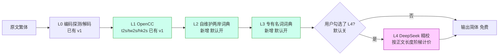
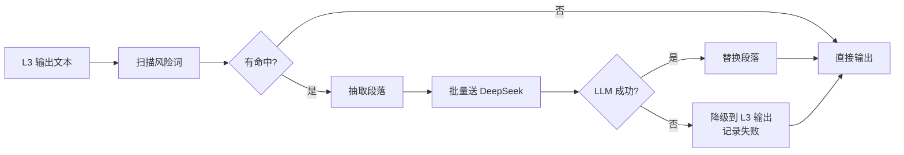
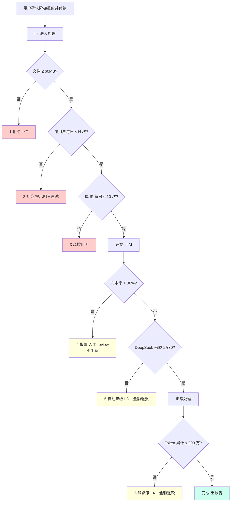
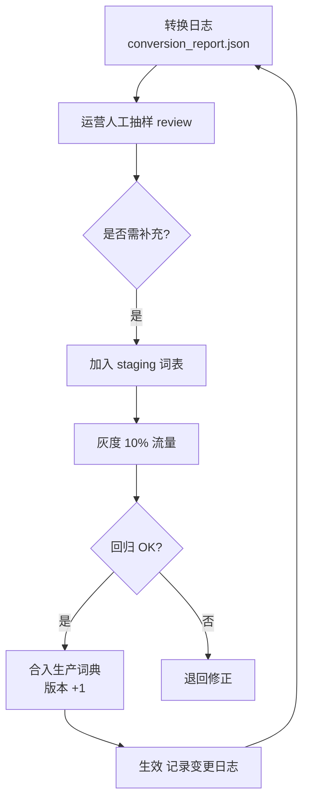

# 两岸用词差异处理方案（繁简转换 v2）

> v1（`docs/TRADITIONAL-TO-SIMPLIFIED-DESIGN.md`）解决了「字形 + 横排」，但 OpenCC 内置词典对**两岸三地用词差异**（軟體/软件、滑鼠/鼠标、雷根/里根、窩心/暖心 等）覆盖度有限。本文为 v2 设计：**分层管线 + 自维护词典 + DeepSeek 精校兜底**。

---

## 一、问题界定

「同样意思、两岸词汇不同」分为 5 类，处理方式不一样：

| 类别 | 例子 | 当前 `tw2s`/`hk2s` 是否能解决 | 本方案 |
|------|------|------|------|
| A. 纯字形差异 | 傳→传、體→体 | ✅ 已解决（v1）| L1 |
| B. 常见科技/生活用词 | 軟體→软件、網路→网络、滑鼠→鼠标 | ⚠️ 部分（OpenCC 内置词典覆盖有限）| L1 + **L2** |
| C. 专有名词（人名/地名/机构/品牌）| 雷根→里根、賓拉登→本拉登、奔馳→奔驰 | ❌ 几乎未解决 | **L3** |
| D. 流行语/网络用语/新词 | 影片→视频、貼文→帖子 | ❌ 词典老旧 | **L2 + L4** |
| E. 上下文相关歧义词 | 機車（交通工具 vs 吐槽词）、窩心（贴心 vs 委屈）| ❌ 字典法天花板 | **L4 LLM** |

**关键洞察**：OpenCC 是「字典替换」，对 A/B 友好；C/D 靠词典扩展可解；**E 类不引入语义模型解不彻底**。

---

## 二、方案总图（分层管线）



### 设计原则（呼应五大工程支柱）

| 工程支柱 | 本方案如何落地 |
|---|---|
| **数据可控** | 词典本地化（YAML/JSON 入仓），不依赖外部 API；DeepSeek 调用前敏感片段脱敏 |
| **链路可观测** | 每次转换产出 `conversion_report.json`，记录命中的层、条目、词典版本、Token 消耗 |
| **迭代性能** | 各层独立开关；词典文件支持热加载；L4 LLM 走标准接口，1 小时内可替换模型 |
| **失败可回滚** | 任意层失败自动降级到上一层；DeepSeek 余额不足或 Token 超额自动停 L4 并退款 |
| **成本可预测** | L4 仅命中段落触发；6 道护栏（见 §六）保证极端情况下成本不失控 |

---

## 三、各层详细设计

### 3.1 L1：OpenCC 字形 + 内置词典（已实现）

- 已在 `backend/app/engine/cleaners/cjk_normalizer.py` 实现
- 三种配置：`t2s` / `tw2s` / `hk2s`，由 `traditional_variant` 参数控制
- **本方案不改动 L1**，作为底层兜底

### 3.2 L2：自维护两岸用词词典（核心新增）

#### 3.2.1 词典结构（YAML，可热加载）

```yaml
# data/lexicon/tw_to_cn.general.yaml
version: "2026.05.18"
license: "MIT (sourced from tongwen-dict + CC BY-SA from MediaWiki)"
domain: "general"
entries:
  - tw: "軟體"
    cn: "软件"
    confidence: high
    tags: [tech]
  - tw: "滑鼠"
    cn: "鼠标"
    confidence: high
  - tw: "影片"
    cn: "视频"
    confidence: medium
    note: "在「影視作品」语境下也可能保留"
```

#### 3.2.2 词典领域（避免误伤）

| 领域文件 | 示例条目 | 默认启用 |
|---|---|---|
| `general.yaml` | 軟體/網路/滑鼠 | ✅ 全开 |
| `tech.yaml` | 雲端/伺服器/區塊鏈 | ✅ 全开 |
| `movie.yaml` | 影片/貼文 | ✅ 全开 |
| `risky.yaml` | 機車/窩心 等多义词 | ❌ 默认关（需 L4） |

API 参数：`lexicon_domains: ["general", "tech", "movie"]`（多选，默认前 3 个）。

#### 3.2.3 匹配器选型

| 方案 | 实现复杂度 | 性能 | 可观测性 | 推荐 |
|---|---|---|---|---|
| A. 编译进 OpenCC 自定义字典 | 低 | 最快 | ❌ 无法溯源具体条目 | 短期可用 |
| B. **OpenCC 后接 Aho-Corasick 自有匹配器** | 中 | 略慢（毫秒级）| ✅ 可记录命中条目/版本 | **采用** |

**决策**：直接走 B，避免后期切换成本。Python 实现可用 `pyahocorasick` 库（已在工程边界）。

#### 3.2.4 词典数据来源（冷启动）

| 来源 | 量级 | 许可证 | 备注 |
|---|---|---|---|
| **tongwen-dict** | ~5k | **MIT** ✅（用户已确认）| 维基百科繁简词条，质量中等 |
| MediaWiki 繁简转换表 | ~1.5w | CC BY-SA | 需在产品/文档页注明来源 |
| 自有转换日志反挖 | 持续 | - | **用户产生**，治理价值最大 |
| 人工维护（疑难词）| 百级 | - | 处理 E 类争议词 |

**冷启动路径**：先合并 tongwen-dict + MediaWiki 表打底 → 上线后靠日志增量积累 → 不要一开始手敲。

#### 3.2.5 安全替换约束

- **仅匹配 ≥2 字词**（避免单字误伤）
- **仅在文本节点替换**（不动 HTML 标签/属性，防止破坏 `<a href="軟體.html">`）
- **支持 do_not_translate 白名单**（用户可上传，如人名「林書豪」不要被处理）
- **长词优先**（Aho-Corasick 自动按最长匹配）

### 3.3 L3：专有名词词典（人名/地名/品牌）

单独成层的理由：
1. **敏感**：错一个人名读者就出戏，治理标准更高
2. **可定制**：出版社/客户口径不同，需 override 机制
3. **双向需求**：陆→台「首尔↔首爾」、台→陆「雷根↔里根」

**结构**：

```yaml
# data/lexicon/proper_noun.yaml
- tw: "雷根"
  cn: "里根"
  type: person
  source: "1980s US President"
  bidirectional: true
- tw: "賓拉登"
  cn: "本·拉登"
  type: person
- tw: "首爾"
  cn: "首尔"
  type: location
  bidirectional: true
```

**开关**：API 参数 `enable_proper_noun_dict: bool`，默认 `true`；用户可上传 `custom_lexicon_id` 做出版社级 override。

### 3.4 L4：DeepSeek 精校（付费可选）

> ⚠️ **唯一会触发 LLM 与计费的层**

#### 3.4.1 触发策略（关键：成本可控）

- **不全文跑 LLM**：只对**命中风险词的段落**调用 DeepSeek
- 风险词来自 `risky.yaml`：機車/窩心/打的/班房/土豆/搞 等高歧义词
- 命中段落以**段落**为单位送入（保留上下文）



#### 3.4.2 Prompt 模板（草案）

```
你是繁简转换的「中国大陆习惯用语」精校器。
任务：将下面的繁体中文段落转换为符合大陆习惯的简体中文，仅修改用词，不改动语义和文体。
约束：
1. 保留原段落的 HTML 标签结构（如 <p>、<em>）
2. 仅替换两岸用词差异，不做翻译或改写
3. 返回纯文本，不要解释

输入：
{paragraph_html}

输出：
```

#### 3.4.3 失败降级

| 失败类型 | 处理 |
|---|---|
| DeepSeek API 超时 / 5xx | 单段重试 1 次 → 仍失败则保留 L3 输出 |
| DeepSeek 余额不足 | 整本任务自动降级到 L3 + **全额退款** |
| LLM 返回格式错 | 单段保留 L3 输出，写入 `conversion_report.json` |
| 触达成本兜底（200 万 token，见 §六-6）| 静默停止 L4 + **全额退款** |

---

## 四、API/Schema 变更

### 4.1 新增请求参数

| 参数 | 类型 | 默认 | 说明 |
|---|---|---|---|
| `traditional_variant` | enum | `auto` | **沿用 v1**：auto/tw/hk |
| `lexicon_domains` | string[] | `["general","tech","movie"]` | L2 启用领域 |
| `enable_proper_noun_dict` | bool | `true` | L3 总开关 |
| `custom_lexicon_id` | string? | null | 用户上传的 override 词典 ID（暂留扩展位）|
| **`enable_precision_polish`** | **bool** | **`false`** | **L4 总开关，开启后按正文有效字数阶梯计价** |
| `alipay_order_no` | string? | null | 支付宝订单号（开启 L4 时必填）|

### 4.2 返回结构扩展（`conversion_report.json`）

```json
{
  "trace_id": "xxx",
  "lexicon_versions": {
    "general": "2026.05.18",
    "proper_noun": "2026.05.18"
  },
  "hits": [
    {"layer": "L1", "engine": "opencc", "profile": "tw2s"},
    {"layer": "L2", "tw": "軟體", "cn": "软件", "count": 12, "domain": "tech"},
    {"layer": "L3", "tw": "雷根", "cn": "里根", "count": 3},
    {"layer": "L4", "paragraphs_polished": 7, "tokens_in": 8400, "tokens_out": 6200, "cost_cny": 0.034}
  ],
  "l4": {
    "enabled": true,
    "model": "deepseek-chat",
    "fallback": false,
    "refund_required": false
  }
}
```

### 4.3 持久化（`storage_db.py`）

`JobRecord` 新增字段：
- `enable_precision_polish: bool`
- `precision_polish_status: enum('not_used', 'success', 'failed_refunded', 'fallback_refunded')`
- `lexicon_versions: jsonb`

需做一次 SQLite/Postgres 迁移。

---

## 五、价格策略（敲定）

### 5.1 定价表（对外保持极简）

| 套餐 | 价格 | 限制 | 内容 | 支付通道 |
|---|---|---|---|---|
| **免费体验** | **¥0** | **每月 1 本，单文件 ≤ 20MB** | L0+L1+L2+L3（覆盖 80%-90% 体验）| - |
| **单本处理** | **¥5.99/本** | 单文件 ≤ 60MB | EPUB 修复、排版优化、TOC 修复、设备优化、繁简标准转换 | **支付宝当面付**（沿用 `alipay.py`）|
| **AI 精校加购** | **¥3.99 起，阶梯计价** | 随单本处理或免费额度内主动勾选；支付前先解析正文并报价 | + L4 DeepSeek 精校（Token 不封顶）| **支付宝当面付** |

AI 精校按**正文有效字数**计价（去除目录、导航、样式、空白与重复元数据）：

| 正文有效字数 | AI 精校价格 |
|---|---:|
| ≤ 15 万字 | ¥3.99 |
| 15-30 万字 | ¥5.99 |
| 30-60 万字 | ¥8.99 |
| 60-100 万字 | ¥12.99 |
| > 100 万字 | ¥12.99 起，每增加 50 万字 + ¥4 |

### 5.2 定价理由

- 主价格只放两档：**免费体验 / 单本处理**，降低用户决策负担
- 免费额度从「每月 3 本」收紧为「**每月 1 本，≤20MB**」，既能试用，也能防止批量白嫖
- AI 精校作为高级选项隐藏在勾选项中，不进入主价格表
- 心理价位：**¥3.99 起**，小书低门槛，大书按正文长度自然加价
- `¥5.99/本` 作为核心单本处理价格，承载修复、排版和标准繁简转换
- DeepSeek 成本 ≈ ¥0.24/本（典型 30 万字）→ **毛利 94%**

### 5.3 成本测算（DeepSeek-chat 价目，¥1/M input + ¥4/M output）

| 场景 | 输入 token | 输出 token | 原始 | ×3 冗余 | 毛利率 |
|---|---|---|---|---|---|
| 典型 30 万字 / 5% 命中 | 2 万 | 1.5 万 | ¥0.08 | **¥0.24** | **94%** |
| 中长 50 万字 / 8% 命中 | 5 万 | 4 万 | ¥0.21 | ¥0.63 | 84% |
| 极端 80 万字 / 15% 命中 | 16 万 | 12 万 | ¥0.64 | ¥1.92 | 52% |
| 理论最坏（整书全命中）| 100 万 | 100 万 | ¥5 | ¥15 | -¥11（触发兜底退款）|

---

## 六、成本护栏（Token 不封顶下的「成本可预测」）

**对用户**：精校 Token 不封顶（产品承诺）  
**对内部**：6 道护栏保证极端值可控



| 序号 | 护栏 | 阈值 | 触发行为 | 用户感知 |
|---|---|---|---|---|
| 1 | 文件大小 | ≤ 60MB（沿用现有）| 上传时拒绝 | 提示「文件过大」|
| 2 | 每用户每日次数 | 每个支付订单只对 1 本生效 | 不能复用订单 | 透明 |
| 3 | 单 IP 每日次数 | ≤ 10 次 | 风控阻断 | 提示「今日额度已用完」|
| 4 | 命中率监控 | 单本风险词命中 > 30% | 报警 + 不阻断（可能文学书）| 透明 |
| 5 | DeepSeek 余额 | < ¥30 | 自动降级 L3 + 全额退款 | 提示「精校暂不可用，已退款」|
| 6 | **软兜底（用户不可见）** | 单本 token > 200 万 | 静默停 L4 + 全额退款 | 提示「部分段落降级处理，已退款」|

**呼应「失败可回滚」**：5/6 任一触发，**任务仍完成**（输出 L3 结果），用户**全额退款**。

---

## 七、与现有系统的衔接

### 7.1 模块改动清单

| 文件 | 改动 |
|---|---|
| `backend/app/engine/cleaners/cjk_normalizer.py` | 解耦为 4 个子组件：`OpenCCLayer` / `LexiconLayer(L2)` / `ProperNounLayer(L3)` / `LLMPolishLayer(L4)`；保留对外接口不变 |
| `backend/data/lexicon/*.yaml` | **新建目录** + 词典文件 |
| `backend/app/engine/cleaners/lexicon_matcher.py` | **新建**：Aho-Corasick 匹配器，统一被 L2/L3 复用 |
| `backend/app/engine/cleaners/llm_polish.py` | **新建**：L4 DeepSeek 调用 + 降级逻辑 |
| `backend/app/main.py` | API 增加 `enable_precision_polish` 等参数 + 支付校验 |
| `backend/app/storage_db.py` | `JobRecord` 加字段 + 迁移脚本 |
| `backend/app/infra/alipay.py` | **无改动**（直接复用 `create_alipay_precreate`）|
| `backend/app/tasks/balance_check.py` | 阈值从 `BALANCE_WARN_CNY=10` 调整为 `30` |
| `frontend/traditional-to-simplified.html` | 见 §八 |
| `frontend/vertical-to-horizontal.html` | 见 §八（同步改）|

### 7.2 与 AI 翻译（`semantics_translator.py`）的关系

| 维度 | 繁简精校（L4）| AI 翻译 |
|---|---|---|
| 触发 | 仅命中段落 | 全文 |
| 模型 | DeepSeek | DeepSeek（同源）|
| 计费 | ¥3.99 起，按正文有效字数阶梯计价（支付宝）| $1.99/本（PayPal）|
| 串联顺序 | **先翻译，后精校**（如果都开启）| - |

**串联场景**：若用户同时开「英→中翻译 + 简体大陆精校」，先 SemanticsTranslator 译为简体中文 → 再走 L1-L4 精校用词。两次 DeepSeek 调用，分别独立计费。

---

## 八、前端 UX 设计（同步告知用户）

### 8.1 落地页改动（`traditional-to-simplified.html` / `vertical-to-horizontal.html`）

在「**繁体来源**」下拉下方新增一个折叠面板「**用词风格**」：

```
┌─────────────────────────────────────────────┐
│ 用词风格   [标准（免费）  ▼]                  │
│                                               │
│  ○ 基础（免费）                               │
│     OpenCC 字形 + 内置词典                     │
│                                               │
│  ● 标准（免费 · 推荐）       ← 默认选中         │
│     ↑ 自维护两岸词典（軟體→软件等 1.5w+ 条）   │
│                                               │
│  ○ 精校（¥3.99 起，上传解析后报价）             │
│     ↑ AI 处理歧义词（窝心/机车等）             │
│     · 预计耗时 +20s                            │
│     · Token 不封顶，超额自动退款                │
└─────────────────────────────────────────────┘
```

### 8.2 三处文案钩子

#### 8.2.1 上传页 ⓘ 悬浮提示

> 同样一句话，台湾用「軟體」，大陆用「软件」。我们用三层管线智能处理常见用词差异（免费），精校层会调用 AI 解决「机车/窝心」等高度依赖上下文的歧义词，价格按正文有效字数阶梯计算，¥3.99 起。

#### 8.2.2 付费确认弹窗

> **精校用词：¥3.99 起**
> 
> · 仅处理疑难词段（约占全书 5%）  
> · 上传解析后按正文有效字数报价，支付前确认  
> · Token 不封顶，DeepSeek 余额不足或异常时**自动全额退款**  
> · 预计耗时 +20 秒  
> · 失败不扣费

#### 8.2.3 结果页质量报告新增条目

```
✨ 转换质量报告
├─ 字形转换：tw2s（OpenCC v1.1.6）
├─ 两岸词汇替换：147 处（词典版本 2026.05.18）
├─ 专有名词替换：12 处（雷根→里根 等）
└─ AI 精校：7 段（cost: ¥0.034）   ← 仅启用 L4 时显示
```

### 8.3 SEO 落地内容（顺手做）

在 `traditional-to-simplified.html` 的 FAQ 区新增一题：

> **Q: 為什麼「軟體」轉成「软体」而不是「软件」？**
> 
> A: 普通繁简转换是字形映射，会产生「软体」这种「字对了、词不对」的结果。FixEpub 的标准模式已内置两岸词典自动处理为「软件」；如需处理「窝心」「机车」「打的」等高度依赖上下文的歧义词，可启用 ¥3.99 起的精校模式，上传解析后按正文有效字数报价。

---

## 九、词典治理流程（闭环）



**节奏建议**：
- **冷启动期**（前 2 个月）：每周一次词典更新
- **稳定期**：每月一次

**版本号约定**：`YYYY.MM.DD`，跟随发布日期。回滚到任意历史版本只需修改配置。

---

## 十、实施路线（按 ROI 排序）

| 阶段 | 时长（估）| 内容 | 交付物 | 用户感知 |
|---|---|---|---|---|
| **P0 准备** | 0.5d | 拉取 tongwen-dict + MediaWiki 表 → 编译为 YAML；确定 schema | 词典文件 v0.1 | 无 |
| **P1 MVP（L2）** | 2-3d | Aho-Corasick 匹配器 + general 词典 + 报告字段 | 「軟體→软件」类替换生效，**免费** | **大幅提升** |
| **P2 L3 专有名词** | 2d | proper_noun.yaml + override 接口预留 | 「雷根→里根」类生效 | 中 |
| **P3 L4 精校 + 支付** | 3d | DeepSeek 调用 + 支付宝订单校验 + 阶梯报价 + 6 道护栏 + 前端 UI | ¥3.99 起的 AI 精校可用 | 小（按需）|
| **P4 治理** | 持续 | 日志反挖 + 灰度流程 + 版本管理 | 词典版本化 | 长期 |

> **P1 是「做对的事」**，把 80% 用户痛点（B 类常见用词）解决；P3 是锦上添花。

---

## 十一、验收标准（Definition of Done）

| 类别 | 指标 |
|---|---|
| **功能** | 繁体「軟體」→ 简体「软件」（标准模式，免费）✅ |
| | 繁体「雷根」→ 简体「里根」（专有名词模式，免费）✅ |
| | 繁体「機車真討厭」+ L4 → 简体「摩托车真讨厌」（精校模式，按正文长度计价）✅ |
| **性能** | 标准模式（L1+L2+L3）对单本 30 万字增加耗时 < 500ms |
| | 精校模式（+L4）对单本 30 万字增加耗时 < 30s |
| **稳定性** | 任一层失败（OpenCC/词典/LLM）不导致整本任务失败，能降级到上一层输出 |
| **成本** | 典型本毛利 ≥ 90%；极端本毛利 ≥ 50%；触达兜底自动退款 |
| **可观测** | 报告中可见每层命中数；L4 调用可见 token 与 ¥ |
| **可回滚** | 词典版本可任意切换；L4 总开关可一键关闭 |

---

## 十二、风险与对策

| 风险 | 对策 |
|---|---|
| **词典误伤**（如人名一部分被替换）| L2 默认仅匹配 ≥2 字 + `do_not_translate` 白名单 |
| **HTML 结构破坏** | 仅在文本节点替换，不动 tag/attr |
| **词典与 OpenCC 内置冲突** | L2 在 OpenCC **之后**跑；报告中标出「重复命中」便于清理 |
| **许可证** | tongwen-dict (MIT) ✅；MediaWiki (CC BY-SA) → 在产品页注明来源 |
| **DeepSeek 涨价** | 余额监控 + 阈值告警；走标准 OpenAI 兼容接口，1 小时内可换模型 |
| **用户期望「100% 大陆人口吻」** | 文案明确：规则法解 80%-90%，剩余可选 ¥3.99 起的 AI 精校 |
| **支付宝订单与任务解耦异常** | 沿用 `epub-repair.html` 已经验证的 `out_trade_no = job_id` 模式 |
| **L4 失败但用户已付款** | 6 道护栏中 5/6 触发都**自动退款**，沿用 `refund.html` 流程 |

---

## 十三、可观测性细节

每次转换 **必须**写入 `conversion_report.json`，至少包含：

```json
{
  "trace_id": "abc123",
  "job_id": "job_xxx",
  "input": {"filename": "x.epub", "size_mb": 5.2, "detected_lang": "zh-TW"},
  "config": {
    "traditional_variant": "tw",
    "lexicon_domains": ["general", "tech"],
    "enable_proper_noun_dict": true,
    "enable_precision_polish": true
  },
  "layers": {
    "L1_opencc": {"profile": "tw2s", "duration_ms": 234},
    "L2_lexicon": {
      "version": "2026.05.18",
      "hits": 147,
      "top_words": [{"tw":"軟體","cn":"软件","count":12}],
      "duration_ms": 89
    },
    "L3_proper_noun": {"version": "2026.05.18", "hits": 12, "duration_ms": 23},
    "L4_polish": {
      "model": "deepseek-chat",
      "paragraphs_polished": 7,
      "tokens_in": 8400,
      "tokens_out": 6200,
      "cost_cny": 0.034,
      "duration_ms": 18420,
      "fallback": false,
      "refunded": false
    }
  },
  "alipay_order_no": "20260518xxxx"
}
```

**用途**：
- 用户透明度（在前端报告卡片中展示精简版）
- 运营治理（词典命中 Top 词，识别新词需求）
- 财务对账（与支付宝订单匹配）
- 风控（命中率、退款率）

---

## 十四、文档变更联动

本方案上线时需同步更新：

| 文件 | 更新内容 |
|---|---|
| `docs/PRODUCT-STRATEGY.md` § 五 | 定价表新增「AI 精校 ¥3.99 起，按正文有效字数阶梯计价」 |
| `docs/TRADITIONAL-TO-SIMPLIFIED-DESIGN.md` | 顶部增加「v2 设计已发布」跳转链接 |
| `frontend/traditional-to-simplified.html` FAQ | 新增「软体 vs 软件」问答 |
| `frontend/vertical-to-horizontal.html` | 同步精校 UI 与 FAQ |
| `frontend/refund.html` | 补充「精校自动退款」条款 |

---

## 附录 A：风险词表（`risky.yaml` 示例）

仅命中下表词条的段落才会送入 L4 LLM，控制成本：

| 风险词 | 默认含义（台/港）| 大陆含义 | 处理策略 |
|---|---|---|---|
| 機車 | ① 摩托车 ② 形容人难搞 | 摩托车 | 上下文判断 |
| 窩心 | 贴心、温暖 | 委屈、郁闷 | **完全相反**，必须 LLM |
| 打的 | （台不用）| 打车 | 罕见情况 |
| 班房 | 教室 | 监狱 | 上下文判断 |
| 土豆 | 花生（台）| 马铃薯 | 上下文判断 |
| 搞 | 中性「做」| 中性「做」 | 一般保留 |
| 窗口 | 视窗（OS）| 窗口 | 看是否 OS 语境 |

完整表持续维护在 `data/lexicon/risky.yaml`。

---

## 附录 B：与 v1 设计的关系

- **不替代 v1**：v1 的「横排化 + OpenCC + 编码探测」仍是基础
- **本文为 v1 之上的增强**：v1 = L0+L1；v2 = L0+L1+**L2+L3+L4**
- v1 中提到的「若要做台湾用语→大陆用语风格转换，再考虑 LLM」**即本方案的 L4**
