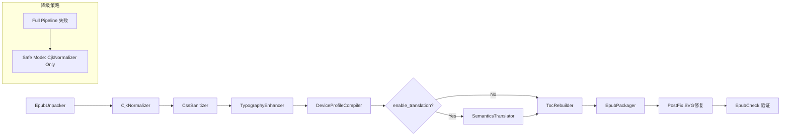

# EPUB Fixer 核心引擎技术设计

> **核心定位**：把引擎从"语法解析器（Syntax Parser）"升级为"语义编译器（Semantic Compiler）"。
> 引用 LLVM/GCC 的类比：同一个源文件，针对不同目标设备编译出最优解。

---

## 一、功能优先级全景矩阵

| 优先级 | 模块 | 功能名称 | 核心价值 | 实现状态 |
| :--- | :--- | :--- | :--- | :--- |
| **P0（生死线）** | 底层管道 | 无损解压与重打包 | 保证文件结构合法（`mimetype` 前置等） | ✅ 已实现 |
| **P0（生死线）** | 魔法清洗 | 暴力 CSS 降维打击 | 剔除绝对单位、硬编码字体与背景色 | ✅ 已实现 |
| **P0（生死线）** | CJK 处理 | 竖排转横排与方向清洗 | 清除 `rtl` / `vertical-rl` 标签，横向重排 | ✅ 已实现 |
| **P0（生死线）** | 质量校验 | EpubCheck 闭环 | 输出 100% 符合 Amazon KDP 上架标准 | ✅ 已实现 |
| **P1（商业壁垒）** | CJK 处理 | 繁简智能互转 | 港台轻小说/专业书受众刚需 | ✅ 已实现 |
| **P1（商业壁垒）** | 目标设备 | Kindle 墨水屏特化编译 | 去色、加黑边框、去透明度 | ✅ 已实现 |
| **P1（商业壁垒）** | 目标设备 | Apple Books 特化编译 | 保留色彩、WebKit 前缀 | ✅ 已实现 |
| **P1（商业壁垒）** | 魔法清洗 | 启发式目录重建与锚点重连 | 拯救无目录/目录失效文件 | ✅ 已实现 |
| **P1（商业壁垒）** | AI 翻译 | 全书 AI 翻译（保留排版） | `asyncio` + LLM + SQLite 缓存 | ✅ 已实现 |
| **P2（AI深水区）** | AI 语义重构 | 幽灵目录 AI 语义提取 | 对无明显标签文本，用 LLM 推断章节层级 | 🔲 待实现 |
| **P2（AI深水区）** | STEM 兼容 | 表格防溢出与公式保护 | 拯救学术/技术书籍，处理 MathML/SVG | 🔲 待实现 |
| **P2（AI深水区）** | 极致排版 | CJK 标点悬挂与两端对齐修复 | 注入避头尾规则，修复字间距撕裂 | ✅ 已实现 |
| **P2（AI深水区）** | 极致排版 | 孤字/寡行控制 | 段落末孤字绑定处理 | ✅ 已实现 |
| **P2（AI深水区）** | 无障碍合规 | AI 生成图片 Alt 文本 | 满足 ADA/A11y，通过海外平台上架审核 | 🔲 待实现 |

---

## 二、已实现的 Pipeline 架构



### 模块说明

| 模块 | 文件 | 职责 |
|---|---|---|
| `EpubUnpacker` | `engine/unpacker.py` | 用 `ebooklib` 加载 EPUB，返回 Book 对象 |
| `CjkNormalizer` | `cleaners/cjk_normalizer.py` | 横向化 CSS（`writing-mode`），替换竖排标点，繁体→简体（OpenCC） |
| `CssSanitizer` | `cleaners/css_sanitizer.py` | 纯正则清洗内联 style：剔除 `font-family`、固定行高、`background-color` |
| `TypographyEnhancer` | `cleaners/typography_enhancer.py` | 注入 `orphans/widows/overflow-wrap`，修复省略号和破折号 |
| `DeviceProfileCompiler` | `cleaners/device_profile.py` | Kindle 墨水屏去色 / Apple WebKit 前缀注入 |
| `SemanticsTranslator` | `cleaners/semantics_translator.py` | 异步 LLM 翻译，占位符保护 SVG/图片，SQLite 缓存去重 |
| `TocRebuilder` | `engine/toc_rebuilder.py` | 扫描 h1-h6 和加粗居中段落，重建 NCX/NAV 目录并注入锚点 |
| `EpubPackager` | `engine/packager.py` | `ebooklib` 打包 + PostFix（SVG 大小写修复、`<head/>` 补全、OPF 修复） |

### 目录结构

```
backend/app/
├── main.py                    # FastAPI API 层（路由、Job 调度）
├── converter.py               # EpubConverter（入口，分发 EPUB/PDF）
├── models.py                  # Job, JobStatus, OutputMode, DeviceProfile
├── storage.py                 # 内存 JobStore（线程安全）
└── engine/
    ├── __init__.py            # 导出 ExtremeCompiler
    ├── compiler.py            # ExtremeCompiler（Pipeline 调度器）
    ├── unpacker.py
    ├── packager.py
    ├── toc_rebuilder.py
    ├── translation_cache.py   # SQLite 缓存（SHA-256 哈希）
    └── cleaners/
        ├── __init__.py        # 导出全部清洗器
        ├── css_sanitizer.py
        ├── cjk_normalizer.py
        ├── device_profile.py
        └── semantics_translator.py
```

---

## 三、关键工程决策记录

### 决策 1：为何用纯正则而非 BeautifulSoup 处理 CSS

`ebooklib` 的 XML 解析器会把所有属性名强制小写，破坏 SVG 大小写敏感属性（如 `preserveAspectRatio` → `preserveaspectratio`），导致封面图片缩放异常。

**方案**：`CssSanitizer` 用纯正则在 `style="..."` 属性值内部做替换，不经过 DOM 解析。`EpubPackager` 的 PostFix 阶段在解压后的文件上做字符串级别的大小写修复。

### 决策 2：翻译时 SVG/图片保护机制

翻译阶段不能让 BeautifulSoup 碰 `<svg>` 和 `` 标签，否则同样破坏大小写属性。

**方案**：在进入 BeautifulSoup 之前，用纯正则把所有 `<svg>...</svg>` 和 `` 替换为字符串占位符 `IMG_PH_0`，翻译完成后再原样替换回来。

### 决策 3：Python 是唯一正确选择

- AI 基础设施：LLM 接入（DeepSeek/OpenAI/本地模型）Python 生态最完善
- DOM 操作：`BeautifulSoup4` 对烂 HTML 的容错率远高于 Node.js 的 cheerio
- EPUB 生态：`ebooklib` 提供底层 EPUB XML 结构操作能力

---

## 四、P2 深水区功能详细规划（待实现）

### 4.1 幽灵目录 AI 语义提取

**痛点**：很多小说章节名不是 `Chapter 1`，而是 `[艾莉亚]`、`第一日`、甚至只是 `***`，正则抓不到。

**方案**：调用轻量级 LLM，基于文本块的上下文语义、长度特征和间距特征推断章节层级，自动生成多级树状目录。

### 4.2 CJK 标点悬挂与两端对齐修复

**痛点**：中文 EPUB 在 Apple Books/Kindle 中出现极难看的字间距拉扯（`text-align: justify` + 无 CJK 断行规则导致）。

**方案**：
- 注入 `line-break: anywhere`、`word-break: break-all`
- 结合 `text-justify: inter-ideograph`
- 识别连续标点，防止出现排版空洞

### 4.3 无障碍合规（ADA/A11y）

**方案**：调用多模态大模型识别书中插图，自动生成 `alt` 文本，满足海外平台严格上架要求。

---

## 五、质量评估体系

### 机器校验层

- **EpubCheck 错误清零率**：修复后 100% 通过 W3C EpubCheck 校验
- **处理时延**：单本常规书（10MB 内）稳定在 5 秒以内（Serverless 兼容）
- **Token 成本统计**：翻译任务完成后输出 `TranslationStats` 摘要（模型、调用次数、费用估算）

### 视觉校验层（人工抽检）

1. **控制权释放测试**：调整字体大小和行距，文字是否跟随（验证绝对单位清除）
2. **夜间模式测试**：切换黑底白字，无残留硬编码白色背景
3. **跳转连贯性测试**：点击 TOC 目录，锚点是否精准落地

### 失败用例反哺机制

用户点击 👎 后，提示留下原始文件供分析——这是获取世界上最刁钻边界用例、不断加高护城河的最宝贵来源。
