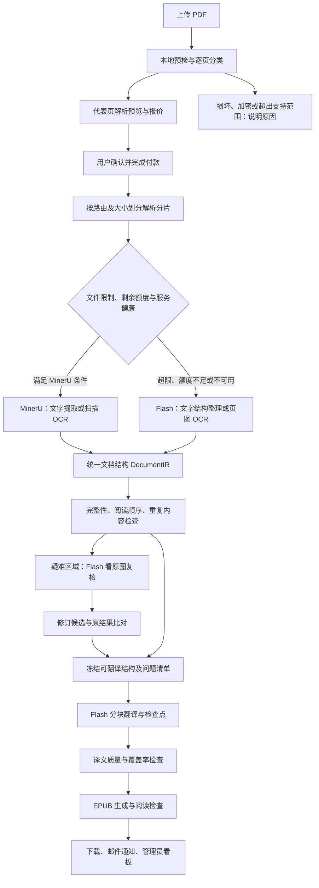

# PDF 翻译技术架构 v2.1：文本解析与扫描 OCR

日期：2026-09-21  
状态：**待用户审核，仅技术设计；未实现、未部署、未调用付费模型或上传书籍至外部服务。**

本文是 PDF 翻译的统一方案入口。已确定的产品要求与未确定的验收参数分开记录；更新文档不代表批准开发或上线。

### 阅读顺序

- 产品范围与整体流程：第 1–3 节。
- MinerU 免费额度、超限转 Flash、并发预留和防重复：第 4 节。
- Flash 独立 OCR、页码对照与固定报价：第 5–7 节。
- 恢复、速度与稳定性验收、成本：第 8–10 节。
- API Key 安全与联调验收：第 11–12 节。

### 最新决策记录（2026-09-21）

| 决策 | 当前约定 |
|---|---|
| 输入与输出 | 文本、扫描、混合 PDF；译文 EPUB＋原 PDF 页码对照 |
| 免费通道 | MinerU 云端 API Key；200 MB／200 页单文件限制，每日 1000 页最高优先级额度 |
| 超限策略 | 原文件或可用高优先级额度超限，未提交工作直接走 DeepSeek Flash；不拆单绕开路由规则 |
| Flash 能力 | 必须可独立完成全文 OCR，不能依赖 MinerU 先给出结果 |
| 渲染工具 | PDFium／Poppler 负责本地 PDF 转页图，二选一；不是 OCR 或翻译模型 |
| 速度与可靠性 | 同样本对比，不预设哪家更快；额度不足与服务异常需可切换、可追踪 |
| 密钥安全 | 仅服务端使用，私有配置 0600，不进入前端、源码、日志、任务载荷或部署包 |
| 本期状态 | 旧引擎配置建议已清理；PDF 入口仍关闭，待方案审核后实现 |

MinerU 免费属性按用户提供的服务方案记录，限额以第 4 节标注的官方文档与实际账号核验为依据；DeepSeek OCR 消耗 Token，须纳入订单和平台预览预算。

## 1. 结论与已确定需求

**文本型和扫描型是两条内容提取路线，共用一套结构整理、翻译、质量检查与 EPUB 交付流程。** 分流单位是页，必要时细化为区域，而不是给整本书贴一个标签。一本书可以同时包含原生文字页、扫描页、已有 OCR 文字层的扫描页和混合页。

本方案落实以下用户要求：

- 首版同时支持文本型、扫描型与混合型 PDF。
- 输出中文译文 EPUB，包含原 PDF 页码对照；不以复刻原布局的译文 PDF 为本期交付目标。
- MinerU 使用云端 API Key 接入，不自部署 MinerU 模型。
- DeepSeek 使用项目已配置的 Flash 通道，既可独立承担全文 OCR/布局提取，也承担翻译及按需视觉复核。
- MinerU 作为免费解析通道；单文件超限或每日高优先级额度不足时，直接将未提交工作路由到 Flash，不等待低优先级队列。
- OCR 速度、阅读质量、成本同时纳入验收，不能只以生成文件成功为标准。
- 局部异常尽可能局部处理，保留已完成成果；不能静默漏译，也不能把缺字猜补当作识别结果。
- 用户通过方案后才进入实现。真实 API 联调与费用预算在相应验收阶段另行明确。

### 1.1 与原方案的关系

旧解析引擎的选型、依赖与配置建议已清理；[PDF 接入入口](PDF-INTEGRATION-PLAN.md)仅链接本文件。当前工作树没有旧引擎的运行代码或依赖可移除；不因此删除 EPUBCheck 等其他功能需要的 Java 运行时。

现有代码核查结果：

| 位置 | 当前实现 | 本期需要补齐 |
|---|---|---|
| `backend/app/domain/input_formats.py`、`backend/app/main.py` | 文件名与文件头检查均拒绝 PDF | 仅在新流程完成验收、开关打开后接收 PDF |
| `backend/app/converter.py::_pdf_to_html` | pypdf 逐行抽取文字；无文字时生成占位内容 | 不作为收费交付路径；空提取应成为明确异常 |
| `backend/app/engine/adapters/html_to_epub_builder.py` | 简单单章节 HTML 打包 | PDF 需要多章节、图片资源、表格和页码导航 |
| `backend/app/domain/translation_checkpoints.py` | 已有与源文件、配置和章节关联的检查点 | 增加 PDF 解析版本、结构版本及页码映射到恢复指纹 |
| 现有订单、翻译、邮件与看板 | 已有可复用模块 | 适配 PDF 阶段、成本、部分完成和恢复状态；仍需集成回归 |

“可复用”不表示无需改动，尤其不能直接把整本 PDF 拼成一个巨大 XHTML 再翻译。

## 2. 总体架构

解析、翻译、打包分为独立后台阶段。前端关闭不会取消订单，API 服务不阻塞等待云端识别完成。混合文档会经过两条提取路线，但只有一份合并后的内容清单和一笔订单。

## 3. 两条解析路线与分流规则

| 页面情况 | 路线 | 关键检查 |
|---|---|---|
| 原生文字可读、字形与位置合理 | 文字路线，优先使用现有文字层 | 断行、连字符、双栏顺序、页眉页脚、脚注 |
| 整页扫描图，无可靠文字层 | 扫描路线，OCR 后恢复段落结构 | 旋转、倾斜、低清、漏行、表格与公式 |
| 扫描图已有隐藏 OCR 层 | 先验证文字层；可靠则复用，否则重新 OCR | 重复文字、乱码、文字与图像不对应 |
| 正文可提取，但局部图片含正文 | 文字与扫描路线组合 | 区域覆盖与去重，不能把整页重复翻译 |
| 空白、纯插图、封面或目录页 | 按页面角色处理 | 空白不等于 OCR 失败；封面不能因字少误判 |
| 提取异常且无法确定路线 | 标为待复核，保留原页 | 不凭文本字符数一个阈值直接作结论 |

### 3.1 本地预检

使用现有 pypdf 读取页数、加密状态和文字层信号，不宣称其具备 OCR。PDFium 与 Poppler 是可选的本地 PDF 渲染工具，用于把原 PDF 页面转换为 PNG/JPEG、提供预览、原图核验和区域裁图；它们不是 OCR 模型，也不需要云端 API Key。[PDFium](https://pdfium.googlesource.com/pdfium/) / [Poppler](https://poppler.freedesktop.org/)

渲染器与识别器分开：`PDF → 本地渲染页图 → Flash OCR → 原文结构`。首版只选一个渲染后端，优先评估 PDFium 的 Python 绑定；Poppler 作为候选，不默认同时安装两套。按需渲染并限制页图像素、内存、超时，禁止一次把整本书的高清页图装入内存。页面坐标、旋转和裁图变换都纳入回归。此处选型待离线验证。

分类综合使用有效字符比例、替换字符与乱码比例、文字重复程度、图像占比、文字区域覆盖等信号。阈值必须通过标注样本确定，不能把“有文字”直接等同于“无需 OCR”。

### 3.2 文字路线

本地读取负责预检和可靠文字层提取。满足免费通道条件时由 MinerU 完成结构化解析；超限或额度不足时走 Flash，将可用文字和位置线索作为输入，布局不明确时补充页图。纯文字页不为了切换供应商而无条件重新 OCR。双栏、表格、脚注和跨页段落仍需结构重建。

后续只有在同样本质量与速度达标后，才增加纯本地解析快路；首版不为节省一次 API 请求而牺牲阅读顺序。

### 3.3 扫描与混合路线

扫描页可由 MinerU 或独立的 Flash OCR 适配器完成识别与布局解析，产出可选中、可重排的正文。不能用原扫描页截图替代整页译文，却标为翻译成功。

应用采用统一的 `native / ocr / mixed / review` 路由概念，具体映射到所选 MinerU 云端模型参数。在接口验证前，不假设所有模型的 OCR 参数行为一致，也不假设“不强制 OCR”意味着云端完全不做视觉计算。

混合页优先利用服务返回的文字、图片与区域结构去重。需要独立区域请求时，必须通过适配器验证坐标回映射；不能假定云端 API 原生支持任意 bbox 参数。

## 4. 双通道路由与 MinerU 云端适配器

### 4.1 官方接口核查与边界

2026-09-21 查询的官方文档列出：精准解析使用 Bearer Token；单文件上限 200 MB、200 页；账号每日有 1000 页最高优先级额度，超出后优先级降低。本地文件可申请批量上传地址、上传后按 batch ID 查询结果，返回结构化结果包。以上是文档值，实际账号限额与字段行为须联调确认，不代表本项目已接入。[MinerU 云端 API 文档](https://mineru.net/apiManage/docs)

适配流程：

1. 持久化本地解析意图、输入哈希、页范围和配置指纹。
2. 申请上传地址，立即保存 batch/task 标识与分片对应关系。
3. 上传后调度短时轮询任务；排队等待不占用常驻 Web 请求或长时间占用 worker。
4. 结果完成后下载到服务端，验证包结构、页覆盖和资源引用，再写入 DocumentIR。
5. 前端只读取本系统状态，不获得 MinerU Key、临时上传链接或云端结果包地址。

首版以轮询为准，减少回调接入复杂度。上传超时、云端排队、解析失败、结果下载失败分别记录。若提交结果不确定，先恢复已有任务查询；不能把业务关联 ID 当作提供商保证的幂等键，也不能盲目再次提交。

### 4.2 免费通道与直接切换策略

用户已明确采用 MinerU 免费服务。方案按“供应商解析费为免费、仍消耗配额/网络/本机资源”记账；每日 1000 页是最高优先级额度，不等于超出后必然收费或彻底不可用。本系统选择超出后直接走 Flash，不依赖低优先级解析。

| 提交前条件 | 处理 |
|---|---|
| 原文件 ≤ 200 MB 且 ≤ 200 页，额度足够，服务健康 | 可走 MinerU 免费通道 |
| 原文件超过其中任一限制 | 整个新任务直接走 Flash；不拆成多个 MinerU 请求来绕过此路由规则 |
| 待提交页数超过剩余可用高优先级额度 | 当前未提交解析单元直接走 Flash，不为凑满额度刻意再拆小单元 |
| MinerU 密钥失效、持续错误或延迟触发熔断 | 未提交单元切换 Flash，并向管理员记录原因 |
| MinerU 已受理或提交状态不确定 | 先按原任务标识核查，不能立即重复投递 Flash |
| Flash 余额不足、预算不足或不可用 | 暂停并通知；不偷偷回到 MinerU 低优先级队列，也不无限重试 |

路由先遵守文件/配额硬规则，再评估服务健康和预算。可配置管理员强制 Flash，用于质量验收和可靠性要求更高的处理；不自动把“免费”当作唯一优先级。

### 4.3 配额核算与并发预留

- 维护账号级持久化用量账本，提交前原子预留页数；预览、失败重试和其他站内入口统一计入，防止多个 worker 同时认为还有额度。
- 若供应商提供可信剩余额度则同步；目前不能假设存在可直接查询余额的 API。站外使用同一 Key 会导致本地账本偏差，需独立账号或管理员校正。
- 提交失败仅在确认供应商未受理时释放预留；状态不确定保守占用，不能重复释放。按供应商核实的时区和重置周期结算，不随意假定本地午夜。
- 额度无法确定且无法保守保证时按不可用处理，未提交任务走 Flash。重启后账本、预留和外部任务标识必须保留。
- 如仅剩 80 页高优先级额度，新来 100 页解析任务直接走 Flash；已缓存且可复用的页不重新提交。

### 4.4 大书与 Flash 页图分批

- MinerU 的 200 页/200 MB 上限不作为本站或 Flash 的同等上限。超过它们的书走 Flash，但仍需满足本站独立的文件/资源上限。
- Flash OCR 按页或少量页面分批发送图片，遵守实际图片大小、总请求体、上下文和输出上限；不把 300 页 PDF 原文件当成一个图片请求。
- 大页需要裁成区域时保留小幅重叠、区域坐标和顺序；合并时去重，不能将重叠文本重复翻译。输入细节不足或输出截断时缩小区域重试，不把截断响应标为成功。
- 每批持久化明确的 `local_page → source_page_index` 映射，非连续页不能仅用起始页加偏移计算。
- 跨页段落、续表在 DocumentIR 合并阶段处理。整本仍只有一个订单和一份语义目录；识别批次不是用户章节。
- 每个解析单元只允许一个有效供应商结果。切换时递增版本并使旧回包失效；若供应商无法取消已受理任务，不能承诺不产生重复资源开销。首版对这类单元先恢复查询/人工处理，避免自动双跑。

## 5. DeepSeek Flash 的职责

使用项目配置的 `deepseek-flash` 通道；官方文档支持图文输入，但本项目的图片调用、请求限额与实际账号能力仍需验证。[DeepSeek 视觉 API 文档](https://api-docs.deepseek.com/guides/vision/)

| 职责 | 输入 | 输出与限制 |
|---|---|---|
| 独立 OCR / 布局提取 | 原页图或裁图、可靠文字层（如有）、源页与区域 ID | 输出原文、块类型及顺序；页号由程序注入，模型坐标只能作待验证候选 |
| OCR 疑难复核 | 原区域图、必要上下文、MinerU 原结果 | 修订候选及无法辨认标记；禁止只凭上下文猜字 |
| 阅读顺序复核 | 可疑区域图、带 ID 的文本块 | 顺序建议；必须保持块映射与覆盖，不能自由重写整页 |
| 正文翻译 | 已冻结的原文结构、术语表、章节上下文 | 译文块，与源块对应 |
| 图中嵌字翻译 | 可识别的局部文字与原图 | 首版以原图旁的译文说明呈现，不承诺图片像素重绘 |

Flash 直接识别路线需要覆盖全部待识别内容；MinerU 路线只对有证据的异常区域或验收抽样调用 Flash 复核，不对每页进行第二次完整识别。Flash 直接识别后也不默认用同一模型全量再识别一次。不同引擎的置信度不可直接比较；未提供置信度记为未知，不能制造精确分数。

复核候选必须通过块 ID、覆盖范围、数字、公式和文本完整性检查。不能用模型自评“很有信心”作为唯一通过标准。复核完成后冻结结构版本，再开展翻译；若修改源块，只使对应翻译检查点失效。

## 6. 统一文档结构与页码对照

建议建立独立、版本化的 DocumentIR，而不是以 Markdown 字符串作为唯一事实来源。

| 层级 | 必要字段 |
|---|---|
| 文档 | 源文件哈希、页数、标题、语言、IR 版本、解析配置指纹 |
| 页 | 原文件页序、可选印刷页码、尺寸、旋转、路线、处理状态与警告 |
| 块 | 稳定 block ID、类型、原文、顺序、章节、源页范围、坐标、提取来源 |
| 资源 | 图片/区域图哈希、本地引用、源位置、类型与大小 |
| 审计 | MinerU 原结果、Flash 修订候选、接受理由、版本与时间 |
| 翻译 | 源块哈希、目标语言、模型与提示版本、译文、QA、Token 与成本来源 |

内部统一使用从 1 开始的 `source_page_index`；供应商可能使用不同基数，转换只在适配层完成并通过边界测试。坐标统一为旋转校正后的页面归一化坐标，保留原坐标系与变换信息。

一个段落可关联多个源页和多个源区域。跨页合并不能丢失出处；稳定 ID 不能依赖临时文件名或每次随机生成的 EPUB 标识。

### 6.1 EPUB 呈现

- 按语义章节组织 XHTML，保留标题、列表、插图、图注和可用表格。
- 在 EPUB 导航中增加原页码列表与对应锚点，并提供普通可点击页码目录作为阅读器兼容回退。
- 标记“原 PDF 第 25 页”；印刷页码如“xii / 12”另列，不混为一种页码。
- 合并后的跨页段落可标记“原 PDF 第 25–26 页”；中文重排后不承诺逐字对应原页边界。
- 页码定位默认指向 EPUB 中的译文段落，不依赖临时下载链接。网站原 PDF 对照查看走现有鉴权。
- 简单表格生成表格；复杂表格或公式无法可靠重建时保留原区域图，能确认的译文另附说明，明确哪些文字未译。
- 避免把整本扫描图重复嵌入 EPUB；仅保留必要图片和异常区域，防止成品体积失控。

## 7. 付款前预览与报价

**调整此前“完整解析后按精确字数报价”的假设：扫描件若先全量 OCR，会在未付款时消耗完整解析配额并增加等待。** 首版建议采用以下可审核流程：

1. 免费本地预检整本文件：页数、类型分布、限制、可提取字数。
2. 代表页预览：建议不超过 3–5 页，覆盖正文、扫描和复杂页；这是拟议预算，不是已开通的免费额度。
3. 预览优先复用缓存并遵守相同路由规则。MinerU 免费预览仍扣减内部高优先级页数账本；需走 Flash 的预览仅在管理员预先批准的独立小额预算内执行，费用由平台承担。无预算时展示原页图及本地提取的预检预览，明确尚未完成 OCR；不假装已验证识别质量。设置会话、文件、每日额度与限流。
4. 文本型优先按可靠字数估价；扫描型按页数和抽样字数估算，混合型组合计算。展示固定总价及 OCR 范围，付款冻结金额，不在完成后突然追加收费。
5. 报价预留必要的 Flash OCR 切换成本，供应商选择不改变已冻结的用户应付额。同时设置内部成本上限；超限后暂停需要额外成本的工作并通知管理员，不继续无限消耗，也不擅自向用户补扣费用。

**PDF 翻译单独计价，不套用格式修复的 2.99 元。** 具体单价、预览资源预算与售后补偿规则待业务审核。若代表页无法稳定解析，先说明问题，不创建不可交付的收费承诺。

## 8. 任务状态、幂等和恢复

业务订单与技术阶段分离。沿用现有订单身份、权限及支付验签；下列是拟议阶段，不直接假定现有 JobStatus 已支持。

`preflight → preview → quoted → pending_payment → parsing → reviewing → translating → packaging → qa → completed`

其中 parsing 下细分本地排队、上传、供应商排队、识别、下载和合并。另设 `paused_balance / paused_quota / needs_review / partially_completed / failed` 的兼容映射。新增状态时同步前端、看板、重试和邮件，防止旧页面误显示完成。

| 故障 | 恢复策略 |
|---|---|
| 429、临时网络或 5xx | 有限指数退避并加抖动；提交不确定先查询，不盲目重复建任务 |
| 云端队列等待较长 | 保持排队状态，说明最后观测时间；不以进度暂时不变直接判失败 |
| MinerU 密钥无效或高优先级额度耗尽 | 未提交工作走 Flash；已提交工作先核查，保留成果并通知管理员 |
| Flash 余额不足或订单预算不足 | 暂停相应工作并通知管理员；恢复后重检余额/预算再续跑 |
| 部分页 OCR 或部分段翻译失败 | 继续独立部分；局部恢复，不整本重做 |
| 结果 ZIP 下载失败 | 重试下载已有任务结果，不能重新发起 OCR |
| 结构/正文严重缺失 | 进入需处理状态；不发布为完整译本 |
| worker 或服务器重启 | 从持久化任务 ID、页片状态和块检查点恢复 |

新增解析任务表、分片表、源页映射及阶段指标；大体积 IR 和资源存受控文件存储，数据库保存索引与校验和。worker 使用租约及原子状态变更防止并发重复执行；任务提交不保证供应商侧 exactly-once，异常窗口需显式记录与核对。

缓存指纹至少包括源哈希、页范围、提取模式、解析版本、结构修订版本、目标语言、模型和术语表。首版缓存按用户/订单权限隔离，哈希命中不授予他人文件访问权。

## 9. 速度、调度与成本

### 9.1 速度测量口径

记录上传、本地预检、预览、供应商排队、解析、下载合并、视觉复核、翻译、打包和 QA 的独立时间戳。流水线存在并行时，总耗时按关键路径计算，不能把各阶段耗时简单相加。

| 指标 | 定义 |
|---|---|
| 首次预览耗时 | 上传结束至可用原文预览展示 |
| OCR 观测墙钟耗时 | 提交至结果完整落盘，包含网络和供应商排队 |
| OCR 处理吞吐 | 有可靠运行起止数据时计算扫描页/分钟；无该数据时不伪造纯处理速度 |
| 端到端耗时 | 付款确认至可下载成品，另列上传到下载的全流程耗时 |
| 复核比例 | 进入 Flash 视觉复核的页/区域占比 |
| 冷/热缓存耗时 | 首次解析与检查点复用分别统计 |
| 长尾 | 样本量足够后给出 P50/P95，并同时报告样本数与失败数 |

进度只累计真实完成的页和块；没有供应商细粒度进度时显示阶段与等待时间，不能定时虚增百分比。预计完成时间先不给固定值，积累同类型、相近页数的真实数据后给区间，并在排队变化时更新。

### 9.2 优化顺序

1. 避免不必要的 OCR、重复上传、重复复核与重复翻译。
2. MinerU 在单文件允许范围内比较任务大小；Flash 比较单页/少量页及裁图策略、并发 1/2/4。实际参数服从图片请求限制、账号配额与站点预算，不把 PDF 页分片档位直接作为 Flash 图片批次大小。
3. 轮询带退避且用定时任务调度，防止等待占满 worker。
4. 按订单公平分配解析槽位，预览设小额独立额度，防止大书挤占所有任务。
5. 首版整本结构确认后翻译，以保证术语与目录一致；后续再评估按完整章节流水线重叠解析和翻译，不能边反复修订源块边重复付费翻译。

MinerU 云端识别无需本机部署 OCR 模型，但文件渲染、拆分、解包仍会消耗 CPU、内存和磁盘，必须有独立队列和资源限制。

### 9.3 可靠性与路由评价

“MinerU 免费服务可能不如 DeepSeek OCR 快或稳定”作为用户指出的风险纳入设计，目前无本项目对照测量证明两者孰优。用同一标注样本比较页图准备、网络、排队、首结果/整体耗时、超时率、成功率、恢复时间和提取完整性，区分 OCR 原文质量与翻译流畅度。

分别维护供应商健康窗口和熔断状态。阈值由实测确定，不凭单次慢请求切换整站；对未提交工作可直接避开不健康通道，对已受理工作遵守 4.4 的单结果与防重复规则。上线前必须验证 Flash 独立 OCR 能在没有任何 MinerU 结果时完整工作。

### 9.4 成本记账

按用户确认的免费方案，MinerU 供应商解析费记为“免费方案（0 元）”，同时保留方案来源/日期、页数与高优先级配额消耗；网络、渲染与存储资源单列。Flash OCR、视觉复核、翻译分别记录输入输出/缓存 Token 和估算/实际费用。免费方案状态失效或不明时标为待核实；缺失计费数据不能自动推断为 0。

MinerU 云端模型、已有 DeepSeek API Key 的图片请求能力、账号实时配额、价格表生效日期都应成为验收记录。密钥不写入配置快照、日志或报告。

## 10. 质量与交付状态

质量分两道门：提取质量与翻译质量。流畅的译文不能弥补错误的 OCR 原文。

- 全页清点：每页必须有“提取完成、合理空白/插图、异常保留”等明确结果，无静默缺页。
- 内容清点：非装饰源块必须有译文、保留原因或错误记录；页眉页脚移除须保留可核查记录。
- 专项检查：数字、代码、公式、表格行列、脚注锚点、双栏顺序、跨页合并和重复文本。
- EPUB 检查：结构与资源引用通过检查，并在 Apple Books 实际抽检正文、目录、图片、表格和页码导航。
- 全部必要正文通过：标为完成；仍有必要正文未翻译：标为部分完成/需处理，给出原页码和影响，不发“整本翻译完成”的误导邮件。
- 局部原图回退不阻断其他可处理内容；但全文几乎都回退原图时不能算可交付译本。

## 11. 安全、留存和系统接入

### 11.1 API Key 安全要求（实现与上线门禁）

- 仅服务端使用 Key，沿用现有 Flash 配置，新增 MinerU 独立环境项；原始值不进入浏览器、URL 查询参数、数据库业务记录、任务消息或模型提示词。
- 配置文件权限 0600、所在私有目录限制访问，使用部署服务身份读取。配置输入隐藏回显，不使用带 Key 的命令行参数，不开启 shell 调试打印；只返回配置是否存在和检查结果。
- `.env`、密钥、含密钥的备份不得进入 Git、部署 ZIP、容器构建上下文、公开静态目录或报告；生产备份只留在受限服务器路径。上线前检查实际打包内容，不能只依赖 `.gitignore`。
- HTTP 日志和异常先脱敏，再输出白名单字段。屏蔽 Authorization、完整请求体、环境变量及临时签名链接；供应商 Key 只发送给固定对应的 HTTPS API 主机，上传/结果 CDN 请求不携带 API Authorization，也不能随重定向转发。
- 模型输入仅含书籍和解析上下文；书内文字按不可信数据处理，不能指令程序读取配置、调用任意 URL 或泄露系统信息。
- 管理界面只显示“已配置/需更新”等状态，不提供读取原 Key 的接口；配置修改与测试需管理员权限，认证测试不发送真实书籍。
- 支持独立轮换、撤销和禁用通道；发现泄露先撤销再替换，错误日志只记录渠道和任务标识。配置加载/重启沿用现有安全发布流程。
- 使用虚构哨兵 Key 做泄露回归：成功/失败、401/429/5xx、重定向、超时、任务序列化和打包结果均不得出现原值；严禁拿真实 Key 做快照测试。

以上是拟实施要求，本轮没有读取、复制或修改真实 Key，不能将文档要求视为生产已经验收。

### 11.2 文件与运行安全
- 页面说明外部解析/翻译服务处理范围；预览阶段也可能上传抽样内容，不把云端预览写成“完全本地”。
- 上传限制同时校验类型、页数、解密能力与资源消耗；加密或损坏文件提前说明。远端下载做 HTTPS/目标地址校验，结果解包防路径穿越及解压膨胀。
- 原文件、分片、OCR 结果和译文沿用受控下载权限。正式结果不能依赖供应商短期 URL；本地验证落盘后才标记阶段完成。
- 活跃任务及可恢复失败任务保留必要中间成果。按公开留存期限统一清理，不能在每次 worker 的 finally 中删除恢复所需数据。具体留存天数和供应商端删除能力上线前明确。
- 独立 PDF 开关关闭后只阻止新单；已有付费单需继续可恢复。部署沿用项目脚本，先核查运行订单和数据迁移兼容性。

建议模块边界（名称为设计建议，不表示文件已存在）：

| 模块 | 职责 |
|---|---|
| `pdf_preflight` | 元数据、类型分类、限制与代表页选择 |
| `pdf_partition` | 分片、页图、源页映射 |
| `mineru_client` | 鉴权、上传、轮询、错误分类与结果下载 |
| `pdf_document_ir` | 页/块/资源结构、版本和清点 |
| `pdf_provider_router` | 单文件限制、账号额度原子预留、健康熔断、切换和单结果版本 |
| `deepseek_pdf_ocr` | Flash 独立页图识别、请求/输出限制、结构校验与页码映射 |
| `pdf_visual_review` | 疑难区域候选修订与质量验证 |
| `pdf_translation_orchestrator` | 支付后阶段调度、检查点、预算与恢复 |
| `pdf_epub_builder` | 章节、资源、目录与页码锚点 |
| 现有订单/支付/邮件/看板 | 统一订单身份，扩展状态展示与成本信息 |

## 12. 验收计划与决策门

### A. 离线验证：不调用外部 API、不消耗模型 Token

使用有权使用的 PDF 和供应商响应替身，验证页分类、分片、页码回映射、IR 合并、付款金额冻结、重复事件、服务重启、缓存、损坏响应、结果解包和 EPUB 构建。覆盖 10、100、300 页档位；300 页应直接选择 Flash。补充 200/201 页与 200 MB 边界、剩余 80 页却提交 100 页、跨日配额、并发抢额度、未知提交结果、供应商迟到回包、OCR 输出截断及哨兵 Key 防泄露测试。

此阶段不能证明 MinerU 真实 OCR 质量、配额或耗时，也不能证明 Flash 图片识别效果。

### B. 真实 API 验证：预算批准后执行

准备至少 12 份代表性文档，覆盖文本单栏/双栏、清晰扫描/低清旋转、混合文字层、表格公式和已有错误 OCR 层；建立人工标注页集。比较 MinerU 免费通道与 Flash 独立 OCR 的同页结果、整体速度、超时率和恢复能力；再比较 Flash 局部复核的收益。分别验证高优先级额度内与切换后的行为，避免只比较主观流畅度。

必须输出：首览与端到端时间、排队/处理时间可观测性、字符错误率、阅读顺序、页块完整性、表格/公式抽检、视觉复核比例、实际/估算成本及来源。

不预设未经实测的“100 页几分钟”。硬门禁是无静默缺页、源页映射正确、无重复收费/翻译、异常可恢复、成品状态真实；速度与识别精度的数值门槛由该基线报告提出，用户确认后固定。

### C. 管理员试用与灰度

先管理员试用，再对有限用户开放。完成真实付款、异步恢复、邮件送达和 Apple Books 阅读检查，保持既有 EPUB 回归通过。两条 PDF 路线均验收后才宣称支持文本与扫描 PDF 翻译。

### 审核时仍需确定

1. 固定报价算法、OCR 预览资源预算、单订单成本上限。
2. 本站页数/体积上限及文件留存期限（供应商上限不自动成为本站承诺）。
3. 真实联调可用的 MinerU Key、账号配额和费用预算；密钥走安全配置，不在聊天提供。
4. 部分完成后的补译、人工处理与退款规则。

以上属于方案参数，不妨碍明确架构；本文件完成不代表用户批准实现。

## 13. 参考资料

- [MinerU 云端 API](https://mineru.net/apiManage/docs)：本方案使用云端精准解析能力；开源本地版功能不自动等同于此 API。
- [DeepSeek 图片输入](https://api-docs.deepseek.com/guides/vision/)：Flash 图片输入契约。
- [pypdf 文字提取说明](https://pypdf.readthedocs.io/en/stable/user/extract-text.html)：文字层提取与扫描件 OCR 的区别。
- [PDF 接入入口](PDF-INTEGRATION-PLAN.md)：旧入口已清理，统一指向本方案。

外部文档核查日期为 2026-09-21；实现时需再次核对并锁定接口适配版本。文中的路由、预算、数据结构和调度方式为本项目拟议设计，不是供应商性能保证。
