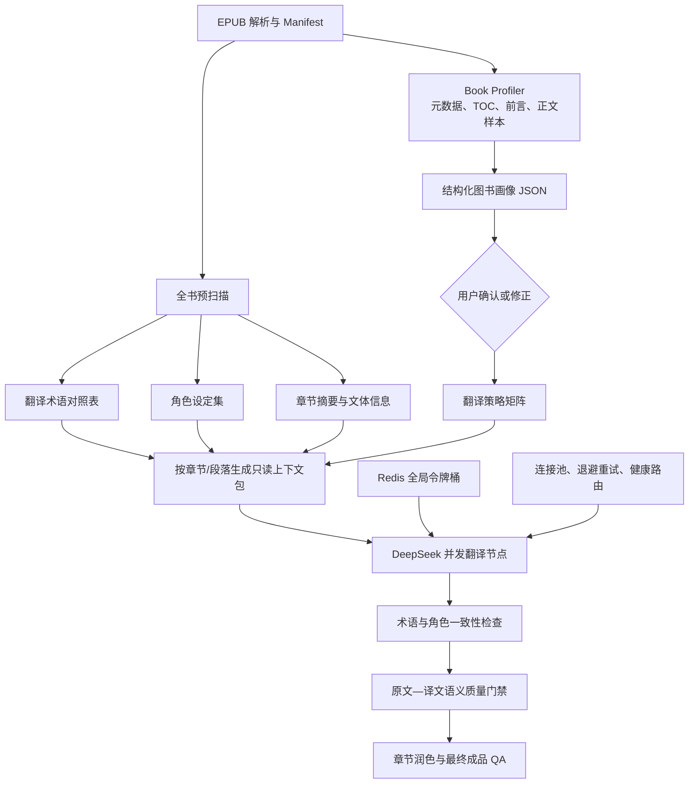

# EPUB 翻译质量增强方案

> 状态：第一、第二阶段已落地，保留 OCR 与深度评测增强项
>
> 更新时间：2026-07-27
>
> 本文同时记录方案、已实现边界和待办，不应把规划项误认为现有能力。

## 0. 实施状态（2026-07-27）

已接入主翻译链路：

- Book Profiler 有界抽样、结构化画像、证据/置信度、人物设定和失败回退。
- 五类受版本管理的策略矩阵、用户提交前人工覆盖和 `mirror_fidelity` 负面约束。
- 动态 Prompt、策略/画像/上下文缓存隔离、相关术语与人物子集注入。
- 翻译前确定性生成章节只读抽样提要；并发请求之间没有串行滑动窗口。
- 全书术语目录和角色译名合并；否定、因果、转折丢失作为新增复核信号。
- 可选 Redis 跨 Worker RPM/TPM 令牌桶；默认关闭，待生产配额压测后启用。
- 翻译上传先进入 `awaiting_confirmation`：探针完成后展示画像、依据和抽样范围，用户确认前不创建支付订单、不启动翻译。
- 用户可在线修订全书策略、术语、角色译名/身份、双语输出、术语标记和章节级覆盖策略；确认快照版本化保存在当前任务。独立脚注文件仍照常翻译，但默认继承全书策略，不为每个单行脚注生成冗余的章节覆盖控件。
- 章节覆盖策略进入实际 Prompt、文学润色权限和缓存上下文，不只是前端展示。
- 增加句子数量/结构异常、跨章节标准术语和角色译名漂移复核信号；当前均为告警，不作为独立交付门禁。
- 可选 Redis 全局健康路由共享供应商/模型的失败、冷却和延迟；Redis 不可用时回退进程内健康状态。
- 已确认术语可在 Reduce 前确定性插入 `epub-term` 标记；默认关闭，模型无权自由生成高亮标签。

仍未完成：

- OCR 与图文重绘、反向翻译辅助信号。
- 基于向量或独立模型的深层句级语义蕴含评测，以及无明确原文证据时的角色关系推断；当前只做保守的确定性结构与标准译名检查。
- Redis 令牌桶和全局健康路由的生产配额压测与参数标定；两者默认关闭。

## 1. 目标

在不单纯依赖修改大模型提示词的前提下，从全书知识、上下文组织、请求治理和质量验证四个层面提高 EPUB 翻译质量与稳定性：

1. 全书先生成《翻译术语对照表》和《角色设定集》。
2. 翻译前生成只读的上下文包，提供章节摘要、相邻内容和相关全局设定。
3. 并发翻译节点共享一致的术语、人物和风格约束。
4. 使用动态并发、连接池、退避重试、健康路由和分布式令牌桶稳定模型调用。
5. 使用原文—译文质量门禁识别漏译、增译、错译和跨章节不一致。

## 2. 总体流程



关键约束：上下文资料在并发翻译开始前生成，并作为只读数据分发。并发请求之间不依赖彼此的完成顺序。

## 3. 前置分析与动态策略路由

在正式启动全书切块翻译前，新增“前置分析与路由”（Pre-analysis & Routing）阶段。该阶段先判断书籍类型、语言难度、叙事基调和忠实度风险，再决定后续翻译策略，避免所有书籍共用同一套翻译人设。

### 3.1 图书探针（Book Profiler）

#### 输入范围

图书探针读取以下只读信息：

- OPF 元数据：书名、作者、语言、出版信息、主题和简介。
- EPUB 目录（TOC）及章节层级。
- 前言、序言或导论。
- 第一章前几千字。
- 对于长书，可从全书前部、中部、后部增加少量分布式样本，避免仅凭前言误判正文文体。

探针模型应支持足够的上下文长度和稳定的结构化输出。Google Gemini API 可以作为候选，但实现时应保持供应商可配置；将书稿发送到新的模型供应商前，必须满足用户授权、隐私披露和数据路由要求。

#### 输出格式

探针必须通过 JSON Schema 返回结构化结果，不能只输出自然语言评价。建议结构：

```json
{
  "genre": "philosophy",
  "subgenres": ["political_philosophy", "history"],
  "tone": ["serious", "argumentative", "historically_situated"],
  "complexity": {
    "source_level": "C1",
    "syntax": "complex",
    "terminology_density": "high"
  },
  "narrative": {
    "person": "third",
    "dialogue_ratio": "low",
    "rhetorical_features": ["irony", "nested_clauses"]
  },
  "fidelity_risk": "high",
  "recommended_strategy": "mirror_fidelity",
  "confidence": 0.91,
  "evidence": [
    {
      "source": "preface",
      "reason": "contains historically situated political argument"
    }
  ]
}
```

必须保存探针输入范围、模型、版本、输出、置信度和证据，便于复核。JSON 解析或 Schema 校验失败时，不能凭不完整结果路由。

`B1/B2/C1` 等级只表示原文语言复杂度，不代表可以自动降低译文思想难度。原文表达通俗时可以选择更自然的中文叙事；原文思想复杂时不能为了匹配较低阅读等级而简化概念。

### 3.2 翻译策略矩阵

后端预置有限且可测试的策略，不允许探针临时自由生成任意翻译规则。建议第一阶段提供五类：

| 策略 | 适用书籍 | 核心目标 | 润色权限 |
|---|---|---|---|
| `neutral_faithful` | 类型不明确或低置信度书籍 | 忠实、清晰、稳健 | 低 |
| `literary_narrative` | 通俗小说、叙事文学 | 对话自然、人物声音连贯、场景有氛围 | 中，但不得增删事实 |
| `academic_rigorous` | 学术、社科、理论著作 | 术语精确、论证链完整、定义一致 | 低 |
| `mirror_fidelity` | 历史、政治、哲学、法律及高精度技术文献 | 镜像级忠实，保留修辞、语锋和结构张力 | 极低或关闭 |
| `practical_technical` | 手册、教程、技术文档、科普 | 指令清晰、步骤准确、名词统一 | 低到中 |

路由示例：

- B1/B2 通俗小说优先进入 `literary_narrative`，允许在不改变事实、人物关系和语气的前提下调整中文语序、拆分不适合中文阅读的长句。
- 哲学、认识论、政治理论、市场反身性等著作进入 `academic_rigorous` 或 `mirror_fidelity`，由忠实度风险决定。
- 手册和技术文档进入 `practical_technical`，优先保证操作步骤、警告、变量、参数和专有名词准确。
- 探针置信度不足、文体混合或 Schema 异常时，回退到 `neutral_faithful` 并提示用户确认。

一本书可以有“全书主策略＋章节覆盖策略”。例如正文采用文学叙事，附录、技术说明和书目仍采用严谨策略。

### 3.3 镜像级忠实（Mirror-level Fidelity）

政治、历史、哲学、法律和高精度技术文献默认将“绝对忠实”置于流畅和通俗之前。

核心规则：

- **克制润色**：关闭或大幅削弱文学润色权限。
- **保留修辞与语锋**：保留比喻、排比、外交辞令、讽刺、情绪强度和刻意含糊。
- **结构映射**：在符合中文基本语法的底线之上，尽量保持逻辑顺序、从句嵌套和论证层级。
- **零增删**：禁止添加解释、背景补充、总结或省略过渡词。
- **保持时代语境**：禁止用现代网络文学、营销文案或轻快口吻改写历史文献。
- **保留认识边界**：原文故意含糊或证据不足时，译文不得擅自明确化。
- **保留立场与争议性**：不得弱化、审查、美化或替作者修正观点。

镜像级忠实的负面约束模板应作为受版本管理的策略资产，而不是散落在代码中的临时字符串。示意：

```text
首要原则：绝对忠实于原文。
禁止简化或剥离原文修辞、讽刺、情绪强度和刻意模糊。
禁止改变逻辑推导顺序、因果、否定、程度和从句关系。
禁止添加解释性文字、总结或省略过渡内容。
在中文语法允许范围内，尽量保持原文结构与时代语感。
```

### 3.4 动态组装翻译请求

逐段调用 DeepSeek 时，System Prompt 和结构化请求按确定顺序组装：

```text
[全局忠实与安全基础指令]
+ [探针选择的文体策略]
+ [书籍画像与全书风格约束]
+ [当前块相关的术语子集和角色设定子集]
+ [章节摘要与只读上下文包]
+ [HTML 占位符和输出 JSON 契约]
```

约束：

- 完整术语表和角色设定集保存在任务级只读存储中，每次只注入当前块相关子集。
- 策略模板、探针结果、术语版本、角色版本和上下文哈希进入缓存命名空间，防止跨策略误用旧译文。
- 格式保护规则拥有最高优先级；任何策略都不能修改、删除或重排 HTML 标签和锚点。
- `mirror_fidelity` 不应自动进入强文学润色；必须使用对应的克制编辑和原文语义门禁。

### 3.5 异常处理与人工干预

探针完成后，前端展示一个简洁的确认面板：

```text
AI 判定：严肃哲学 / 政治思想
建议策略：镜像级忠实
判断置信度：91%
主要依据：高密度理论术语、嵌套论证、历史语境
```

用户可以：

- 接受建议策略。
- 改选文学叙事、学术严谨、镜像级忠实、技术实用或中性忠实。
- 查看探针依据和抽样范围。
- 修改或确认术语、人物和称谓。
- 将本次选择锁定为全书策略。

处理规则：

- 低置信度、混合文体、探针失败或策略冲突时必须要求用户确认。
- 高置信度结果可以默认选中建议项，但在用户确认前不能悄悄改变已明确选择的翻译模式。
- 用户选择优先于探针结果，并记录覆盖原因。
- 探针服务不可用时回退到 `neutral_faithful`，不能阻塞普通翻译。

当前实现中，翻译任务首次上传不会立即下单，而是返回
`awaiting_confirmation + translation_preflight`。只有
`POST /api/v2/jobs/{job_id}/confirm-profile` 原子保存用户修订后，后端才创建
支付宝订单；重复确认返回冲突，避免重复下单。

### 3.6 双语对照与术语溯源

镜像级忠实面向历史研究者、严肃阅读者和具有原文阅读能力的用户，建议强化溯源能力：

- 支持段落级原文—译文交织，使用现有双语 EPUB 结构和不同 CSS 样式区分。
- 在探针建议 `mirror_fidelity` 时，前端可以推荐开启双语对照。
- 是否自动默认开启双语对照仍属于待确认的产品决策，不能在未告知用户时改变输出模式或价格。
- 术语高亮应由 Reduce/重打包阶段基于已确认术语表确定性插入专用标签，不能让模型自由生成或改写 HTML。
- 高亮可携带原文术语、统一译名和说明引用，但默认展示应克制，避免破坏正常阅读。

## 4. 全书术语对照表与角色设定集

### 4.1 当前已有能力

- 扫描全书正文并抽取高频人名、地名、机构名和缩写候选。
- 调用模型统一翻译候选术语。
- 合并公共术语、自动术语和用户术语。
- 翻译每个段落时只注入该段实际出现的相关术语。
- 文学模式可以从代表性段落生成全书风格档案。

当前主要实现位置：

- `backend/app/engine/glossary_extractor.py`
- `backend/app/engine/glossary_service.py`
- `backend/app/domain/fast_translation_runner.py`
- `backend/app/engine/cleaners/semantics_translator.py`

### 4.2 已新增：《翻译术语对照表》

建议字段：

| 字段 | 说明 |
|---|---|
| 原文术语 | 原书中的名称或固定表达 |
| 统一译名 | 全书采用的目标语言译法 |
| 类型 | 人名、地名、组织、书名、专业术语、称谓等 |
| 别名 | 简称、缩写、旧称或不同拼写 |
| 首次出现位置 | 章节、文件和 locator |
| 原文例句 | 用于消歧的上下文 |
| 来源 | 公共词库、自动生成、用户指定、人工确认 |
| 置信度 | 自动判断的可靠程度 |
| 状态 | 自动、已确认、已修订、禁止使用 |

术语表应版本化。用户确认或修订后的译法优先级最高，并可作为后续同类书稿的高质量翻译记忆。

### 4.3 已新增：《角色设定集》

建议字段：

| 字段 | 说明 |
|---|---|
| 角色 ID | 同一人物的稳定标识 |
| 原文姓名 | 全名及原文写法 |
| 中文译名 | 全书统一译名 |
| 别名与称谓 | 姓氏、昵称、头衔和代称 |
| 性别与代词 | 仅在原文有可靠依据时记录 |
| 身份 | 职务、阵营、社会角色 |
| 人物关系 | 亲属、同事、对手等 |
| 时代与地点 | 与称谓、语域有关的背景 |
| 首次出现位置 | 用于追踪和人工复核 |
| 证据片段 | 支撑设定的原文 |
| 置信度 | 明确、推断、待确认 |

角色设定不能根据常识随意补充。没有可靠原文证据的字段必须标记为“未知”或“待确认”。

### 4.4 向并发节点分发

- 全量术语表和角色集保存在任务级只读存储中。
- 每个翻译块只检索并携带当前内容涉及的术语和角色。
- 全书通用翻译规则与文学风格档案可以进入 System Prompt。
- 当前段落相关术语、人物设定和上下文作为结构化请求字段发送。
- 不把完整角色集和完整术语库塞入每个请求，避免 Token 浪费及无关设定干扰。

## 5. 只读上下文包

### 5.1 当前已有能力

高质量和文学模式当前会为翻译块提供：

- 书名。
- 当前章节文件。
- 上一段的截断文本。
- 下一段的截断文本。
- 当前段落实际涉及的术语。

标准模式当前不携带这些章节上下文。

### 5.2 待新增上下文

建议在翻译开始前一次性生成：

- 全书简要背景。
- 章节摘要。
- 章节文体与叙述视角。
- 当前场景涉及的人物及关系。
- 当前章节新增的术语和别名。
- 当前块前若干段的压缩摘要。
- 当前块后的必要消歧信息。
- 与当前块相关的术语、角色和风格规则。

单个请求建议包含：

```text
当前待翻译块
+ 章节摘要
+ 当前块前文摘要
+ 必要的相邻原文
+ 相关术语子集
+ 相关角色设定子集
+ 全书风格约束
```

### 5.3 明确删除的方案

不采用“每个请求完成后，再串行更新滑动窗口，然后启动下一个请求”的方案。

原因：

- 会使并发节点互相等待。
- 大幅降低长书翻译速度。
- 请求完成顺序不稳定，容易污染上下文状态。
- 某个慢请求或失败请求可能阻塞后续章节。

替代方案：

- 翻译前预生成只读章节摘要和上下文包。
- 按 chunk 位置确定性地提取前文窗口，不依赖请求完成顺序。
- 如果需要使用已完成译文更新知识，只在章节完成后进行集中一致性复核，不阻塞首轮并发翻译。

## 6. 模型请求治理

### 6.1 当前已有能力

- 单本书内部使用动态并发限制器。
- 请求失败时降低并发。
- 连续快速成功后逐步恢复并发。
- 使用 HTTP Keep-Alive 连接池。
- 使用指数退避和随机抖动重试。
- 支持主模型、备用模型、主通道、备用通道和 TokenHub。
- 根据近期失败次数、冷却时间和延迟调整模型路由顺序。
- 批量失败时自动拆分后重试。

### 6.2 已新增（默认关闭）：分布式令牌桶

当前动态并发只在单个翻译进程内生效。后续建议通过 Redis 建立跨 Worker 共享的令牌桶：

- 按供应商和模型分别配置 RPM、TPM 和最大并发。
- 请求前预估输入与输出 Token，并从对应桶中申请额度。
- 请求完成后按真实 Token 用量修正。
- 429 或超时增加通道惩罚并降低放行速度。
- 多本书共享配额，避免不同 Worker 同时冲击同一模型。
- 为付费任务、重试任务和后台低优先级任务设置不同队列权重。

### 6.3 已新增（默认关闭）：全局健康路由

- 将当前进程内的路由健康状态保存到 Redis。
- 多个 Worker 共享供应商延迟、失败率、429、鉴权错误和熔断状态。
- 在满足用户授权和数据发送规则的前提下，按稳定性、延迟、价格和剩余配额选择通道。
- 鉴权错误立即停止当前通道，网络波动按退避策略重试，内容质检失败切换更高质量模型。

## 7. 翻译质量验证

建议增加以下非提示词质量能力：

1. 原文—译文句级对齐，检查漏译和无依据增译。
2. 检查数字、日期、否定、程度、因果和转折关系。
3. 检查人物、称谓、代词和关系的一致性。
4. 检查术语表规定译法是否被正确使用。
5. 检查章节之间的人名、地名和专有名词漂移。
6. 检查译文是否过短、过长、仍为原文或包含错误说明。
7. 检查 HTML、锚点、脚注和目录结构是否保持完整。

反向翻译只作为高风险段落的辅助信号，不作为主要质量标准或独立交付门禁，因为同一种语义错误可能在反向翻译中被再次合理化。

## 8. 暂缓事项

- OCR 与图文重绘保留为后续 TODO，当前阶段不实现。
- 不实现请求完成后串行更新的滑动窗口。
- 不将反向翻译作为主要质量标准。

## 9. 建议实施顺序

1. 建立 Book Profiler JSON Schema、探针抽样规则、证据和置信度机制。
2. 建立五类翻译策略矩阵和 `mirror_fidelity` 负面约束模板。
3. 增加探针结果确认、策略覆盖和低置信度人工干预界面。
4. 新增角色设定集及其证据、置信度和人工确认结构。
5. 在翻译前生成章节摘要和只读上下文包。
6. 将动态策略、相关术语和角色子集注入并发翻译请求。
7. 增加原文—译文句级对齐和角色一致性检查。
8. 建立 Redis 跨 Worker 令牌桶和全局健康路由。
9. 评估镜像级忠实的双语推荐和术语高亮产品交互。
10. 使用真实书稿建立质量与性能基准，完成 A/B 验证后再调整默认策略。

## 10. 验收指标

| 指标 | 目标方向 |
|---|---|
| 严重语义错误率 | 下降 |
| 漏译与增译段落数 | 下降 |
| 人名、地名、称谓冲突数 | 接近 0 |
| 用户人工修改字符比例 | 下降 |
| HTML 与脚注结构错误数 | 保持为 0 |
| 429、超时和无效重试率 | 下降 |
| 单本书平均翻译耗时 | 不因上下文机制显著恶化 |
| 高质量模式额外 Token 成本 | 可解释、可控制 |
| 图书类型与策略人工覆盖率 | 持续下降并可解释 |
| 镜像级忠实严重修辞损失数 | 接近 0 |
| 探针失败后的任务可继续率 | 100% |

## 11. 待继续补充

- 待补充 Book Profiler 的最终 JSON Schema、抽样比例和供应商选择。
- 待补充五类策略模板的完整版本与回归样本。
- 待确认镜像级忠实是否默认推荐或默认开启双语对照。
- 待补充术语高亮标签、CSS 和阅读器兼容策略。
- 待根据真实用户反馈继续细化角色设定字段和人工确认交互。
- 待根据真实书稿基准调整章节摘要长度和缓存策略。
- 待补充 Redis 令牌桶及全局健康路由的生产配额配置。
- 待补充真实书稿质量基准与验收阈值。
- 待补充新的质量方案和产品需求。
